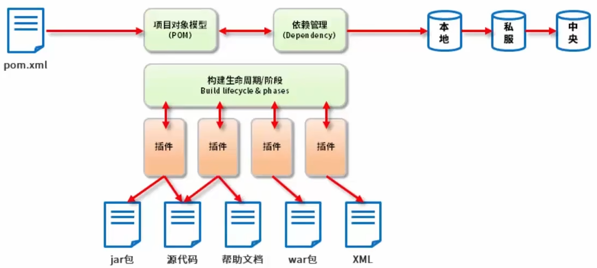
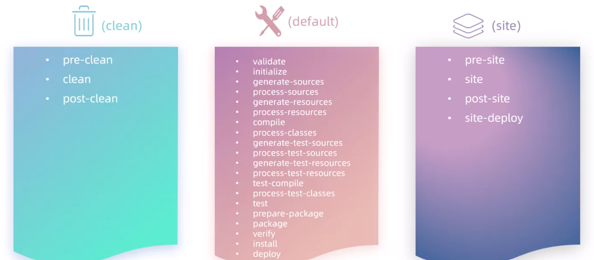

# 概述


本笔记始建于2025/03/25，用于总和JavaWeb所有必须的技术栈

内容组织结构如下：

- 前端
  - 基础
    - HTML
    - CSS
    - JavaScript
  - 框架
    - Ajax
    - Vue
    - React
- 后端
  - 基础
    - Java SE
    - Java EE
  - 工具链
    - Maven
    - Tomcat
    - Linux
    - Docker
  - Spring基础
    - Spring Framework
    - SpringBoot
  - 数据库
    - MySQL
    - MyBatis
    - MyBatis-Plus
    - Redis
  - 云
    - SpringCloud


# 前端


# 后端


## 基础


### Java SE


#### JDBC

##### 概述

Java数据库连接，（Java Database Connectivity，简称JDBC）是SUN公司提供的一套规范，由一系列类和接口组成。

数据库厂商通过实现该规范，使得Java程序可以通过统一的接口访问不同的数据库驱动。

##### 流程

- 加载数据库驱动

  添加项目依赖，如

  ```xml
  <dependency>
      <groupId>mysql</groupId>
      <artifactId>mysql-connector-java</artifactId>
      <version>8.0.33</version>
  </dependency>
  ```

  使用反射加载（可选的）：

  ```java
  Class.forName("com.mysql.jdbc.driver");
  ```

- 新建数据库连接

  通过`java.sql.DriverManager`和`java.sql.Connection`新建并获取数据库连接

  ```java
  Connection connection = DriverManager.getConnection(url, user, password);
  ```

- 创建并执行SQL语句

  通过`java.sql.Statement`执行SQL语句，使用`java.sql.ResultSet`检索查询结果

  ```java
  Statement statement = connection.createStatement();
  ResultSet resultSet = statement.executeQuery(sql);
  ```

- 释放资源

  ```java
  resultSet.close();
  statement.close();
  connection.close(); // 将关闭事务
  ```

##### API

概述各主要类、接口的功能

`DriverManager`

- 注册驱动

  通常的驱动实现（如mysql）会在类加载阶段自动注册驱动

-  创建数据库连接

`Connection`

- 创建SQL语句对象

  如`Statement`、`PreparedStatement`

- 管理事务

`Statement`

- 执行SQL语句
- 批处理SQL语句

`PreparedStatement`

- `Statement`的含预编译功能子类

`CallableStatement`

- `PreparedStatement`的含数据库存储过程或函数调用功能子类

`ResultSet`

- 用于结果的存储、遍历、查询

##### 预编译与参数化

使用`PreparedStatement`用于解决SQL注入问题，流程参考如下：

- 使用`?`占位符替代原参数
- 创建预编译SQL语句
- 设置参数
- 执行语句

```java
String sql = "SELECT * FROM CITY WHERE CountryCode = ?";
PreparedStatement preparedStatement = connection.prepareStatement(sql);
preparedStatement.setString(1, "CHN");
ResultSet resultSet = preparedStatement.executeQuery();
```

##### 事务

- 使用`connection.setAutoCommit(false)`关闭自动事务提交（自行管理事务时使用）
- 使用`connection.commit()`提交事务
- 使用`connection.rollback()`回滚事务

##### 资源释放

JDBC中的`Connection`、`ResultSet`等会占用大量的数据库、系统或内存资源，手动管理时应当及时释放


### Java EE


#### 数据库连接池

##### 概述

连接池通过管理和复用少数几个数据库连接`java.sql.Connection`，使得

- 数据库连接的生命周期管理代码分离以降低耦合
- 减少创建和销毁数据库连接所花费的时间
- 减少维护数据库连接所花费的资源

`javax.sql.DataSource`/`jakarta.sql.DataSource`是`java.sql.DriverManager`的替代接口，为连接池和分布式事务提供了支持

可通过自行实现`DataSource`或使用现有库来使用数据库连接池功能

##### Druid

使用硬编码初始化

```java
DruidDataSource dataSource = new DruidDataSource();
dataSource.setDriverClassName("com.mysql.cj.jdbc.Driver");
dataSource.setUrl("jdbc:mysql://localhost:3306/world");
dataSource.setUsername("root");
dataSource.setPassword("123456");
```

使用配置文件初始化

- `/src/main/resouces/db.properties`

  ```properties
  driverClassName=com.mysql.cj.jdbc.Driver
  url=jdbc:mysql://localhost:3306/world
  username=root
  password=123456
  ```

- 核心代码

  ```java
  Properties properties = new Properties();
  properties.load(this.getClass().getClassLoader().getResourceAsStream("db.properties"));
  DataSource dataSource = DruidDataSourceFactory.createDataSource(properties);
  ```

连接的获取与归还

```java
Connection connection = dataSource.getConnection();
/*...*/
connection.close(); // 实质上归还了连接而不是立即关闭连接
```

##### C3P0

一款较早期的开源数据库连接池，使用方式类似于`Druid`


## 工具链


### Maven

可在Apache Maven官网获得更详细的[文档](https://maven.apache.org/guides/)


#### 概述

Maven是由Apache托管的用于简化Java项目构建流程的开源工具

##### 为什么使用Maven

- 传统项目依赖与多项目间依赖手动管理困难
- 不同开发环境的项目结构互相冲突
- 手动和非统一的项目构建、测试、打包、发布流程混乱

##### Maven的功能

- 依赖管理

  统一的便捷的项目依赖管理与项目间依赖管理

- 项目构建

  统一的编译、测试、打包和发布流程

- 项目结构

  统一的便于管理、扩展、维护的项目结构

##### Maven模型




#### 部署

##### 安装

Windows环境无需安装守护进程时仅解压即可

##### 配置

- 环境变量

  - `JAVA_HOME`：用于Maven运行所需的Java环境
  - `MAVEN_HOME`：用于Maven自身及其他依赖Maven的应用
  - `PATH`：用于命令行，值应为`%MAVEN_HOME%\bin`

- 全局配置文件`%MAVEN_HOME%\conf\settings.xml`

  - 本地仓库`settings.localRepository`

    默认值`${user.home}/.m2/repository`

  - 镜像仓库`settings.mirrors`

    Maven默认远程中央仓库地址`repo.maven.apache.org/maven2/`

    使用如下配置增加阿里云镜像仓库

    ```xml
    <mirror>
        <id>nexus-aliyun</id>
        <mirrorOf>central</mirrorOf>
        <name>Nexus aliyun</name>
        <url>http://maven.aliyun.com/nexus/content/groups/public</url>
    </mirror>
    ```

- 用户配置文件`settings.xml`

  与全局配置文件格式相同，用于覆盖全局配置文件配置，位于本地仓库路径下

  当本地仓库路径未修改时默认路径即为`${user.home}/.m2/settings.xml`


#### 目录结构

Maven提供了一系列标准的项目目录结构

- `src`/    源文件
  - `main`/
    - `java`/
    - `resources`/
    - `webapp`/
  - `test`/
    - `java`/
    - `resources`/
- `target`/    构建输出
- `pom.xml`    POM声明


#### 命令

##### 原型

可使用原型（Archetype）快速创建标准的目录结构的项目

参考`mvn archetype:generate`

##### 构建

在Maven项目根目录（`pom.xml`所在文件夹）可执行若干构建命令

- `mvn clean`：清除构建输出`target/`
- `mvn compile`：编译源代码文件并输出`.class`文件与资源文件到`target/`
- `mvn test`：编译测试源代码文件并输出`.class`文件与资源文件到`target/`，执行测试代码并输出结果报告到`target/surefire-reports`
- `mvn package`：编译、测试源代码与资源文件并打包为`.jar`文件输出到`target/`
- `mvn install`：编译、测试、打包源代码与资源文件并存储到本地仓库


#### IDEA整合

IDEA通常使用自带Maven，如果需要使用自行配置的Maven应通过IDEA设置进行修改，注意IDEA支持的Maven版本存在滞后

在IDEA运行/调试配置中可新增Maven运行/调试，用于在运行/调试时强制使用Maven构建插件

在使用IDEA新建项目时可选择Maven Archetype使用Maven原型功能快速创建标准目录结构的项目


#### POM

POM即项目对象模型（Project Object Model），是Maven识别、解析、管理项目的依据，由`pom.xml`进行声明

##### 内容

`pom.xml`支持的内容如下：

```xml
<project
         xmlns="http://maven.apache.org/POM/4.0.0"
         xmlns:xsi="http://www.w3.org/2001/XMLSchema-instance"
         xsi:schemaLocation="http://maven.apache.org/POM/4.0.0 https://maven.apache.org/xsd/maven-4.0.0.xsd">
    
    <!-- POM版本，值应为"4.0.0"，Maven目前仅支持该版本 -->
    <modelVersion>4.0.0</modelVersion>
    
    <!-- The Basics -->
    
    <!-- 项目的坐标 groupId:artifactId:version -->
    <groupId>...</groupId>
    <artifactId>...</artifactId>
    <version>...</version>
    <!-- 项目打包（生命周期"package"）方式，与项目类型相关，默认值"jar"，常见值如"jar"、"war"、"rar"、"pom"等，IDEA会识别该值以判断项目类型 -->
    <packaging>...</packaging>
    <!-- 依赖声明 -->
    <dependencies>...</dependencies>
    <!-- 用于声明继承的父POM -->
    <parent>...</parent>
    <!-- 用于继承中父POM进行依赖管理 -->
    <dependencyManagement>...</dependencyManagement>
    <!-- 用于聚合模块的子模块声明 -->
    <modules>...</modules>
    <!-- 子模块声明 -->
    <properties>...</properties>
    
    <!-- Build Settings -->
    
    <build>...</build>
    <reporting>...</reporting>
    
    <!-- More Project Information -->
    
    <name>...</name>
    <description>...</description>
    <url>...</url>
    <inceptionYear>...</inceptionYear>
    <licenses>...</licenses>
    <organization>...</organization>
    <developers>...</developers>
    <contributors>...</contributors>
    
    <!-- Environment Settings -->
    <issueManagement>...</issueManagement>
    <ciManagement>...</ciManagement>
    <mailingLists>...</mailingLists>
    <scm>...</scm>
    <prerequisites>...</prerequisites>
    <repositories>...</repositories>
    <pluginRepositories>...</pluginRepositories>
    <distributionManagement>...</distributionManagement>
    <profiles>...</profiles>
    
</project>
```

POM的最小内容应包含：

- `project`根
- `modelVersion`
- `groupId`
- `artifactId`
- `version`

##### Maven坐标

Maven项目的唯一标识，由`groupId`、`artifactId`、`version`组成


#### 依赖

Maven项目通过在`pom.xml`声明依赖和在本地或远程仓库中存储的依赖来进行依赖管理

##### 依赖传递

若工件A**直接依赖**工件B，工件B直接依赖工件C，则默认情况下工件A**间接依赖**工件C

##### 依赖调解

项目的所有依赖组成依赖树，可通过命令`mvn dependency:tree`查看依赖树

当依赖树中存在多个`groupId`和`artifactId`相同的依赖时将发生依赖冲突，通过依赖调解解决冲突

规则如下：

- 同一`pom.xml`文件相同依赖后声明的优先
- 在依赖树上深度低者优先
- 在依赖树上同一深度先声明的优先

##### 可选依赖

通过声明某依赖的`denpendency.optional`值为`true` ，使得该项目的该依赖对依赖该项目的项目隐藏

简单来说，就是使当前项目的某依赖无法被传递

`optional`的默认值是`false`

```xml
<dependency>
    <groupId>com.example.web</groupId>
    <artifactId>lib</artifactId>
    <version>1.0</version>
    <optional>true</optional>
</dependency>
```

##### 排除依赖

通过对某依赖声明`denpendency.exclusions`的一个或多个`exclusion`，使得从该依赖传递的一个或多个间接依赖被排除

在`exclusion`中仅需声明`groupId`和`artifactId`

```xml
<dependency>
    <groupId>com.example.web</groupId>
    <artifactId>lib</artifactId>
    <version>1.0</version>
    <exclusions>
        <exclusion>
            <groupId>com.example.util</groupId>
            <artifactId>util</artifactId>
        </exclusion>
    </exclusions>
</dependency>
```

##### 依赖范围

通过`denpendency.scope`声明依赖的作用范围

`scope`的默认值为`compile`，可选的值有

- `compile`：参与所有编译、测试编译、测试执行和打包
- `provided`：参与编译、测试编译、测试执行，但不参与打包，用于目标运行环境已提供该依赖的情况，如Servlet API
- `runtime`：不参与编译、测试编译，但参与测试执行和打包，常用于仅在运行时所需的依赖，如JDBC
- `test`：参与测试编译、测试执行，不参与编译和打包
- `system`
- `import`

```xml
<dependency>
    <groupId>com.example.web</groupId>
    <artifactId>lib</artifactId>
    <version>1.0</version>
    <scope>compile</scope>
</dependency>
```

##### 依赖范围的传递

当某项目的某依赖声明的依赖范围，且该依赖对其依赖也声明了依赖范围，那么该项目对该间接依赖的依赖范围将通过以下规则获得

- `provided`和`test`声明的依赖无法被传递，因此声明了`provided`或`test`的间接依赖项将被忽略
- 最终的依赖范围将取两个依赖范围的交集

简单来说，如果A依赖B，B依赖C，那么C对于A的依赖范围如下表所示

| A声明B的范围 \ B声明C的范围 | compile  | provided | runtime  | test |
| --------------------------- | -------- | -------- | -------- | ---- |
| compile                     | compile  | 忽略     | runtime  | 忽略 |
| provided                    | provided | 忽略     | provided | 忽略 |
| runtime                     | runtime  | 忽略     | runtime  | 忽略 |
| test                        | test     | 忽略     | test     | 忽略 |


#### 生命周期与插件

Maven生命周期是指构建流程中的各个阶段的总和，每个阶段都需要一个特定的插件实现，每个阶段的执行必须依赖前一个阶段的执行结果

Maven共有三类生命周期：

- clean：用于清理
- default：用于编译、测试、打包、安装、部署等
- site：生成报告、发布站点等



常用的生命周期阶段：

- clean 移除上一次构建生成的文件
- compile 编译项目源代码
- test 使用合适的单元测试框架运行测试
- package 将编译后的文件打包
- install 安装项目到本地仓库

通过执行特定的Maven命令即可通过特定的Maven插件执行指定的阶段

可通过在`pom.xml`中声明插件来实现更复杂的功能


#### 多模块

Maven支持项目以多模块的方式管理项目的编码、编译、测试、运行等构建流程

##### 原始

通过仓库和依赖管理实现多模块的构建管理，通过手动管理的方式按照合理顺序从底层到高层对模块进行构建和安装、发布

如对于依赖A-B、B-C、B-D、D-E，当D模块更新时，需要依次对D、B、A模块分别进行编译、测试、打包、安装、发布的构建流程，使得上层模块能正确使用下层已经更新了的模块

##### 聚合

通过Maven定义聚合模块，在聚合模块中声明其所有子模块，使得对聚合模块的构建等效于对其所有子模块的合理顺序的依次构建，实现多模块构建管理的自动化，即执行聚合模块的单个构建命令等效于对所有子模块执行有顺序的构建命令

构建顺序通常由Maven通过依赖树决定，使得依赖树中更深的子模块更早构建，如果子模块不互相依赖，那么构建顺序由模块的声明顺序决定

常见项目结构：

- `App/`
  - `SubApp1`
    - `src/`
    - `pom.xml` 子模块POM声明
  - `SubApp2`
    - `src/`
    - `pom.xml` 子模块POM声明
  - `pom.xml` 聚合模块POM声明

或

- `App/`
  - `pom.xml` 聚合模块POM声明
- `SubApp1`
  - `src/`
  - `pom.xml` 子模块POM声明
- `SubApp2`
  - `src/`
  - `pom.xml` 子模块POM声明

聚合模块声明：

```xml
<?xml version="1.0" encoding="UTF-8"?>
<project xmlns="http://maven.apache.org/POM/4.0.0"
         xmlns:xsi="http://www.w3.org/2001/XMLSchema-instance"
         xsi:schemaLocation="http://maven.apache.org/POM/4.0.0 http://maven.apache.org/xsd/maven-4.0.0.xsd">

  <modelVersion>4.0.0</modelVersion>

  <groupId>com.example.pom</groupId>
  <artifactId>pom</artifactId>
  <version>1.0</version>

  <!-- 聚合模块必须声明打包方式为"pom" -->
  <packaging>pom</packaging>

  <!-- 通过modules标签声明子模块，值为各子模块的相对目录 -->
  <modules>
    <!-- 该子模块位于聚合模块目录内 -->
    <module>Module A</module>
    <!-- 该子模块位于聚合模块目录旁 -->
    <module>../Module B</module>
  </modules>

</project>
```

##### 继承

Maven提供了继承的功能，可用于在多模块构建管理中，让多个子模块POM继承同一个父POM，以用于简化重复的配置，处理可能的依赖版本冲突等问题

- 在子模块的`pom.xml`中声明继承

```xml
<?xml version="1.0" encoding="UTF-8"?>
<project xmlns="http://maven.apache.org/POM/4.0.0"
         xmlns:xsi="http://www.w3.org/2001/XMLSchema-instance"
         xsi:schemaLocation="http://maven.apache.org/POM/4.0.0 http://maven.apache.org/xsd/maven-4.0.0.xsd">
    <modelVersion>4.0.0</modelVersion>
    
    <!-- 声明继承 -->
    <parent>
        <groupId>com.example.pom</groupId>
        <artifactId>parent</artifactId>
        <version>1.0</version>
        <!-- 非必须，Maven会先尝试从相对路径中获取，再尝试从仓库中获取-->
        <relativePath>../pom.xml</relativePath>
    </parent>

    <!-- 从父POM中继承groupId和version的值，因此此处可无需重复声明 -->
    <artifactId>app</artifactId>
    
    <dependencies>
        <dependency>
            <!-- 从父POM中继承version值，因此此处可无需重复声明 -->
            <groupId>com.example.lib</groupId>
            <artifactId>lib</artifactId>
        </dependency>
    </dependencies>

</project>
```

- 父POM应另属于一个新模块，声明父POM

```xml
<?xml version="1.0" encoding="UTF-8"?>
<project xmlns="http://maven.apache.org/POM/4.0.0"
         xmlns:xsi="http://www.w3.org/2001/XMLSchema-instance"
         xsi:schemaLocation="http://maven.apache.org/POM/4.0.0 http://maven.apache.org/xsd/maven-4.0.0.xsd">

    <modelVersion>4.0.0</modelVersion>

    <groupId>com.example.pom</groupId>
    <artifactId>parent</artifactId>
    <version>1.0</version>
    
    <!-- 必须声明打包方式为"pom" -->
    <packaging>pom</packaging>
    
    <!-- 通过该标签声明依赖版本，使得子POM在声明依赖时无需指定版本 -->
    <dependencyManagement>
        <dependencies>
            <dependency>
                <groupId>com.example.lib</groupId>
                <artifactId>lib</artifactId>
                <version>1.0</version>
            </dependency>
            <dependency>
                <groupId>com.example.lib</groupId>
                <artifactId>lib2</artifactId>
                <version>2.0</version>
            </dependency>
        </dependencies>
    </dependencyManagement>

    <!-- 对于build.plugins，同样可通过build.pluginManagement标签来声明plugin进行插件管理 -->
    
</project>
```

- 可被继承的POM标签包含

  ```markdown
  - groupId
  - version
  - description
  - url
  - inceptionYear
  - organization
  - licenses
  - developers
  - contributors
  - mailingLists
  - scm
  - issueManagement
  - ciManagement
  - properties
  - dependencyManagement
  - dependencies
  - repositories
  - pluginRepositories
  - build
    - plugin executions with matching ids
    - plugin configuration
    - etc.
  - reporting
  ```

- 不会被继承的POM标签包含

  ```markdown
  - artifactId
  - name
  - prerequisites
  ```

- 继承和聚合可同时使用，且通常共同使用；在一个多模块的项目中，父模块同时承担着通过继承功能管理多模块项目依赖和通过聚合功能管理多模块构建流程的功能


### Tomcat


#### 概述

Tomcat是Apache Jakarta的开源Web Servlet容器，实现了部分Java EE/Jakarta EE规范

- ≤ Tomcat 9：支持Java EE
- ≥ Tomcat 10：支持Jakarta EE

常用版本：

- Tomcat 9：支持Java EE 8
- Tomcat 10：支持部分Jakarta EE 10
- Tomcat 11：支持部分Jakarta EE 11

注意目标为Tomcat 9的Web应用无法发布在Tomcat 10上

支持的Java EE/Jakarta EE规范有：

- Servlet
- JSP
- WebSocket

若需要使用实现了所有Java EE/Jakarta EE规范的Java EE全栈服务器，可参考`WebSphere`、`WebLogic`等


#### Tomcat 9

可以在官方文档里参考或学习详细的使用方法：[Tomcat 9 文档](https://tomcat.apache.org/tomcat-9.0-doc/index.html)

##### 使用入门

- 安装和确保合适的Java环境

  - 推荐JDK 8运行环境

    较高或较低的版本均可能产生意外的问题

  - 配置`JAVA_HOME`环境变量

- 下载并解压合适的Tomcat包

  如`Core 64-bit Windows.zip`，包含核心jar程序和适用于Windows的已编译本机库、bat脚本等

- 修改或确认`/conf/server.xml`中的端口号（默认为8080）使其处于可用状态

  ```xml
  <!--默认的配置如下-->
  <Connector port="8080" protocol="HTTP/1.1"
                 connectionTimeout="20000"
                 redirectPort="8443"
                 maxParameterCount="1000"
                 />
  ```

- 解决可能的终端输出乱码问题

  可选的方案有：

  - 修改`/conf/logging.properties`中的`java.util.logging.ConsoleHandler.encoding`为本机默认编码
  - 修改启动脚本中的JVM参数

- 使用`/bin`目录下的`startup.bat`和`shutdown.bat`等脚本启动或关闭Tomcat服务器

- 访问http://localhost:8080确认服务器运行状况

##### Context

在Tomcat中，Context概指一个Web应用程序，在一个Tomcat可以同时存在多个Context

##### 目录结构

- `/bin`：脚本等可执行文件，用于启动、关闭、管理Tomcat服务器
- `/conf`：配置文件，核心配置文件为`server.xml`
- `/logs`：日志文件
- `/webapps`：Web应用程序存储目录
  - `/ROOT`：默认Web应用目录
    - `/WEB-INF`
      - `/classes`：Web应用的Java类文件和资源
      - `/lib`：Web应用Java程序依赖的Jar文件
      - `web.xml`：Web应用核心描述文件
    - `/static_resources_dir_1...`：更多的静态文件
    - `*.html、*.js、*.jsp...`：静态资源文件等
  - `/app_dir_1...`：更多的Web应用
- `/lib`：Web应用运行所需的Jar依赖文件包
- `/temp`：JVM临时文件目录
- `/work`：Tomcat的临时工作目录，JSP编译后的`.java`、`.class`等文件也存储于此

##### 部署Web应用

- 静态部署：在Tomcat启动前部署或更新Web应用
- 动态部署：在Tomcat运行时部署或更新Web应用，依赖Tomcat的配置和自动部署工具

可以使用以下方法部署待发布的Web应用

- 复制Web应用文件夹到`/webapps`或其子文件夹

- 复制WAR存档的Web应用到`/webapps`或其子文件夹

  Tomcat会自动解压该WAR存档，但更新Web应用时应删除原先的已解压的文件夹

- 使用Tomcat Manager进行图形化的管理

##### Manager

Tomcat Manager时一个Tomcat内置的Web服务，提供了以下图形化便捷功能：

- 远程部署、更新Web应用
- 管理Web应用
- 服务器资源和运行状态的统计
- SSL/TLS管理

等等

##### 其他功能

Tomcat支持的其他常用功能包括：

- WebSocket支持
- 虚拟主机
- Realm支持
- JNDI
- JSP支持
- SSL/TLS支持
- CGI
- 反向代理
- 负载均衡
- 集群支持
- Windows服务
