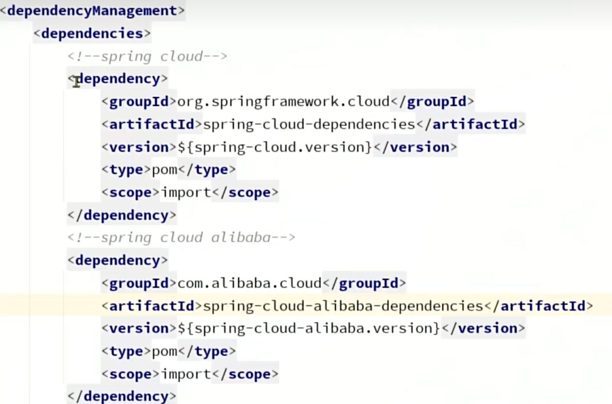

### 概述

微服务是一种软件架构风格

需要解决的问题：

- 服务拆分
- 远程调用
- 服务治理
- 请求路由
- 身份认证
- 配置管理
- 服务保护
- 分布式事务
- 异步通信
- 消息可靠性
- 延迟消息
- 分布式搜索
- 倒排索引
- 数据聚合


### Docker

https://docs.docker.com


```bash
docker run -d --name mysql3306 -p 3306:3306 -e TZ=Asia/Shanghai -e MYSQL_ROOT_PASSWORD=123456 mysql
```

- `run -d` 在后台运行
- `--name mysql3306` 容器名称
- `-p 3306:3306`  容器宿主机端口到容器端口的映射
- `-e KEY=VALUE` 环境变量，参考各镜像文档说明
- `mysql` 镜像名称，此处为简写，完整镜像名称为 `[respository]:[tag]`，如`mysql:5.7`，tag默认值为`lastest`，如`mysql`相当于`mysql:lastest`


常用命令

- `docker pull` 从远程镜像仓库拉取镜像到本地
- `docker push` 将本地镜像推送到远程镜像仓库
- `docker images` 查看本地镜像
- `docker rmi` 删除本地镜像
- `docker build` 构建自定义镜像
- `docker save` 保存镜像为文件
- `docker load` 加载文件为镜像
- `docker run` 从镜像创建并运行容器
- `docker start` 运行容器
- `docker stop` 停止容器
- `docker ps` 查看容器
- `docker rm` 删除容器
- `docker logs` 查看容器日志
- `docker exec` 在容器中执行


数据卷（volume）

由于在容器内管理文件和文件内容较为繁琐，可使用数据卷进行映射


有关命令

- `docker volume create` 创建数据卷
- `docker volume ls` 查看数据卷
- `docker volumn rm` 删除数据卷
- `docker volumn inspect` 查看数据卷详情
- `docker volumn prune` 删除未使用的数据卷
- `docker run -v [数据卷名]:[容器内目录]` 挂载数据卷，如果数据卷不存在则创建
- `docker run -v [宿主机目录]:[容器内目录]` 挂载数据卷并指定数据卷所在目录

```bash
docker run -d --name nginx -p 80:80 -v outer:/usr/share/nginx/html nginx
```

数据卷默认位于`/var/lib/docker/volumes`

可以在`docker run`命令中使用多个`-v`挂载多个目录到数据卷

在`docker inspect [容器名]`的输出结果的`Mounts`中查看挂载情况

部分镜像默认存在数据卷挂载，如mysql，但mysql使用的是匿名卷，每次新建容器都会创建一个唯一ID作为名称的数据卷


自定义镜像


`Dockerfile`是由一系列指定构成的文本文件，用于说明如何构建镜像

常见指令

- `FROM [respository]:[tag]` 指定基础镜像 
- `ENV [KEY]=[VALUE]` 指定环境变量
- `COPY [src] [dest]` 复制指定本地文件到镜像
- `RUN [shell]` 执行shell命令
- `EXPOSE [port]` 暴露端口
- `ENTRYPOINT [shell]` 启动命令

```dockerfile
FROM ubuntu:16.04
ENV JAVA_DIR=/usr/local
COPY ./jdk8.tar.gz $JAVA_DIR/
COPY ./app.jar /temp/app.jar
RUN cd $JAVA_DIR && tar -xf ./jdk8.tar.gz && mv ./jdk1.8.0_144 ./java8
ENV JAVA_HOME=$JAVA_DIR/java8
ENV PATH=$PATH:$JAVA_HOME/BIN
ENTRYPOINT ["java","-jar","/app.jar"]
```

```dockerfile
FROM openjdk:11.0-jre-buster
COPY ./app.jar /temp/app.jar
ENTRYPOINT ["java","-jar","/app.jar"]
```

构建自定义镜像

```bash
docker build -t [respository]:[tag] [path]
```

```bash
docker build -t myapp:1.0 .
```

`-t [respository]:[tag]` 对该镜像进行命名

`path` `Dockerfile`的所在路径


容器网络

所有容器位于`127.17.0.0/16`，网关为`127.17.0.1`作为虚拟网桥

容器的IP是动态分配的

自定义容器网络

自定义网络可以让容器间通过容器名而不是IP进行网络访问（因为存在内置DNS）

- `docker network create` 创建网络
- `docker network ls` 查看网络
- `docker network rm` 删除网络
- `docker network prune` 删除未使用的网络
- `docker network connect` 指定容器连接网络
- `docker network disconnect` 指定容器断开网络
- `docker network inspect` 查看网络详情
- `docker run --network [网络名称]` 指定网络


DockerCompose

通过`docker-compose.yml`来定义一组容器的部署


### 微服务概述


工具

JMeter压力测试


单体架构在大型项目中的问题：

- 团队协作
- 构建、打包、发布
- 可用性
- 系统资源


微服务：

- 服务的粒度更小
- 团队自治
- 服务自治


SpringCloud是一款热门的微服务框架，其集成了大量的已有的优秀的微服务组件

- 服务注册发现
  - `Eureka`
  - `Nacos`
  - `Consul`
- 服务远程调用
  - `OpenFeign`
  - `Dubbo`
- 服务链路监控
  - `Zipkin`
  - `Sleuth`
- 统一配置管理
  - `SpringCloudConfig`
  - `Nacos`
- 统一网关路由
  - `pringCloudGateway`
  - `Zuul`
- 流控、降级、保护
  - `Hystix`
  - `Sentinel`


Spring Cloud对微服务组件制定了统一的标准，各公司提供了实现标准的组件集，如Spring Cloud Alibaba

引入依赖管理后无需手动选择各组件的版本




### 服务拆分


原则

- 高内聚
- 低耦合


方式

- 纵向拆分/垂直拆分

  按业务模块拆分

- 横向拆分/水平拆分

  抽取公共服务


工程结构

- 独立Project

  独立开发流程（团队、版本管理、项目管理），数据独立

- Maven聚合

  无业务模块间依赖声明，代码分离人不分离，数据独立


注意事项：

各服务间数据隔离，严禁共用Entity类、Mapper

配置`spring.application.name`指定服务名称

IDEA服务栏可选择多个服务进行启动，也可使单个服务启动多个实例


### 服务治理

- 服务调用者需要动态的获取服务提供者
- 需要处理服务提供者状态的变更
- 多个相同服务提供者实例应负载均衡


#### 注册中心

- 服务注册

  服务提供者向注册中心注册自己的服务

- 服务发现

  服务消费者向注册中心获取所需的服务


注册中心组件

- Nacos 由阿里巴巴开发，集成于Spring Cloud Alibaba
- Eureka Netflix公司开发


Nacos作为一个单独服务运行，本身也需要数据源，可使用MySQL

服务端口：

- 8848
- 9848
- 9849

后台面板 `http://[ip]:8848/nacos`


#### 服务注册


#### 服务发现


### 远程调用


#### OpenFeign

可以使用OpenFeign简化服务远程调用的代码

OpenFeign是一个声明式的HTTP客户端，由SpringCloud基于Eureka的Feign改造而来


OpenFeign会代理接口方法，使其通过某种复杂均衡算法，从服务发现获得的若干个服务实例中选择一个实例，通过HTTP对该服务进行调用

默认的HTTP客户端为HttpURLConnection，不支持连接池，每次请求都会重新创建一个连接，效率较低

可以选择其他HTTP客户端：

- Apache HttpClient 支持连接池
- OKHttp 支持连接池


日志


通过Bean定义一个客户端日志级别


定义全局日志级别


#### 最佳实践

当一个服务通过HTTP接口向其他服务提供服务入口，其他的所有服务都需要为该服务编写相同或相似的HTTP客户端接口和DTO，且一旦接口或DTO发生变化，将引发严重的维护问题

解决方案一：

适用于项目级别分离的微服务架构

服务提供者的开发团队在实现业务功能和HTTP接口以外，提供公共的依赖以提供统一的HTTP接口客户端API和DTO声明


解决方案二：

适用于Maven模块分离而人不分离的微服务架构

在公共模块中声明DTO和HTTP接口客户端API，在多团队开发时该方案可能引发更多问题


### API网关

负责请求路由、请求转发、认证授权、负载均衡、限流熔断、请求聚合、请求响应转换、协议转换、安全监测、日志监控等多种功能

其中最关键的是请求路由、请求转发、认证授权


常见组件：

- Spring Cloud Gateway

  基于WebFlux，性能优异，响应式编程

- Netflix Zuul

  基于Servlet阻塞式，原始性能较差，需要调优


#### 快速入门

创建Spring Boot项目


或


#### 请求路由


#### 身份认证


通过声明GlobalFilter实现身份认证功能，并将用户身份写入请求头

各服务通过SpringMVC Interceptor在请求处理前读取请求头并将用户信息保存到ThreadLocal，在请求处理后清除ThreadLocal

当服务间调用时，通过OpenFeign的RequestInterceptor统一的从ThreadLocal读取用户信息写入请求头

考虑到用户可能未登录，实际上服务获取的用户信息可能为空


### 配置管理

- 统一配置，去除冗余重复配置数据
- 配置热更新，无需重启服务

Nacos即具备配置管理功能


在Nacos后台面板汇总进行配置管理，使用Data ID作为配置的限定名

统一或相似的配置抽取为模版用于管理，可变值使用`$`变量


更改传统的SpringBoot配置加载流程

其中bootstrap.yml用于定义Nacos等必须配置，且这些配置将在合并配置流程中被合并到SpringBoot上下文


快速入门


配置热更新

假设某服务名为`foobar`，即使该服务未在`bootstrap.yaml`中声明需要读取的共享配置，但由于在`bootstrap.yaml`中配置了`spring.application.name=foobar`、`profiles.active=pro`、`spring.cloud.nacos.config.file-extension=yaml`，Nacos默认将读取`foobar.yaml`和`foobar-pro.yaml`配置文件


### 服务保护


#### 雪崩问题

微服务调用链路中的某个服务故障，导致其上下游的所有服务不可用，最终导致所有直接或间接关联的服务集体故障

- 服务提供者应尽可能避免故障
- 服务消费者应尽可能减少下游服务故障对本服务的影响


#### 保护方案

请求限流


线程隔离


服务熔断


组件

- Sentinel Spring Cloud Alibaba组件
- Hystrix Spring Cloud Netflix组件


#### Sentinel


Sentinel分为控制台服务器和依赖项客户端

控制台服务器是一个Jar文件，启动后默认在8080端口开放HTTP服务器，在控制台服务器中可以对所有已连接的客户端进行实时流量监控、并设置保护规则

服务配置：

引入依赖项


配置控制台服务器地址


簇点链路


由于默认监控的是请求路径，考虑到RESTful风格，需要请求方法区分簇点资源


Sentinel是通过实时检测Spring MVC HTTP接口的方式来识别出簇点资源的，如果一个HTTP接口未被调用，那么它将不会被Sentinel监控

通过配置，OpenFeign接口也可成为簇点资源


请求限流


线程隔离


Fallback

当下游服务故障时对其的调用将经由Fallback进行失败降级处理


服务熔断


### 分布式事务


#### 事务

将一组相关的数据库操作捆绑在一起，构成一个单一的、不可分割的工作单元


##### 四大特性ACID

**原子性**

事务中的所有操作是一个不可分割的最小工作单位。它们要么全都成功，要么全部失败

**一致性**

事务执行的结果必须使数据库从一个一致状态转换到另一个一致状态

即使事务执行中途失败或者并发执行多个事务时，一致性也必须保证

一致性包括：符合所有预定义规则、约束，如主键唯一性、外键约束、数据类型、业务规则等

**隔离性**

多个并发执行的事务应该相互隔离，使得每个事务感知不到有其他事务在同时执行。一个事务的中间状态不应该被其他并发事务感知

**持久性**

一旦一个事务成功提交，它对数据库所做的修改就是永久性的


##### ACID的破坏

可能的因素有：

- 事务在进行时遭到强行中止
- 多个并发事务的操作交叉执行

常见的包括：

- 事务进行中的程序性错误或异常

  如由执行事务的业务程序或数据库为了保障一致性而主动产生错误或异常

- 网络故障

  业务程序之间或业务程序与数据库之间的网络通信故障，包括网络数据包丢失、网络延迟、网络中断等

- 系统故障

  执行事务的业务程序或数据库管理系统应意外中止

- 介质故障

  存储数据的介质发生故障

- 恶意入侵

  受到恶意软件、病毒、木马、物理侵入等安全方面的数据、网络、系统等的修改或破坏


##### 并发控制

事务是并发控制的基本单位

以下并发问题将破坏隔离性

**丢失修改**

两个事务同时写入，先后提交，导致其中一个事务提交的修改丢失

**脏读**

一个事务读取了另一个事务尚未提交的数据，随后另一事务进行撤销

**不可重复读**

一个事务中多次读取同一项或多项数据，多次读取之间另一事务提交导致数据修改、新增或删除，导致多次读取的数据结果不一致

部分情况下称幻读


##### 锁协议

可用于解决并发控制问题，但将带来严重的性能问题

**排它锁**

数据仅能加一个排他锁，加排他锁后不可加共享锁

**共享锁**

数据可加多个共享锁

**一级锁协议**

事务在写数据时需对数据加排他锁直到事务结束，事务读数据无需加任何锁

仅能解决丢失修改问题

**二级锁协议**

事务在写数据时需加排他锁直到事务结束，读数据时需加共享锁直到读结束

仅能解决丢失修改和脏读问题

**三级锁协议**

事务在写数据时需加排他锁直到事务结束，读数据时需加共享锁直到事务结束

能解决丢失修改、脏读、不可重复读问题


#### 分布式事务

一个分布式系统中，完成一个业务操作需要协调多个独立的服务或数据源上执行的操作，并且这些操作必须作为一个整体单元要么全部成功，要么全部失败回滚

每个独立服务或数据源上的事务成为分支事务，整个业务的所有操作成为全局事务


#### Seata概述

分布式事务解决方案组件


#### TC服务

TC服务是一个微服务组件，拥有自己的Web控制台，需要依赖持久化存储如数据库、Redis、文件等，配置方式与常见组件不同，参考官网


#### Seata集成


##### XA模式


通过数据库事务开启直到所有分支事务执行完才提交或回滚事务来保障一致性


优点

- 强一致性
- 数据库支持性好
- 实现简单

缺点

- 性能差


##### AT模式


通过立即提交和数据快照来保障事务操作的原子性

需要在数据库中为Seata提供特定的表，并对指定方法添加`@GlobalTransactional`注解


仅追求最终一致性

优点

- 性能好

缺点

- 可能产生丢失修改、脏读、不可重复读的问题


##### 选择方式

对性能要求高的业务使用AT模式，对强一致性要求高的业务使用XA模式

此外，Seata还支持其他分布式事务模式