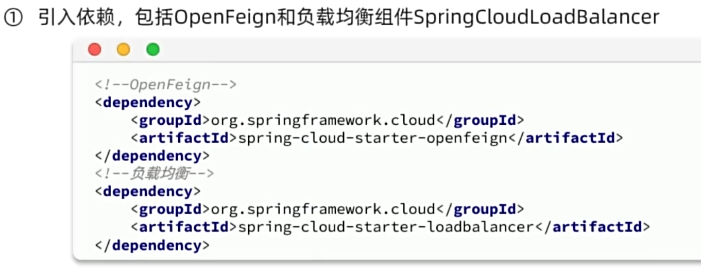
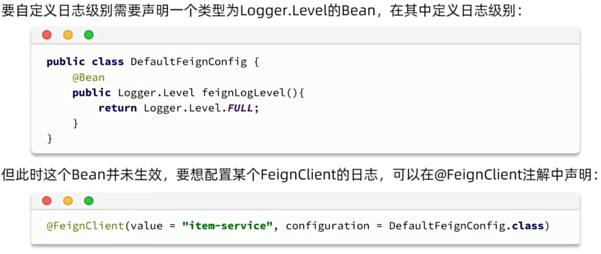
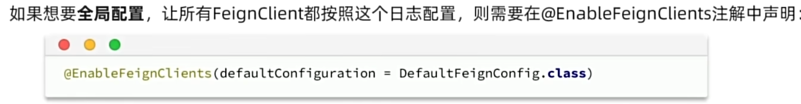
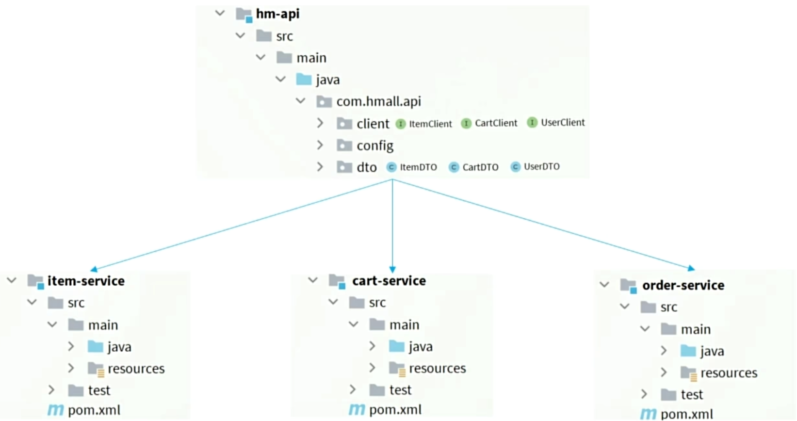

### 概述

微服务是一种软件架构风格

需要解决的问题：

- 服务拆分
- 远程调用
- 服务治理
- 请求路由
- 身份认证
- 配置管理
- 服务保护
- 分布式事务
- 异步通信
- 消息可靠性
- 延迟消息
- 分布式搜索
- 倒排索引
- 数据聚合


### Docker

https://docs.docker.com


```bash
docker run -d --name mysql3306 -p 3306:3306 -e TZ=Asia/Shanghai -e MYSQL_ROOT_PASSWORD=123456 mysql
```

- `run -d` 在后台运行
- `--name mysql3306` 容器名称
- `-p 3306:3306`  容器宿主机端口到容器端口的映射
- `-e KEY=VALUE` 环境变量，参考各镜像文档说明
- `mysql` 镜像名称，此处为简写，完整镜像名称为 `[respository]:[tag]`，如`mysql:5.7`，tag默认值为`lastest`，如`mysql`相当于`mysql:lastest`


常用命令

- `docker pull` 从远程镜像仓库拉取镜像到本地
- `docker push` 将本地镜像推送到远程镜像仓库
- `docker images` 查看本地镜像
- `docker rmi` 删除本地镜像
- `docker build` 构建自定义镜像
- `docker save` 保存镜像为文件
- `docker load` 加载文件为镜像
- `docker run` 从镜像创建并运行容器
- `docker start` 运行容器
- `docker stop` 停止容器
- `docker ps` 查看容器
- `docker rm` 删除容器
- `docker logs` 查看容器日志
- `docker exec` 在容器中执行


数据卷（volume）

由于在容器内管理文件和文件内容较为繁琐，可使用数据卷进行映射


有关命令

- `docker volume create` 创建数据卷
- `docker volume ls` 查看数据卷
- `docker volumn rm` 删除数据卷
- `docker volumn inspect` 查看数据卷详情
- `docker volumn prune` 删除未使用的数据卷
- `docker run -v [数据卷名]:[容器内目录]` 挂载数据卷，如果数据卷不存在则创建
- `docker run -v [宿主机目录]:[容器内目录]` 挂载数据卷并指定数据卷所在目录

```bash
docker run -d --name nginx -p 80:80 -v outer:/usr/share/nginx/html nginx
```

数据卷默认位于`/var/lib/docker/volumes`

可以在`docker run`命令中使用多个`-v`挂载多个目录到数据卷

在`docker inspect [容器名]`的输出结果的`Mounts`中查看挂载情况

部分镜像默认存在数据卷挂载，如mysql，但mysql使用的是匿名卷，每次新建容器都会创建一个唯一ID作为名称的数据卷


自定义镜像


`Dockerfile`是由一系列指定构成的文本文件，用于说明如何构建镜像

常见指令

- `FROM [respository]:[tag]` 指定基础镜像 
- `ENV [KEY]=[VALUE]` 指定环境变量
- `COPY [src] [dest]` 复制指定本地文件到镜像
- `RUN [shell]` 执行shell命令
- `EXPOSE [port]` 暴露端口
- `ENTRYPOINT [shell]` 启动命令

```dockerfile
FROM ubuntu:16.04
ENV JAVA_DIR=/usr/local
COPY ./jdk8.tar.gz $JAVA_DIR/
COPY ./app.jar /temp/app.jar
RUN cd $JAVA_DIR && tar -xf ./jdk8.tar.gz && mv ./jdk1.8.0_144 ./java8
ENV JAVA_HOME=$JAVA_DIR/java8
ENV PATH=$PATH:$JAVA_HOME/BIN
ENTRYPOINT ["java","-jar","/app.jar"]
```

```dockerfile
FROM openjdk:11.0-jre-buster
COPY ./app.jar /temp/app.jar
ENTRYPOINT ["java","-jar","/app.jar"]
```

构建自定义镜像

```bash
docker build -t [respository]:[tag] [path]
```

```bash
docker build -t myapp:1.0 .
```

`-t [respository]:[tag]` 对该镜像进行命名

`path` `Dockerfile`的所在路径


容器网络

所有容器位于`127.17.0.0/16`，网关为`127.17.0.1`作为虚拟网桥

容器的IP是动态分配的

自定义容器网络

自定义网络可以让容器间通过容器名而不是IP进行网络访问（因为存在内置DNS）

- `docker network create` 创建网络
- `docker network ls` 查看网络
- `docker network rm` 删除网络
- `docker network prune` 删除未使用的网络
- `docker network connect` 指定容器连接网络
- `docker network disconnect` 指定容器断开网络
- `docker network inspect` 查看网络详情
- `docker run --network [网络名称]` 指定网络


DockerCompose

通过`docker-compose.yml`来定义一组容器的部署


### 微服务概述


工具

JMeter压力测试


单体架构在大型项目中的问题：

- 团队协作
- 构建、打包、发布
- 可用性
- 系统资源


微服务：

- 服务的粒度更小
- 团队自治
- 服务自治


SpringCloud是一款热门的微服务框架，其集成了大量的已有的优秀的微服务组件

- 服务注册发现
  - `Eureka`
  - `Nacos`
  - `Consul`
- 服务远程调用
  - `OpenFeign`
  - `Dubbo`
- 服务链路监控
  - `Zipkin`
  - `Sleuth`
- 统一配置管理
  - `SpringCloudConfig`
  - `Nacos`
- 统一网关路由
  - `pringCloudGateway`
  - `Zuul`
- 流控、降级、保护
  - `Hystix`
  - `Sentinel`


Spring Cloud对微服务组件制定了统一的标准，各公司提供了实现标准的组件集，如Spring Cloud Alibaba

引入依赖管理后无需手动选择各组件的版本


### 服务拆分


原则

- 高内聚
- 低耦合


方式

- 纵向拆分/垂直拆分

  按业务模块拆分

- 横向拆分/水平拆分

  抽取公共服务


工程结构

- 独立Project

  独立开发流程（团队、版本管理、项目管理），数据独立

- Maven聚合

  无业务模块间依赖声明，代码分离人不分离，数据独立


注意事项：

各服务间数据隔离，严禁共用Entity类、Mapper

配置`spring.application.name`指定服务名称

IDEA服务栏可选择多个服务进行启动，也可使单个服务启动多个实例


### 服务治理

- 服务调用者需要动态的获取服务提供者
- 需要处理服务提供者状态的变更
- 多个相同服务提供者实例应负载均衡


#### 注册中心

- 服务注册

  服务提供者向注册中心注册自己的服务

- 服务发现

  服务消费者向注册中心获取所需的服务


注册中心组件

- Nacos 由阿里巴巴开发，集成于Spring Cloud Alibaba
- Eureka Netflix公司开发


Nacos作为一个单独服务运行，本身也需要数据源，可使用MySQL

服务端口：

- 8848
- 9848
- 9849

后台面板 `http://[ip]:8848/nacos`


#### 服务注册


#### 服务发现


### 远程调用


#### OpenFeign

可以使用OpenFeign简化服务远程调用的代码

OpenFeign是一个声明式的HTTP客户端，由SpringCloud基于Eureka的Feign改造而来




OpenFeign会代理接口方法，使其通过某种复杂均衡算法，从服务发现获得的若干个服务实例中选择一个实例，通过HTTP对该服务进行调用

默认的HTTP客户端为HttpURLConnection，不支持连接池，每次请求都会重新创建一个连接，效率较低

可以选择其他HTTP客户端：

- Apache HttpClient 支持连接池
- OKHttp 支持连接池


日志


通过Bean定义一个客户端日志级别



定义全局日志级别




#### 最佳实践

当一个服务通过HTTP接口向其他服务提供服务入口，其他的所有服务都需要为该服务编写相同或相似的HTTP客户端接口和DTO，且一旦接口或DTO发生变化，将引发严重的维护问题

解决方案一：

适用于项目级别分离的微服务架构

服务提供者的开发团队在实现业务功能和HTTP接口以外，提供公共的依赖以提供统一的HTTP接口客户端API和DTO声明


解决方案二：

适用于Maven模块分离而人不分离的微服务架构

在公共模块中声明DTO和HTTP接口客户端API，在多团队开发时该方案可能引发更多问题

