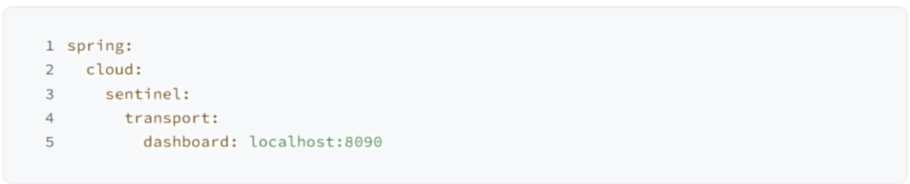
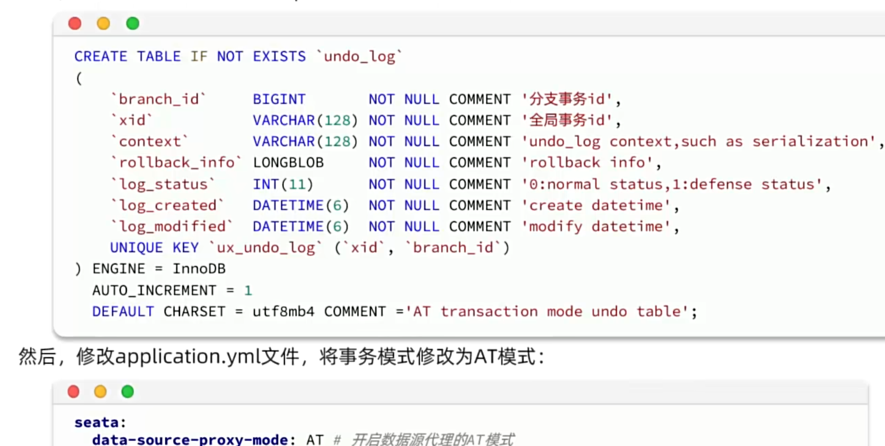
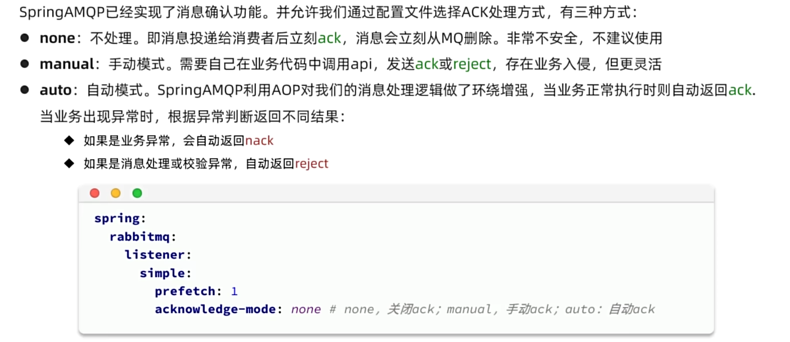
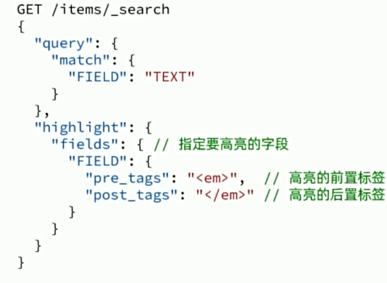

### 概述

微服务是一种软件架构风格，是实现分布式的模式之一

需要解决的问题：

- 服务拆分
- 远程调用
- 服务治理
- 请求路由
- 身份认证
- 配置管理
- 服务保护
- 分布式事务
- 异步通信
- 消息可靠性
- 延迟消息
- 分布式搜索
- 倒排索引
- 数据聚合


### MySQL 进阶


#### DQL 执行顺序

对于语句：

```mysql
SELECT [DISTINCT] ... FROM ... [JOIN ... ON ...] WHERE ... GROUP BY ... HAVING ... ORDER BY ... LIMIT ...
```

其执行顺序为：

```mysql
FROM ... [JOIN ... ON ...] WHERE ... GROUP BY ... HAVING ... SELECT [DISTINCT] ... ORDER BY ... LIMIT ....
```

关键点在于`SELECT`子句在`GROUP BY HAVING`子句后才执行

SQL执行顺序影响包括

- 字段和别名
- 聚合函数
- 子查询

如以下示例展示了错误用法：

-  ```mysql
   SELECT alias_name AS an FROM user WHERE an = 'admin'
   ```

  `SELECT`子句中定义的字段别名`an`无法在`WHERE`子句中使用，但却可以在`ORDER BY`子句中使用

- ```mysql
  SELECT gender FROM user WHERE sum(gender) > 100
  ```

  无法再`WHERE`子句中使用聚合函数，但可以在`HAVING`子句中使用聚合函数，如`SELECT gender FROM user GROUP BY gender HAVING sum(gender) > 100`


#### 流程函数

在MySQL中可以使用流程函数实现复杂的条件分支语句

- `IF(expr, true_value, false_value)`

  如果表达式`expr`为真（非0且非NULL），返回`true_value`，否则返回`false_value`

- `IFNULL(expr1, expr2)`

  如果`expr1`不为NULL，返回`expr1`；否则返回`expr2`

- `NULLIF(expr1, expr2)`

  如果`expr1 = expr2`成立，返回NULL；否则返回`expr1`

- `CASE value WHEN value1 THEN result1 ... ELSE default_result END`

  对`value`进行匹配指定值并返回指定值，否则当无一匹配时返回默认值

- `CASE WHEN condition1 THEN result1 ... ELSE default_result END`

  判断条件以返回指定值，否则当无一条件为真时返回默认值

- `COALESCE(value1, value2, ..., valueN)`

  返回第一个非NULL的值


#### 事务的ACID

##### 原子性

事务中的所有操作是一个不可分割的最小工作单位。它们要么全都成功，要么全部失败

##### 一致性

事务执行的结果必须使数据库从一个一致状态转换到另一个一致状态

即使事务执行中途失败或者并发执行多个事务时，一致性也必须保证

一致性包括：符合所有预定义规则、约束，如主键唯一性、外键约束、数据类型、业务规则等

##### 隔离性

多个并发执行的事务应该相互隔离，使得每个事务感知不到有其他事务在同时执行。一个事务的中间状态不应该被其他并发事务感知

##### 持久性

一旦一个事务成功提交，它对数据库所做的修改就是永久性的


#### 并发事务隔离性

并发事务的隔离性保障通常不绝对，这是因为较强的隔离性往往需要牺牲更多的性能

MySQL提供四种级别的事务隔离，从低到高依次是：

- 读未提交 `READ UNCOMMITED`
- 读已提交 `READ COMMITED`
- 可重复读 `REPEATABLE READ`
- 串行化 `SERIALIZABLE`

通过变量`TRANSACTION_ISOLATION`查看事务隔离级别

```mysql
SELECT @@TRANSACTION_ISOLATION;
```

通过以下语句设置当前会话或全局的事务隔离级别

```mysql
SET [SESSION|GLOBAL] TRANSACTION ISOLATION LEVEL [READ UNCOMMITED|READ COMMITED|REPEATABLE READ|SERIALIZABLE];
```


#### 并发事务问题

##### 脏读 Dirty Read

一个事务A读取了另一个事务B未提交的写数据（插入/更新/删除）

MySQL“读未提交”隔离级别下可发生脏读问题

如果事务B最终回滚，那么事务A读取到的数据是无效的

如果事务B进行了多次写操作，那么事务A读取到的数据可能是不一致的

示例1：

| 时间 | 事务A                     | 事务B               |
| ---- | ------------------------- | ------------------- |
| 0    | 开始事务                  | 开始事务            |
| 1    | 更新Alice余额字段值 -1000 |                     |
| 2    |                           | 查询Alice余额字段值 |
| 3    | 回滚                      |                     |
| 4    |                           | 提交                |

在该示例中事务B将读取到事务A未提交的值

示例2：

| 时间 | 事务A                     | 事务B                        |
| ---- | ------------------------- | ---------------------------- |
| 0    | 开始事务                  | 开始事务                     |
| 1    | 更新Alice余额字段值 -1000 |                              |
| 2    |                           | 查询Alice、Bob余额字段统计值 |
| 3    | 更新Bob余额字段值 +1000   |                              |
| 4    | 提交                      | 提交                         |

在该示例中事务B将读取到中间结果

##### 不可重复读 Non-repeatable Read

事务A两次读取同一数据之间，事务B对该数据进行了写操作（更新、插入、删除）并提交，导致事务A两次读取的结果不同

MySQL“读未提交”、“读已提交”隔离级别下可发生不可重复读问题

示例1：

| 时间 | 事务A                     | 事务B               |
| ---- | ------------------------- | ------------------- |
| 0    | 开始事务                  | 开始事务            |
| 1    | 更新Alice余额字段值 -1000 |                     |
| 2    |                           | 查询Alice余额字段值 |
| 3    | 提交                      |                     |
| 4    |                           | 查询Alice余额字段值 |
| 5    |                           | 提交                |

在该示例中事务B的两次查询的结果不相等

##### 幻读 Phantom Read

- 解释1（主流）：事务A两次读取同一批数据集之间，事务B对该数据集进行了插入或删除操作并提交，导致事务A两次读取的结果不同

  实质上属于“不可重复读”的一种特殊形式

  MySQL“读未提交”、“读已提交”隔离级别下可发生上述幻读问题

  SQL标准允许”可重复读“隔离级别下发生幻读问题，但MySQL的”可重复读“隔离级别可避免上述情况下的幻读问题

  示例1：

  | 时间 | 事务A     | 事务B          |
  | ---- | --------- | -------------- |
  | 0    | 开始事务  | 开始事务       |
  | 1    |           | 查询user表行数 |
  | 2    | 插入行Bob |                |
  | 3    | 提交      |                |
  | 4    |           | 查询user表行数 |
  | 5    |           | 提交           |

  在MySQL中上述示例事务B的两次查询结果相同

- 解释2（少见）：事务A读取某行数据不存在，事务A在插入该行数据前事务B插入了该行数据并提交，导致事务A插入失败，但事务A仍无法读取该行数据

  MySQL“可重复读”隔离级别下可发生上述情况下的幻读问题，对于“读未提交”和“读已提交”隔离级别，事务A在插入失败后可成功读取该行数据

  示例2：

  | 时间 | 事务A             | 事务B             |
  | ---- | ----------------- | ----------------- |
  | 0    | 开始事务          | 开始事务          |
  | 1    | 查询行Bob是否存在 | 查询行Bob是否存在 |
  | 2    | 插入行Bob         |                   |
  | 3    | 提交              |                   |
  | 4    |                   | 插入行Bob         |

  在MySQL中上述示例事务B的插入操作将因为唯一键约束失败

在“串行化”隔离级别下，读写、写写操作间将互相阻塞直到一方提交或回滚，幻读问题将被避免

##### 丢失更新 Lost Update

两个事务在读取同一数据后同时对该数据进行修改，先提交的事务的修改将被后提交的事务的修改覆盖

##### 回滚覆盖 Rollback Lost Update

又称回滚丢失、撤销失效、第一类丢失更新

一个事务回滚时覆盖了另一个事务提交的数据

##### 脏写 Dirty Write

一个事务修改并覆盖了另一个事务尚未提交的写操作

##### 写偏 Write Skew

又称写偏斜

两个或多个数据各自读取一组数据，并各自独立地根据这些数据进行写操作

示例1：

| 时间 | 事务A                           | 事务B                           |
| ---- | ------------------------------- | ------------------------------- |
| 0    | 开始事务                        | 开始事务                        |
| 1    | 查询房间1在指定时间段的预定情况 | 查询房间1在指定时间段的预定情况 |
| 2    | 插入房间1新预定行               |                                 |
| 3    |                                 | 插入房间1新预定行               |
| 4    | 提交                            | 提交                            |

上述示例中满足可重复读，但最终同一时间段可能被重复预定，对于整体而言数据最终不一致


### Redis


#### 概述

Redis，全称Remote Dictionary Server，是一个基于内存的NoSQL键值数据库

NoSQL的特点：

- 非结构化
- 关联性差
- 非SQL
- 基本事务或无事务支持

Redis是单线程的，命令具备原子性，Redis 6之后更新了对网络处理的多线程处理

Redis支持持久化、主从集群、分片集群

可在[官方文档](https://redis.io/docs/latest/)中查找基本教程或所有命令

#### Docker部署

```bash
docker pull redis
docker run --name <my-redis-name> -p 6379:6379 -d redis
docker exec -it <redis-container-id> bash
redis-cli
```

#### 图形化客户端

Windows可参考[Another Redis Desktop Manager](https://github.com/qishibo/AnotherRedisDesktopManager)

或可使用JetBrains的DataGrip或IDEA自带的客户端

#### 数据结构与命令

##### 概述

key一般是String类型

value的常见类型包括：

- String

- Hash

  `{name: "FOOBAR", age: 18}`

- List

  `[A -> B -> C]`

- Set

  `{A, B, C}`

- SortedSet

  `{A: 1, B: 2, C: 3}`

- GEO

  `{A: (123.4, 567,8) }`

- BitMap

  `01001101`

- HyperLog

  `01001101`

前五种为基本类型

##### Key的结构

key可以通过使用符号`:`形成多层级结构，可用于实现命名空间

##### 通用命令

- HELP [command]

  查询一个命令的使用方式

- KEYS [pattern]

  查找匹配pattern的key，可用于模糊查询，性能较差，易造成服务器阻塞

- EXISTS [key ...]

  查找一个或多个key是否存在，返回值为integer

- EXPIRE [key] [seconds]

  设置key的有效期

- TTL [key]

  查询key的剩余有效期，返回-1表示永久，-2表示已删除

- DEL [key ...]

  删除一个或多个key

##### String类型及命令


##### Hash类型及命令

Hash类型的Value是一个无序字典，以`field`为键，以`value`为值


##### List类型及命令

List类型的value是一个双向链表，特点是有序、可重复元素、插入和删除性能高、查询速度性能较差

可用于实现列表、栈、队列/阻塞队列


注意LPUSH等命令插入多个元素时，按顺序逐个插入，这将导致实际的顺序与字面相反

##### Set类型及命令

Set类型的value相当于field的value为null的Hash，具有无序、元素不可重复、高性能、支持集合运算等特点


##### SortedSet类型及命令

SortedSet是一个可排序的集合，基于跳表和哈希表实现，基于元素的score来排序，具有可排序、元素不可重复、查询速度快等特点


注意上述命令均是升序，使用`REV`使该命令按降序执行，如ZREVRANK是ZRANK的降序

#### Java客户端

常用Java客户端

- Jedis

  简单易用，线程不安全，需要连接池

- Lettuce

  基于Netty实现，支持同步、异步、响应式，线程安全，支持哨兵模式、集群模式、管道模式

- Redission

  基于Redis实现分布式、可伸缩的数据结构集合

Spring Data Redis：兼容层，内部基于Jedis或Lettuce实现，提供统一的API

#### Jedis

访问[官网](https://github.com/redis/jedis)查找更多信息

#### Spring Data Redis

##### 概述

- 支持基于不同Redis客户端
- 提供统一API
- 支持Redis发布订阅模型
- 支持Redis哨兵
- 支持Redis集群
- 支持响应式
- 支持序列化和反序列化
- 支持基于Redis的JDK集合实现


##### HelloWorld

添加依赖

```xml
<dependency>
    <groupId>org.springframework.boot</groupId>
    <artifactId>spring-boot-starter-data-redis</artifactId>
</dependency>
```

配置信息

```properties
spring.data.redis.host=localhost
spring.data.redis.port=6379
# spring.data.redis.password= # if need
spring.data.redis.database=0
```

自动装配

```java
@Autowired
private RedisTemplate<String, String> redisTemplate;

@PostMapping("/hello")
public String hello(@RequestParam String value) {
    this.redisTemplate.opsForValue().set("hello", value);
    return this.redisTemplate.opsForValue().get("hello");
}

@GetMapping("/hello")
public String hello() {
    return this.redisTemplate.opsForValue().get("hello");
}
```

##### 序列化

在自动装配时指定泛型将影响序列化操作

使用`RedisTemplate<String, String>`不会自动序列化，而使用`RedisTemplate<Object, Object>`默认使用JDK序列化key和value，导致乱码现象，且存在隐患

参考配置，以支持使用String的getBytes和Jackson进行序列化


或可以使用自动装配`StringRedisTemplate`，默认使用String以避免复杂的序列化

#### 数据缓存

##### 概述


##### 流程

1. 根据键或条件从Redis中查询缓存
   - 如果缓存命中则返回
2. 缓存未命中，根据键或条件中数据库中查询
   - 未查询到结果，直接返回，或可将无结果信息缓存后再返回
3. 查询到结果，缓存并返回

##### 一致性问题与缓存更新策略

使用缓存更新策略解决一致性问题

- 内存淘汰

  Redis使用可指定的策略在内存不足时对部分数据进行淘汰

- 超时剔除

  通过给缓存增加TTL时间，到期自动删除

- 主动更新

  在修改数据库的时候更新缓存

主动更新的常见实现方案

1. Cache Aside Pattern（双写）由缓存的调用者在更新数据库时同时更新缓存
2. Read/Write Through Pattern 将缓存和数据库整合为一个服务，由服务维护一致性
3. Write Behind Caching Pattern（写回）调用者只操作缓存，由其他线程异步地将数据持久化到数据库

双写需要注意的事项：

- 数据库更新时建议删除缓存而不是更新缓存

- 通过事务保障双写操作的原子性

- 删除缓存与更新数据库的操作的先后顺序对数据不一致性均有影响

  

  


### Docker


#### 概述

https://docs.docker.com


```bash
docker run -d --name mysql3306 -p 3306:3306 -e TZ=Asia/Shanghai -e MYSQL_ROOT_PASSWORD=123456 mysql
```

- `run -d` 在后台运行
- `--name mysql3306` 容器名称
- `-p 3306:3306`  容器宿主机端口到容器端口的映射
- `-e KEY=VALUE` 环境变量，参考各镜像文档说明
- `mysql` 镜像名称，此处为简写，完整镜像名称为 `[respository]:[tag]`，如`mysql:5.7`，tag默认值为`lastest`，如`mysql`相当于`mysql:lastest`


#### 常用命令

- `docker pull` 从远程镜像仓库拉取镜像到本地
- `docker push` 将本地镜像推送到远程镜像仓库
- `docker images` 查看本地镜像
- `docker rmi` 删除本地镜像
- `docker build` 构建自定义镜像
- `docker save` 保存镜像为文件
- `docker load` 加载文件为镜像
- `docker run` 从镜像创建并运行容器
- `docker start` 运行容器
- `docker stop` 停止容器
- `docker ps` 查看容器
- `docker rm` 删除容器
- `docker logs` 查看容器日志
- `docker exec` 在容器中执行


#### 数据卷 volume

由于在容器内管理文件和文件内容较为繁琐，可使用数据卷进行映射


有关命令

- `docker volume create` 创建数据卷
- `docker volume ls` 查看数据卷
- `docker volumn rm` 删除数据卷
- `docker volumn inspect` 查看数据卷详情
- `docker volumn prune` 删除未使用的数据卷
- `docker run -v [数据卷名]:[容器内目录]` 挂载数据卷，如果数据卷不存在则创建
- `docker run -v [宿主机目录]:[容器内目录]` 挂载数据卷并指定数据卷所在目录

```bash
docker run -d --name nginx -p 80:80 -v outer:/usr/share/nginx/html nginx
```

数据卷默认位于`/var/lib/docker/volumes`

可以在`docker run`命令中使用多个`-v`挂载多个目录到数据卷

在`docker inspect [容器名]`的输出结果的`Mounts`中查看挂载情况

部分镜像默认存在数据卷挂载，如mysql，但mysql使用的是匿名卷，每次新建容器都会创建一个唯一ID作为名称的数据卷

> [!NOTE]
>
> 如果使用的是Windows上的Docker Desktop，那么简单的`-v name:/path`无法直接通过访问本地磁盘文件或WSL的发行版Linux系统中的文件来访问数据卷，而是需要通过访问`\\wsl$\docker-desktop`或`\\wsl$\docker-desktop-data`（视具体Docker Desktop版本而定）
>
> 在较高的Docker Desktop版本中，WSL发行版`docker-desktop-data`可能不在使用，而是仅使用`docker-desktop`，此时数据卷的位置可能位于`docker-desktop`的`/mnt/docker-desktop-disk/data/docker/volumes`


#### 自定义镜像


`Dockerfile`是由一系列指定构成的文本文件，用于说明如何构建镜像

常见指令

- `FROM [respository]:[tag]` 指定基础镜像 
- `ENV [KEY]=[VALUE]` 指定环境变量
- `COPY [src] [dest]` 复制指定本地文件到镜像
- `RUN [shell]` 执行shell命令
- `EXPOSE [port]` 暴露端口
- `ENTRYPOINT [shell]` 启动命令

```dockerfile
FROM ubuntu:16.04
ENV JAVA_DIR=/usr/local
COPY ./jdk8.tar.gz $JAVA_DIR/
COPY ./app.jar /temp/app.jar
RUN cd $JAVA_DIR && tar -xf ./jdk8.tar.gz && mv ./jdk1.8.0_144 ./java8
ENV JAVA_HOME=$JAVA_DIR/java8
ENV PATH=$PATH:$JAVA_HOME/BIN
ENTRYPOINT ["java","-jar","/app.jar"]
```

```dockerfile
FROM openjdk:11.0-jre-buster
COPY ./app.jar /temp/app.jar
ENTRYPOINT ["java","-jar","/app.jar"]
```

构建自定义镜像

```bash
docker build -t [respository]:[tag] [path]
```

```bash
docker build -t myapp:1.0 .
```

`-t [respository]:[tag]` 对该镜像进行命名

`path` `Dockerfile`的所在路径


#### 容器网络

所有容器位于`127.17.0.0/16`，网关为`127.17.0.1`作为虚拟网桥

容器的IP是动态分配的

自定义容器网络

自定义网络可以让容器间通过容器名而不是IP进行网络访问（因为存在内置DNS）

- `docker network create` 创建网络
- `docker network ls` 查看网络
- `docker network rm` 删除网络
- `docker network prune` 删除未使用的网络
- `docker network connect` 指定容器连接网络
- `docker network disconnect` 指定容器断开网络
- `docker network inspect` 查看网络详情
- `docker run --network [网络名称]` 指定网络


#### DockerCompose

通过`docker-compose.yml`来定义一组容器的部署


### 微服务概述


#### 问题与背景

单体架构在大型项目中的暴露出的问题

- 团队协作
- 构建、打包、发布
- 可用性
- 系统资源

具体而言包括：

- 代码业务功能之间耦合严重
- 小规模改动也需要大规模构建和重新部署
- 高负载业务功能难以水平扩展按需伸缩
- 单一技术栈导致项目技术僵化
- 开发团队过大导致沟通与协作困难
- 单一功能故障影响应用全局


微服务：

- 服务的粒度更小
- 团队自治
- 服务自治


SpringCloud是一款热门的微服务框架，其集成了大量的已有的优秀的微服务组件

- 服务注册发现
  - `Eureka`
  - `Nacos`
  - `Consul`
- 服务远程调用
  - `OpenFeign`
  - `Dubbo`
- 服务链路监控
  - `Zipkin`
  - `Sleuth`
- 统一配置管理
  - `SpringCloudConfig`
  - `Nacos`
- 统一网关路由
  - `SpringCloudGateway`
  - `Zuul`
- 流控、降级、保护
  - `Hystix`
  - `Sentinel`


Spring Cloud对微服务组件制定了统一的标准，各公司提供了实现标准的组件集，如Spring Cloud Alibaba


#### HelloWorld for Spring Cloud Alibaba

Spring Cloud Alibaba（简称SCA）是阿里巴巴提供的一套成熟的技术栈，参考[Spring官方文档](https://spring.io/projects/spring-cloud-alibaba)和[阿里云官方文档](https://sca.aliyun.com/)

1. 使用 spring initializer / IDEA-新建项目-Spring Boot 工具创建 Spring Boot 3 项目

2. 删除源码文件，更改POM为聚合项目

   - 继承`spring-boot-starter-parent`
   - 声明子模块
   - 声明依赖管理`spring-cloud-dependencies`和`spring-cloud-alibaba-dependencies`

   ```xml
   <?xml version="1.0" encoding="UTF-8"?>
   <project xmlns="http://maven.apache.org/POM/4.0.0" xmlns:xsi="http://www.w3.org/2001/XMLSchema-instance"
            xsi:schemaLocation="http://maven.apache.org/POM/4.0.0 https://maven.apache.org/xsd/maven-4.0.0.xsd">
       <modelVersion>4.0.0</modelVersion>
   
       <parent>
           <groupId>org.springframework.boot</groupId>
           <artifactId>spring-boot-starter-parent</artifactId>
           <version>3.2.4</version>
           <relativePath/>
       </parent>
   
       <groupId>com.crim.web.lab</groupId>
       <artifactId>SpringCloudAlibabaHelloWorld</artifactId>
       <version>0.0.1-SNAPSHOT</version>
       <packaging>pom</packaging>
   
       <name>Spring Cloud Alibaba HelloWorld</name>
       <description>Spring Cloud Alibaba HelloWorld</description>
   
       <!-- 子模块声明 -->
       <modules>
   
       </modules>
   
       <!-- 属性声明 -->
       <properties>
           <java.version>17</java.version>
           <spring-boot.version>3.2.4</spring-boot.version>
           <spring-cloud.version>2023.0.1</spring-cloud.version>
           <spring-cloud-alibaba.version>2023.0.1.0</spring-cloud-alibaba.version>
       </properties>
   
       <!-- 依赖管理声明 -->
       <dependencyManagement>
           <dependencies>
               <!-- Spring Cloud -->
               <dependency>
                   <groupId>org.springframework.cloud</groupId>
                   <artifactId>spring-cloud-dependencies</artifactId>
                   <version>${spring-cloud.version}</version>
                   <type>pom</type>
                   <scope>import</scope>
               </dependency>
               <!-- Spring Cloud Alibaba -->
               <dependency>
                   <groupId>com.alibaba.cloud</groupId>
                   <artifactId>spring-cloud-alibaba-dependencies</artifactId>
                   <version>${spring-cloud-alibaba.version}</version>
                   <type>pom</type>
                   <scope>import</scope>
               </dependency>
           </dependencies>
       </dependencyManagement>
   
   </project>
   ```

3. 使用 spring initializer / IDEA-新建模块-Spring Boot 工具创建 Spring Boot 3 子模块

4. 修改POM使其继承自聚合模块

   ```xml
   <?xml version="1.0" encoding="UTF-8"?>
   <project xmlns="http://maven.apache.org/POM/4.0.0" xmlns:xsi="http://www.w3.org/2001/XMLSchema-instance"
            xsi:schemaLocation="http://maven.apache.org/POM/4.0.0 https://maven.apache.org/xsd/maven-4.0.0.xsd">
       <modelVersion>4.0.0</modelVersion>
       
       <parent>
           <groupId>com.crim.web.lab</groupId>
           <artifactId>SpringCloudAlibabaHelloWorld</artifactId>
           <version>0.0.1-SNAPSHOT</version>
       </parent>
       
       <groupId>com.crim.web.lab.scahelloworld</groupId>
       <artifactId>helloworld</artifactId>
       <version>0.0.1-SNAPSHOT</version>
       
       <name>Hello World</name>
       <description>Hello World</description>
       
       <dependencies>
           <dependency>
               <groupId>org.springframework.boot</groupId>
               <artifactId>spring-boot-starter-web</artifactId>
           </dependency>
   
           <dependency>
               <groupId>org.springframework.boot</groupId>
               <artifactId>spring-boot-starter-test</artifactId>
               <scope>test</scope>
           </dependency>
       </dependencies>
   
       <build>
           <plugins>
               <plugin>
                   <groupId>org.springframework.boot</groupId>
                   <artifactId>spring-boot-maven-plugin</artifactId>
               </plugin>
           </plugins>
       </build>
   
   </project>
   ```

5. 进行依赖管理与声明

6. 编写简单的接口和业务代码

7. 启动子模块服务，在IDEA服务-添加-运行配置-Spring Boot中添加该启动配置

8. 可修改更多的服务启动配置项，实现多实例部署等高级部署形式


#### 依赖管理与版本对照

上述章节中提到的对`spring-cloud-dependencies`和`spring-cloud-alibaba-dependencies`POM的导入的核心作用是导入这些POM所定义的`dependencyManagement`，即Spring Cloud和Spring Cloud Alibaba已经定义了一系列微服务组件及框架、库的版本，通过导入这些POM避免繁杂的依赖版本兼容性确认

通过参考文档中Spring Boot、Spring Cloud、Spring Cloud Alibaba版本之间的对应关系进行声明：

- [Spring Cloud与Spring Boot版本对应关系](https://spring.io/projects/spring-cloud)

- [Spring Boot、Spring Cloud、Spring Cloud Alibaba版本对应关系](https://sca.aliyun.com/docs/2023/overview/version-explain/)

- [Spring Cloud 2023.0 依赖版本声明](https://github.com/spring-cloud/spring-cloud-release/wiki/Spring-Cloud-2023.0-Release-Notes)

如 Spring Cloud 2023.0 声明以下依赖版本

- Spring Cloud Vault `4.1.1` ([issues](https://github.com/spring-cloud/spring-cloud-vault/releases/tag/v4.1.1))
- Spring Cloud Bus `4.1.1` ([issues](https://github.com/spring-cloud/spring-cloud-bus/releases/tag/v4.1.1))
- Spring Cloud Zookeeper `4.1.1` ([issues](https://github.com/spring-cloud/spring-cloud-zookeeper/releases/tag/v4.1.1))
- Spring Cloud Kubernetes `3.1.1` ([issues](https://github.com/spring-cloud/spring-cloud-kubernetes/releases/tag/v3.1.1))
- Spring Cloud Task `3.1.1` ([issues](https://github.com/spring-cloud/spring-cloud-task/releases/tag/v3.1.1))
- Spring Cloud Function `4.1.1` ([issues](https://github.com/spring-cloud/spring-cloud-function/releases/tag/v4.1.1))
- Spring Cloud Commons `4.1.2` ([issues](https://github.com/spring-cloud/spring-cloud-commons/releases/tag/v4.1.2))
- Spring Cloud Openfeign `4.1.1` ([issues](https://github.com/spring-cloud/spring-cloud-openfeign/releases/tag/v4.1.1))
- Spring Cloud Circuitbreaker `3.1.1` ([issues](https://github.com/spring-cloud/spring-cloud-circuitbreaker/releases/tag/v3.1.1))
- Spring Cloud Starter Build `2023.0.1` ([issues](https://github.com/spring-cloud/spring-cloud-starter-build/releases/tag/v2023.0.1))
- Spring Cloud Stream `4.1.1` ([issues](https://github.com/spring-cloud/spring-cloud-stream/releases/tag/v4.1.1))
- Spring Cloud Gateway `4.1.2` ([issues](https://github.com/spring-cloud/spring-cloud-gateway/releases/tag/v4.1.2))
- Spring Cloud Consul `4.1.1` ([issues](https://github.com/spring-cloud/spring-cloud-consul/releases/tag/v4.1.1))
- Spring Cloud Contract `4.1.2` ([issues](https://github.com/spring-cloud/spring-cloud-contract/releases/tag/v4.1.2))
- Spring Cloud Config `4.1.1` ([issues](https://github.com/spring-cloud/spring-cloud-config/releases/tag/v4.1.1))
- Spring Cloud Build `4.1.1` ([issues](https://github.com/spring-cloud/spring-cloud-build/releases/tag/v4.1.1))
- Spring Cloud Netflix `4.1.1` ([issues](https://github.com/spring-cloud/spring-cloud-netflix/releases/tag/v4.1.1))


### 服务拆分


原则

- 高内聚
- 低耦合


方式

- 纵向拆分/垂直拆分

  按业务模块拆分

- 横向拆分/水平拆分

  抽取公共服务


工程结构

- 独立Project

  独立开发流程（团队、版本管理、项目管理），数据独立

- Maven聚合

  无业务模块间依赖声明，代码分离人不分离，数据独立


注意事项：

各服务间数据隔离，严禁共用Entity类、Mapper

配置`spring.application.name`指定服务名称

IDEA服务栏可选择多个服务进行启动，也可使单个服务启动多个实例


### 服务治理

- 服务调用者需要动态的获取服务提供者
- 需要处理服务提供者状态的变更
- 多个相同服务提供者实例应负载均衡


#### 注册中心

- 服务注册

  服务提供者向注册中心注册自己的服务

- 服务发现

  服务消费者向注册中心获取所需的服务


注册中心组件

- Nacos 由阿里巴巴开发，集成于Spring Cloud Alibaba
- Eureka Netflix公司开发


Nacos作为一个单独服务运行，本身也需要数据源，可使用MySQL

服务端口：

- 8848
- 9848
- 9849

后台面板 `http://[ip]:8848/nacos`


#### 服务注册


#### 服务发现


#### Nacos

##### 概述

[Nacos官方文档](https://nacos.io/docs/latest/overview/)

Nacos `/nɑ:kəʊs/` 是 `Dynamic Naming and Configuration Service` 的首字母简称，提供了一组简单易用的特性，用于快速实现动态服务发现、服务配置、服务元数据、流量管理等功能

Nacos支持大多数主流服务发现、配置、管理：

- [Kubernetes Service](https://kubernetes.io/docs/concepts/services-networking/service/)
- [gRPC](https://grpc.io/docs/guides/concepts.html#service-definition)
- [Dubbo RPC Service](https://dubbo.apache.org/)
- [Spring Cloud RESTful Service](https://spring.io/projects/spring-cloud)
- [Model Context Protocol](https://modelcontextprotocol.io/introduction)

##### 技术架构


##### 数据模型

Nacos 数据模型由三元组唯一确定，分别是命名空间（Namespace），分组（Group）和资源名；其中资源名按照功能模块的不同，可以分为服务名（ServiceName），配置名（DataId）和MCP服务（McpName）


其中`DataId`采取`package.class`（如`com.example.chat.ai.log.level`）的命名规则保证全局唯一性，包含小写字母和`-`、`_`、`.`、`:`符号，不超过256字节

`Group`建议采取`产品名:模块名`（如`com.example.chat:ai`）保证全局唯一性，只允许英文字符和`-`、`_`、`.`、`:`符号，不超过128字节

##### 部署模式

Nacos提供了两种部署模式：单机模式和集群模式


单机模式适用于开发和测试环境，默认使用Derby内置数据库

集群模式适用于生产环境，默认使用外部数据库

##### 访问方式

Nacos提供了多种环境（Java、Go、Python等）下的客户端依赖，用于微服务实例访问Nacos

Java SDK参考[github项目地址](https://github.com/alibaba/nacos)或[官方文档](https://nacos.io/docs/latest/ecology/use-nacos-with-spring-cloud/)

Nacos 3.0提供了多种类型的Open API：

- Client Open API：用于客户端、服务实例，保障返回结果的一致性和较短的响应时间及性能
- Admin Open API：用于运维或管理、监控、审计，用于不保证确定性的大规模数据检索等场景
- Console Open API：用于控制台

Nacos Open API访问协议包括：

- gRPC：用于Client Open API以保障性能
- HTTP 1.1：用于所有类型的API以提供兼容性

##### HelloWorld for Nacos

1. 使用Docker部署单机Nacos（使用Derby内嵌数据库），并指定访问令牌生成密钥、身份认证Key和Value

   ```bash
   docker run --name nacos -e MODE=standalone -e NACOS_AUTH_TOKEN=${your_nacos_auth_secret_token} -e NACOS_AUTH_IDENTITY_KEY=${your_nacos_server_identity_key} -e NACOS_AUTH_IDENTITY_VALUE=${your_nacos_server_identity_value} -p 8080:8080 -p 8848:8848 -p 9848:9848 -p 9849:9849 -d nacos/nacos-server:latest
   ```

   由于部分端口常被占用，建议更改端口映射

   其中`8848`、`9848`、`9849`端口通常应对外开放

2. 访问Web控制台（`http://ip:8080/`或`http://ip:8848/nacos`），修改控制台用户密钥

3. 对需要进行服务注册和发现的子模块引入依赖（前置参考[HelloWorld for Spring Cloud Alibaba](#HelloWorld for Spring Cloud Alibaba)章节）

   ```xml
   <dependency>
       <groupId>com.alibaba.cloud</groupId>
       <artifactId>spring-cloud-starter-alibaba-nacos-discovery</artifactId>
   </dependency>
   ```

4. 配置服务名和Nacos地址

   注意服务名不应包括非法字符（如空格）

   ```properties
   spring.application.name=HelloWorld
   spring.cloud.nacos.server-addr=127.0.0.1:8848
   ```

5. 新增配置`@EnableDiscoveryClient`（非必须）

   ```java
   @Configuration
   @EnableDiscoveryClient
   public class GlobalConfig {
   }
   ```

6. 启动服务实例，访问Web控制台或调用HTTP接口以确认服务实例被注册

   ```http
   GET http://127.0.0.1:8848/nacos/v3/client/ns/instance/list?serviceName=HelloWorld
   ```

7. 简单的手动服务发现与负载均衡测试

   ```java
   @Autowired
   private DiscoveryClient discoveryClient;
   
   @RequestMapping("/rc/test2")
   public String rcTest2(
           @RequestParam(value = "port", required = false, defaultValue = "8180") Integer port,
           @RequestParam(value = "time", required = false, defaultValue = "5000") Integer time
   ) {
       List<ServiceInstance> instances = discoveryClient.getInstances("Provider");
       log.debug("service \"Provider\" instances : {}", instances);
       if (instances.isEmpty()) {
           return "No service \"Provider\" instances found";
       }
       String url = instances.get(new Random().nextInt(instances.size())).getUri().toString() + "/test?time={time}";
       try {
           String result = RestClient.create().get()
                   .uri(url, Map.of("time", time))
                   .retrieve().body(String.class);
           return "Response from \"" + url + "\" : " + result;
       }
       catch (RuntimeException e) {
           return "Error from \"" + url + "\" : " + e;
       }
   }
   ```


##### 端口

- 8080 用于Web控制台，在Nacos 2.X中控制台的位置位于端口8848的`/nacos`路径
- 8848 主端口，用于服务注册、发现、管理
- 9848 用于RPC协议
- 9849 用于RPC协议
- 7848 用于集群间通讯


### 远程调用


#### 概述

使用普通的HTTP客户端进行远程调用

示例

服务hellworld [8081/8082]

```java
@RequestMapping("/rc/test")
public String rcTest(
        @RequestParam(value = "port", required = false, defaultValue = "8180") Integer port,
        @RequestParam(value = "time", required = false, defaultValue = "5000") Integer time) {
    String url = "http://localhost:" + port + "/test?time={time}";
    try {
        String result = RestClient.create().get()
                .uri(url, Map.of("time", time))
                .retrieve().body(String.class);
        return "Response from \"" + url + "\" : " + result;
    }
    catch (RuntimeException e) {
        return "Error from \"" + url + "\" : " + e;
    }
}
```

服务provider [8180/8181/8182]

```java
@RequestMapping("/test")
public String test(@RequestParam(value = "time", required = false, defaultValue = "5000") Integer time) {
    try {
        Thread.sleep(time);
    }
    catch (InterruptedException e) {
        log.error("error", e);
    }
    return "Provider Test : time delay = " + time + "ms";
}
```

示例请求

```http
get http://localhost:8081/rc/test?port=8182&time=1000
```

多实例部署可便于：

- 提高可用性，避免单一服务崩溃导致应用全局不可用
- 渐进式发布，避免同时更新导致的服务短暂不可用或更新失败服务回滚影响业务全局

但是上述示例仍需要解决：

- 服务注册与发现

  一个服务需要能够知道其他服务的地址与状态

- 负载均衡

  多个实例的负载应均衡

- 代码重复

  应避免重复编写HTTP接口调用代码


#### OpenFeign

##### 概述

OpenFeign是一个声明式的HTTP客户端，通过Java到HTTP端点的绑定实现便捷的HTTP调用

[OpenFeign Github](https://github.com/OpenFeign/feign)

[Spring Cloud OpenFeign 文档](https://spring.io/projects/spring-cloud-openfeign#overview)

如果需要Spring Cloud LoadBalancer，可参考[Spring Cloud LoadBalancer 文档](https://docs.spring.io/spring-cloud-commons/reference/spring-cloud-commons/loadbalancer.html)

OpenFeign技术概览


##### HelloWorld for OpenFeign

1. 在需要的子模块-POM-添加启动器-Spring Cloud Routing选中OpenFeign和LoadBalancer依赖（前置参考[HelloWorld for Nacos](#HelloWorld for Nacos)章节），或手动修改POM添加OpenFeign和LoadBalancer依赖

   LoadBalancer通常是必须的，否则OpenFeign无法正常初始化Bean

   ```xml
   <dependency>
       <groupId>org.springframework.cloud</groupId>
       <artifactId>spring-cloud-starter-openfeign</artifactId>
   </dependency>
   <dependency>
       <groupId>org.springframework.cloud</groupId>
       <artifactId>spring-cloud-starter-loadbalancer</artifactId>
   </dependency>
   ```

2. 配置`EnableFeignClients`注解并定义HTTP客户端的包

   如果未定义包可能会导致`@FeignClient`无法正确地被扫描（`EnableFeignClients`默认扫描其所在类的包及其子包）

   ```java
   @EnableFeignClients("com.example.helloworld.client")
   public class GlobalConfig {
   }
   ```

3. 编写HTTP客户端，可以使用Spring MVC提供的注解

   习惯上可以将HTTP客户端类置于`client`包中

   ```java
   @FeignClient(name = "Provider")
   public interface ProviderServiceClient {
       
       @GetMapping("/test")
       String test(@RequestParam(value = "time", required = false, defaultValue = "5000") Integer time);
       
   }
   ```

4. 自动装配并调用

   ```java
   @Autowired
   private ProviderServiceClient providerServiceClient;
   
   @RequestMapping("/rc/test3")
   public String rcTest3(
           @RequestParam(value = "time", required = false, defaultValue = "5000") Integer time
   ) {
       try{
           return "Response from \"Provider\" : "+providerServiceClient.test(time);
       }
       catch (RuntimeException e) {
           return "Error from \"Provider\" : " + e;
       }
   }
   ```

5. 进行简单的HTTP调用测试，并动态地增减服务实例

   ```http
   GET http://localhost:8081/rc/test3?time=1
   ```

   可以发现默认使用轮询的方式进行负载均衡


##### 连接池

OpenFeign默认未使用连接池，可通过简单的配置使用连接池

1. 引入依赖

   ```xml
   <dependency>
       <groupId>io.github.openfeign</groupId>
       <artifactId>feign-okhttp</artifactId>
   </dependency>
   ```

2. 修改配置（不同版本的Spring Cloud配置项可能不同）

   ```properties
   spring.cloud.openfeign.okhttp.enabled=true
   ```

在笔者的测试中（1实例调用1~3实例）未发现连接池在性能上的明显优化


#### OpenFeign

可以使用OpenFeign简化服务远程调用的代码

OpenFeign是一个声明式的HTTP客户端，由SpringCloud基于Eureka的Feign改造而来


OpenFeign会代理接口方法，使其通过某种复杂均衡算法，从服务发现获得的若干个服务实例中选择一个实例，通过HTTP对该服务进行调用

默认的HTTP客户端为HttpURLConnection，不支持连接池，每次请求都会重新创建一个连接，效率较低

可以选择其他HTTP客户端：

- Apache HttpClient 支持连接池
- OKHttp 支持连接池


日志


通过Bean定义一个客户端日志级别


定义全局日志级别


#### 最佳实践

当一个服务通过HTTP接口向其他服务提供服务入口，其他的所有服务都需要为该服务编写相同或相似的HTTP客户端接口和DTO，且一旦接口或DTO发生变化，将引发严重的维护问题

解决方案一：

适用于项目级别分离的微服务架构

服务提供者的开发团队在实现业务功能和HTTP接口以外，提供公共的依赖以提供统一的HTTP接口客户端API和DTO声明


解决方案二：

适用于Maven模块分离而人不分离的微服务架构

在公共模块中声明DTO和HTTP接口客户端API，在多团队开发时该方案可能引发更多问题


### API网关

负责请求路由、请求转发、认证授权、负载均衡、限流熔断、请求聚合、请求响应转换、协议转换、安全监测、日志监控等多种功能

其中最关键的是请求路由、请求转发、认证授权


常见组件：

- Spring Cloud Gateway

  基于WebFlux，性能优异，响应式编程

- Netflix Zuul

  基于Servlet阻塞式，原始性能较差，需要调优


#### 快速入门

创建Spring Boot项目


或


#### 请求路由


#### 身份认证


通过声明GlobalFilter实现身份认证功能，并将用户身份写入请求头

各服务通过SpringMVC Interceptor在请求处理前读取请求头并将用户信息保存到ThreadLocal，在请求处理后清除ThreadLocal

当服务间调用时，通过OpenFeign的RequestInterceptor统一的从ThreadLocal读取用户信息写入请求头

考虑到用户可能未登录，实际上服务获取的用户信息可能为空


### 配置管理

- 统一配置，去除冗余重复配置数据
- 配置热更新，无需重启服务

Nacos即具备配置管理功能


在Nacos后台面板汇总进行配置管理，使用Data ID作为配置的限定名

统一或相似的配置抽取为模版用于管理，可变值使用`$`变量


更改传统的SpringBoot配置加载流程

其中bootstrap.yml用于定义Nacos等必须配置，且这些配置将在合并配置流程中被合并到SpringBoot上下文


快速入门


配置热更新

假设某服务名为`foobar`，即使该服务未在`bootstrap.yaml`中声明需要读取的共享配置，但由于在`bootstrap.yaml`中配置了`spring.application.name=foobar`、`profiles.active=pro`、`spring.cloud.nacos.config.file-extension=yaml`，Nacos默认将读取`foobar.yaml`和`foobar-pro.yaml`配置文件


### 服务保护


#### 雪崩问题

微服务调用链路中的某个服务故障，导致其上下游的所有服务不可用，最终导致所有直接或间接关联的服务集体故障

- 服务提供者应尽可能避免故障
- 服务消费者应尽可能减少下游服务故障对本服务的影响


#### 保护方案

请求限流


线程隔离


服务熔断


组件

- Sentinel Spring Cloud Alibaba组件
- Hystrix Spring Cloud Netflix组件


#### Sentinel


Sentinel分为控制台服务器和依赖项客户端

控制台服务器是一个Jar文件，启动后默认在8080端口开放HTTP服务器，在控制台服务器中可以对所有已连接的客户端进行实时流量监控、并设置保护规则

服务配置：

引入依赖项


配置控制台服务器地址




簇点链路


由于默认监控的是请求路径，考虑到RESTful风格，需要请求方法区分簇点资源


Sentinel是通过实时检测Spring MVC HTTP接口的方式来识别出簇点资源的，如果一个HTTP接口未被调用，那么它将不会被Sentinel监控

通过配置，OpenFeign接口也可成为簇点资源


请求限流


线程隔离


Fallback

当下游服务故障时对其的调用将经由Fallback进行失败降级处理


服务熔断


### 分布式事务


#### 事务

将一组相关的数据库操作捆绑在一起，构成一个单一的、不可分割的工作单元


##### ACID的破坏

可能的因素有：

- 事务在进行时遭到强行中止
- 多个并发事务的操作交叉执行

常见的包括：

- 事务进行中的程序性错误或异常

  如由执行事务的业务程序或数据库为了保障一致性而主动产生错误或异常

- 网络故障

  业务程序之间或业务程序与数据库之间的网络通信故障，包括网络数据包丢失、网络延迟、网络中断等

- 系统故障

  执行事务的业务程序或数据库管理系统应意外中止

- 介质故障

  存储数据的介质发生故障

- 恶意入侵

  受到恶意软件、病毒、木马、物理侵入等安全方面的数据、网络、系统等的修改或破坏


##### 并发事务问题

事务是并发控制的基本单位

当发生读-写、写-写冲突时，将发生并发事务问题

**丢失修改**

两个事务同时写入，先后提交，导致其中一个事务提交的修改丢失

**脏读**

一个事务读取了另一个事务尚未提交的数据，随后另一事务进行撤销

**不可重复读**

一个事务中多次读取同一项或多项数据，多次读取之间另一事务提交导致数据修改、新增或删除，导致多次读取的数据结果不一致

##### 幻读

部分情况下称幻读


##### 锁协议

可用于解决并发控制问题，但将带来严重的性能问题

**排它锁**

数据仅能加一个排他锁，加排他锁后不可加共享锁

**共享锁**

数据可加多个共享锁

**一级锁协议**

事务在写数据时需对数据加排他锁直到事务结束，事务读数据无需加任何锁

仅能解决丢失修改问题

**二级锁协议**

事务在写数据时需加排他锁直到事务结束，读数据时需加共享锁直到读结束

仅能解决丢失修改和脏读问题

**三级锁协议**

事务在写数据时需加排他锁直到事务结束，读数据时需加共享锁直到事务结束

能解决丢失修改、脏读、不可重复读问题


#### 分布式事务

一个分布式系统中，完成一个业务操作需要协调多个独立的服务或数据源上执行的操作，并且这些操作必须作为一个整体单元要么全部成功，要么全部失败回滚

每个独立服务或数据源上的事务成为分支事务，整个业务的所有操作成为全局事务


#### Seata概述

分布式事务解决方案组件


#### TC服务

TC服务是一个微服务组件，拥有自己的Web控制台，需要依赖持久化存储如数据库、Redis、文件等，配置方式与常见组件不同，参考官网


#### Seata集成


##### XA模式


通过数据库事务开启直到所有分支事务执行完才提交或回滚事务来保障一致性


优点

- 强一致性
- 数据库支持性好
- 实现简单

缺点

- 性能差


##### AT模式


通过立即提交和数据快照来保障事务操作的原子性

需要在数据库中为Seata提供特定的表，并对指定方法添加`@GlobalTransactional`注解



仅追求最终一致性

优点

- 性能好

缺点

- 可能产生丢失修改、脏读、不可重复读的问题


##### 选择方式

对性能要求高的业务使用AT模式，对强一致性要求高的业务使用XA模式

此外，Seata还支持其他分布式事务模式


### 异步通信


相关主题：

- 数据隔离
- SpringAMQP
- work模式
- MQ消息转换器
- 发布订阅模式
- 消息堆积问题处理
- 发送者重连
- 发送者确认
- MQ持久化
- LazyQueue
- 消费者确认
- 失败重试
- 业务幂等
- 延迟消息


优点：

- 解耦
- 异步调用立即返回
- 故障隔离
- 消息缓存削峰填谷

缺点：

- 时效性差
- 可靠性依赖于单一组件


RabbitMQ是最常用的异步通信组件


#### 设计模式

- 点对点 / 生产者 - 消费者模式

  一条消息最多只能被一个消费者成功处理

- 发布 - 订阅模式

  生产者将消息发布到一个主题，多个消费者订阅这个主题

- 请求 - 响应模式

  模拟同步

等等


#### RabbitMQ

参考官方文档，可使用Docker安装部署

需要指定：

- 用户名
- 密码
- 服务名
- 端口
  - 5672（服务端口）
  - 15672（Web控制台端口）
- 插件数据卷挂载


#### 架构


#### Web控制台

- 虚拟主机管理
- 交换机管理
- 队列管理
- 消息管理
- 交换机与队列绑定管理

等

可用于直接在控制台收发消息


#### 用户与虚拟主机

一个RabbitMQ中可以由多个用户，一个用户可分配一个角色以用于管理权限

可为用户创建属于它的虚拟主机


#### Spring AMQP


发送消息


监听消息


#### Work Queue

默认为生产者消费者模式，一个消息只能被一个消费者处理

默认情况下当多个消费者（包括多个服务实例中的消息监听者和一个服务实例中的多个消息监听者）监听同一个队列的消息时，RabbitMQ默认以轮询的方式将消息依次投递到每一个消费者

可能因处理速度慢的消费者造成消息堆积

可通过以下配置解决：


#### 交换机

常见类型：

- Fanout 广播
- Direct 定向
- Topic 话题

##### Fanout


一个队列中的消息只能被一个消费者消费，通过一个Fanout交换机将消息广播到多个队列实现广播模式

虚拟主机中默认包含一个Fanout类型的交换机，也可自行创建并绑定到队列


##### Direct


`bindingKey`是队列绑定到交换机上的属性，一个队列到一个交换机的一次绑定只能声明一个`bindingKey`，但可以将一个队列多次绑定到同一个交换机

一个队列的`bindingKey`可以有多个，多个队列的`bindingKey`可以相同


##### Topic


Topic交换机相当于扩展的Direct交换机，通过`.`符分隔的`routingKey`和`bindingKey`来进行更灵活的路由和匹配

使用方式与Direct近乎相同


#### 代码声明

在代码中而不是Web控制台声明队列、交换机及其绑定关系


##### 基于Bean声明


如果需要多个绑定，则需要声明多个Bean

一般的，这些声明与消息消费者位于同一包

##### 基于注解


在声明消息消费者时同时声明对应的队列、交换机、绑定关系

##### 基于配置

？


#### 消息转换器

 Spring AMQP需要将消息（任意Object对象）转换成字节流，默认机制：

- Message对象自定义字节数据
- 字节数组或字符串消息直接转换成字节流
- 可序列化对象通过`ObjectOutputStream`序列化成字节流

问题：

- 安全风险
- 消息体积大
- 不可跨语言

使用JSON序列化机制替换默认的序列化机制，需要在消息生产者和消费者都进行配置


#### 消息可靠性

消息可能因以下原因导致不可用：

- 网络传输

  消息在发送者与MQ之间、或MQ与消费者之间丢失

- MQ不可用

- 消费者不可用

##### 发送者重连

用于解决消息无法从发送者到MQ的问题

通过配置开启，默认关闭


重连将对当前线程造成阻塞

##### 发送者确认


通过配置开启发送者确认机制


Return Callback是一个RabbitTemplate实例的全局配置


Confirm Callback需要对每一个消息发送进行配置


##### 消息持久化

- 当消息仅保存在内存时，可能因为MQ服务不可用导致消息丢失
- 当消息积压时可能因内存有限造成MQ阻塞

交换机持久化模式

- Durable 默认值 持久化
- Transient 临时交换机

队列持久化模式

- Durable 默认值 持久化
- Transient 临时队列

消息持久化（投递模式）

- Non-Persistent 控制台默认值 非持久化
- Persistent SpringAMQP默认值 持久化

在控制台或代码配置的交换机和队列默认都是持久化

当投递消息时未指定持久化，消息也可能将在可用内存低时进行写入磁盘以解决消息积压，但这一过程会因为MQ阻塞造成性能问题，通过投递消息指定持久化可以解决这一问题

##### Lazy Queue


在3.12之前的版本在新建队列时通过指定参数来指定惰性队列


##### 消费者确认

消息从队列发送到消费者后消息不会立即删除而是进入待确认状态，直到消费者发送回执到队列


通过配置更改消息确认机制



##### 失败重试

用于处理消费者确认机制中当使用auto模式时可能造成的无限循环消息投递

通过本地重试而不是重新入队来减少性能问题


在失败重试次数耗尽后，有多种处理策略，其中模式是reject


其中第三种处理策略配置如下：


使用第三种策略时，失败消息会附加更多的请求头以存储异常信息

##### 业务幂等

MQ会采取重复投递的机制来使得没有回执的消息得到处理，但可能会导致同一个业务被多次执行


通过唯一ID区分消息来避免同一消息被多次消费，可以将ID存储于数据库或Redis


通过业务逻辑本身达到业务幂等，实现复杂且需要达到逻辑严密困难（需要考虑事务、业务时序、故障等多方面问题）

##### 延迟消息

可以指定一定时间后才投递到消费者的消息

可以通过延迟消息实现延迟任务

RabbitMQ默认无延迟消息实现

##### 死信与死信交换机

死信的产生：

- 消费失败且不重新入队
- 消息过期
- 消息堆积


可通过消息过期产生死信的机制来间接实现延迟消息，指定正常队列的死信交换机，将正常交换机与队列之间的`bindingKey`与死信交换机与队列之间的`bindingKey`设为同一值，通过将带有过期时间的消息投递到正常交换机来实现延迟消息


##### 延迟消息插件

社区提供的实现延迟消息队列的RabbitMQ插件

https://github.com/rabbitmq/rabbitmq-delayed-message-exchange


### 分布式搜索

Elasticsearch（ES）是开源的分布式搜索引擎，基于Apache Lucene搜索引擎库开发，以提供分布式的可水平扩展能力和RESTful接口。

ELK指的是Elasticsearch、Kibana、Logstash、Beats等


Kibana提供了Web控制台以用于管理Elasticsearch，其中包括Dev Tools

ES 8大量更改了API

使用Docker部署单机ES，需要配置：

- 服务名
- 单点模式
- 数据卷
- JVM内存（影响ES运行）
- 9200端口（RESTful）
- 9300端口（集群通信）

使用Docker部署Kibana，需要配置：

- 服务名
- ES地址
- 5601端口（Web控制台）


#### 理论概念

##### 倒排索引


##### IK分词器

由国人开发的开源中文语义分词器，开源社区基于IK分词器开发了ES插件

于2012年停止维护，但至今仍在使用

https://github.com/infinilabs/analysis-ik

分词接口

```http
POST /_analyze
{
	"analyzer": "standard",
	"text": "被分词的文本text"
}
```

standard模式会将中文按字分词

ik_smart模式会将中文按语义分词

ik_max_word模式会将中文的词按语义和不同细粒度大小重复分词

IK分词器依赖词典来对中文进行分词，词典可在`es-plugins/data/ik/config/IKAnalyzer.xml`中配置

IK分词器可配置停止词典，以用于去除无语义词汇或敏感词

##### 结构

ES将文档以JSON的形式存储，通过JSON形式的Domain Specific Language（DSL）进行查询


##### 映射


type可以是单一值或数组的类型

索引包括倒排索引

通常只需要对text类型声明分词器

子字段用于type为object的情况


在建立映射时需要考虑的字段包括参与搜索、参与排序和展示的字段

##### 索引

查询索引

GET /索引名称

删除索引

DELETE /索引名称

新增索引


索引不支持修改已有字段

索引新增字段


##### 文档

新增文档


查询文档

GET /索引名称/_doc/文档id

删除文档

DELETE /索引名称/_doc/文档id

更新文档

全量修改（删除旧文档并新增，如果没有旧文档则仅新增）


增量修改（仅修改指定的字段）


##### 批量处理

示例


#### 基本操作

ES 7及以下使用JavaRestClient作为客户端


##### 索引


##### 文档

该新增API也可用于全量修改


##### 批处理

示例


#### DSL


##### 基本结构


##### 叶子查询

常见的叶子查询


##### 复合查询


##### 排序


##### 分页


深度分页问题

在页码数较大且节点较多时产生，有缺陷的解决方案search after、scroll

简单解决方案，设置分页的上限，ES默认上限from+size<10000

##### 高亮



##### 聚合

参与聚合的字段不能是可分词的


聚合可以和查询共同生效，用于形成复杂的聚合

#### 查询


