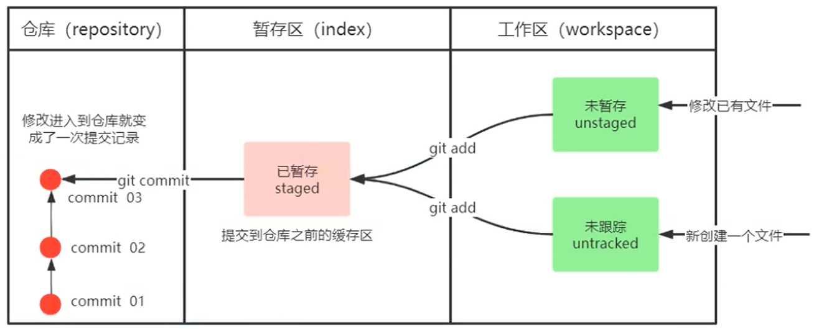
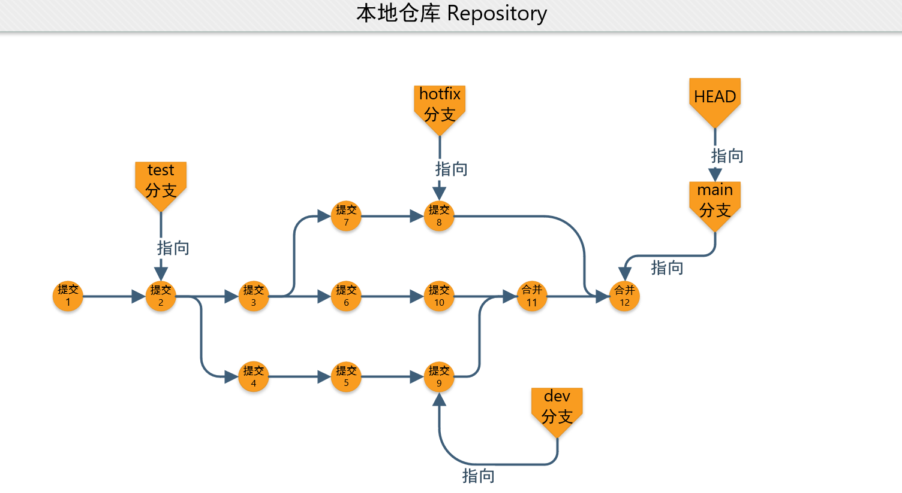

### Git 概述

Git 是一个分布式版本控制系统。与集中式版本控制系统（如SVN）不同，每一个开发者都在其本地计算机上有仓库的完整副本，包括历史记录。

Git 跟踪并管理源代码等文件及其变更记录，并提供极高的性能和灵活的版本管理功能，在开源领域成为事实标准。

Git 为现代软件开发的全流程提供了核心支持：

- 源代码管理
- 版本跟踪
- 协作开发
- 代码审查
- 版本控制
- CI/CD

等

接下来将从浅入深地阐述Git的基本使用到各类具体实践等内容


### Git 入门

#### 概述

在 Git [官网](https://git-scm.com/)可以[下载](https://git-scm.com/install/windows)或查看[文档](https://git-scm.com/docs)和[常见命令速查表](https://git-scm.com/cheat-sheet)

##### 流程图


#### 速查表

##### 仓库

- `git init` 创建一个新仓库
- `git clone <url>` 克隆一个已有仓库

##### 暂存

- `git add <file>` 添加未跟踪的文件或未暂存的更改
- `git add .` 添加所有未跟踪的文件和未暂存的更改
- `git add -p` 添加一个文件的部分
- `git mv <old> <new>` 移动文件
- `git rm <file>` 删除文件
- `git rm --cached <file>` 忘记但不删除一个文件
- `git reset <file>` 取消暂存一个文件
- `git reset` 取消所有暂存的文件
- `git status` 检查已添加的文件

##### 提交

- `git commit` 提交更改并打开文本编辑器以用于写入提交信息
- `git commit -m 'message'` 提交更改
- `git commit -am 'message'` 提交所有未暂存的更改

##### 分支

- `git switch <name>`/`git checkout <name>` 切换分支
- `git switch -c <name>`/`git checkout -c <name>` 创建分支
- `git branch` 列出分支
- `git branch -d <name>` 删除分支
- `git branch -D <name>` 强制删除分支

##### 暂存差异

- `git diff HEAD` 比较所有已暂存和未暂存的更改
- `git diff --staged` 比较已暂存更改
- `git diff` 比较未暂存更改

##### 提交差异

- `git show <commit>` 显示提交与其父提交之间的差异
- `git diff <commit> <commit>` 比较两个提交
- `git diff <commit> <file>` 显示提交与其父提交之间的指定文件的差异
- `git diff <commit> --stat`/`git show <commit> --stat` 显示差异摘要

> 当需要引用提交（即`<commit>`）时，可以使用如下方式：
>
> - 分支 `main`
> - 标签 `v0.1`
> - 提交ID `3e887ab`
> - 远程分支 `origin/main`
> - 当前提交 `HEAD`
> - 3个提交之前 `HEAD~3`

##### 放弃更改

- `git restore <file>`/`git checkout <file>` 删除指定文件的未暂存更改
- `git restore --staged --worktree <file>`/`git checkout HEAD <file>` 删除对指定文件的所有暂存和未暂存更改
- `git reset --hard` 删除所有已暂存和未暂存的更改
- `git clean` 删除未跟踪的文件
- `git stash` 将所有已暂存和未暂存的更改保存到快照

##### 修改历史记录

- `git reset HEAD^` 撤销最近一次提交
- `git rebase -i HEAD~6` 将最后5个提交合并为一个
- `git commit --amend` 修改最后一次提交

##### 查看历史记录

- `git log main`/`git log --graph main`/`git log --oneline` 查看分支的历史记录
- `git log <file>` 查看所有更改过指定文件的提交
- `git log --follow <file>` 查看所有更改过指定文件的提交，包括重命名之前
- `git log -G <regex>` 查看所有匹配指定正则或文本的提交
- `git blame <file>` 查看指定文件的每一行的修改者

##### 合并分支

- `git merge <branch>` 三方合并

  ```bash
  git switch main
  git merge banana
  ```
  
- `git merge <branch>` 快进合并

  ```bash
  git switch main
  git merge banana
  ```
  
- `git cherry-pick <commit>` 复制提交

  示例：

  合并前：

  ![img](data:image/svg+xml;base64,PD94bWwgdmVyc2lvbj0iMS4wIiBlbmNvZGluZz0iVVRGLTgiIHN0YW5kYWxvbmU9Im5vIj8+CjwhRE9DVFlQRSBzdmcgUFVCTElDICItLy9XM0MvL0RURCBTVkcgMS4xLy9FTiIKICJodHRwOi8vd3d3LnczLm9yZy9HcmFwaGljcy9TVkcvMS4xL0RURC9zdmcxMS5kdGQiPgo8IS0tIEdlbmVyYXRlZCBieSBncmFwaHZpeiB2ZXJzaW9uIDEzLjEuMiAoMjAyNTA4MDguMjMyMCkKIC0tPgo8IS0tIFRpdGxlOiBHIFBhZ2VzOiAxIC0tPgo8c3ZnIHdpZHRoPSI0MjJwdCIgaGVpZ2h0PSIxMjNwdCIKIHZpZXdCb3g9IjAuMDAgMC4wMCA0MjIuMDAgMTIzLjAwIiB4bWxucz0iaHR0cDovL3d3dy53My5vcmcvMjAwMC9zdmciIHhtbG5zOnhsaW5rPSJodHRwOi8vd3d3LnczLm9yZy8xOTk5L3hsaW5rIj4KPGcgaWQ9ImdyYXBoMCIgY2xhc3M9ImdyYXBoIiB0cmFuc2Zvcm09InNjYWxlKDEgMSkgcm90YXRlKDApIHRyYW5zbGF0ZSg0IDExOS4yKSI+Cjx0aXRsZT5HPC90aXRsZT4KPCEtLSBBIC0tPgo8ZyBpZD0ibm9kZTEiIGNsYXNzPSJub2RlIj4KPHRpdGxlPkE8L3RpdGxlPgo8cG9seWdvbiBmaWxsPSJub25lIiBzdHJva2U9ImJsYWNrIiBzdHJva2Utd2lkdGg9IjMiIHBvaW50cz0iNDMuMiwtMTE1LjIgMCwtMTE1LjIgMCwtNzIgNDMuMiwtNzIgNDMuMiwtMTE1LjIiLz4KPHRleHQgeG1sOnNwYWNlPSJwcmVzZXJ2ZSIgdGV4dC1hbmNob3I9Im1pZGRsZSIgeD0iMjEuNiIgeT0iLTg2LjQiIGZvbnQtZmFtaWx5PSJtb25vc3BhY2UiIGZvbnQtc2l6ZT0iMjQuMDAiPkE8L3RleHQ+CjwvZz4KPCEtLSBCIC0tPgo8ZyBpZD0ibm9kZTIiIGNsYXNzPSJub2RlIj4KPHRpdGxlPkI8L3RpdGxlPgo8cG9seWdvbiBmaWxsPSJub25lIiBzdHJva2U9ImJsYWNrIiBzdHJva2Utd2lkdGg9IjMiIHBvaW50cz0iMTE1LjIsLTExNS4yIDcyLC0xMTUuMiA3MiwtNzIgMTE1LjIsLTcyIDExNS4yLC0xMTUuMiIvPgo8dGV4dCB4bWw6c3BhY2U9InByZXNlcnZlIiB0ZXh0LWFuY2hvcj0ibWlkZGxlIiB4PSI5My42IiB5PSItODYuNCIgZm9udC1mYW1pbHk9Im1vbm9zcGFjZSIgZm9udC1zaXplPSIyNC4wMCI+QjwvdGV4dD4KPC9nPgo8IS0tIEEmIzQ1OyZndDtCIC0tPgo8ZyBpZD0iZWRnZTIiIGNsYXNzPSJlZGdlIj4KPHRpdGxlPkEmIzQ1OyZndDtCPC90aXRsZT4KPHBhdGggZmlsbD0ibm9uZSIgc3Ryb2tlPSJibGFjayIgc3Ryb2tlLXdpZHRoPSIzIiBkPSJNNDQuMzgsLTkzLjZDNTIuNzksLTkzLjYgNjIuMzEsLTkzLjYgNzAuNzIsLTkzLjYiLz4KPC9nPgo8IS0tIEMgLS0+CjxnIGlkPSJub2RlMyIgY2xhc3M9Im5vZGUiPgo8dGl0bGU+QzwvdGl0bGU+Cjxwb2x5Z29uIGZpbGw9Im5vbmUiIHN0cm9rZT0iYmxhY2siIHN0cm9rZS13aWR0aD0iMyIgcG9pbnRzPSIxODcuMiwtMTE1LjIgMTQ0LC0xMTUuMiAxNDQsLTcyIDE4Ny4yLC03MiAxODcuMiwtMTE1LjIiLz4KPHRleHQgeG1sOnNwYWNlPSJwcmVzZXJ2ZSIgdGV4dC1hbmNob3I9Im1pZGRsZSIgeD0iMTY1LjYiIHk9Ii04Ni40IiBmb250LWZhbWlseT0ibW9ub3NwYWNlIiBmb250LXNpemU9IjI0LjAwIj5DPC90ZXh0Pgo8L2c+CjwhLS0gQiYjNDU7Jmd0O0MgLS0+CjxnIGlkPSJlZGdlMyIgY2xhc3M9ImVkZ2UiPgo8dGl0bGU+QiYjNDU7Jmd0O0M8L3RpdGxlPgo8cGF0aCBmaWxsPSJub25lIiBzdHJva2U9ImJsYWNrIiBzdHJva2Utd2lkdGg9IjMiIGQ9Ik0xMTYuMzgsLTkzLjZDMTI0Ljc5LC05My42IDEzNC4zMSwtOTMuNiAxNDIuNzIsLTkzLjYiLz4KPC9nPgo8IS0tIEQgLS0+CjxnIGlkPSJub2RlNCIgY2xhc3M9Im5vZGUiPgo8dGl0bGU+RDwvdGl0bGU+Cjxwb2x5Z29uIGZpbGw9Im5vbmUiIHN0cm9rZT0iI2YxNGUzMiIgc3Ryb2tlLXdpZHRoPSIzIiBwb2ludHM9IjE4Ny4yLC00My4yIDE0NCwtNDMuMiAxNDQsMCAxODcuMiwwIDE4Ny4yLC00My4yIi8+Cjx0ZXh0IHhtbDpzcGFjZT0icHJlc2VydmUiIHRleHQtYW5jaG9yPSJtaWRkbGUiIHg9IjE2NS42IiB5PSItMTQuNCIgZm9udC1mYW1pbHk9Im1vbm9zcGFjZSIgZm9udC1zaXplPSIyNC4wMCI+RDwvdGV4dD4KPC9nPgo8IS0tIEImIzQ1OyZndDtEIC0tPgo8ZyBpZD0iZWRnZTQiIGNsYXNzPSJlZGdlIj4KPHRpdGxlPkImIzQ1OyZndDtEPC90aXRsZT4KPHBhdGggZmlsbD0ibm9uZSIgc3Ryb2tlPSJibGFjayIgc3Ryb2tlLXdpZHRoPSIzIiBkPSJNMTE2LjM4LC03MC44MkMxMjQuNzksLTYyLjQxIDEzNC4zMSwtNTIuODkgMTQyLjcyLC00NC40OCIvPgo8L2c+CjwhLS0gRSAtLT4KPGcgaWQ9Im5vZGU1IiBjbGFzcz0ibm9kZSI+Cjx0aXRsZT5FPC90aXRsZT4KPHBvbHlnb24gZmlsbD0ibm9uZSIgc3Ryb2tlPSJibGFjayIgc3Ryb2tlLXdpZHRoPSIzIiBwb2ludHM9IjI1OS4yLC00My4yIDIxNiwtNDMuMiAyMTYsMCAyNTkuMiwwIDI1OS4yLC00My4yIi8+Cjx0ZXh0IHhtbDpzcGFjZT0icHJlc2VydmUiIHRleHQtYW5jaG9yPSJtaWRkbGUiIHg9IjIzNy42IiB5PSItMTQuNCIgZm9udC1mYW1pbHk9Im1vbm9zcGFjZSIgZm9udC1zaXplPSIyNC4wMCI+RTwvdGV4dD4KPC9nPgo8IS0tIEQmIzQ1OyZndDtFIC0tPgo8ZyBpZD0iZWRnZTUiIGNsYXNzPSJlZGdlIj4KPHRpdGxlPkQmIzQ1OyZndDtFPC90aXRsZT4KPHBhdGggZmlsbD0ibm9uZSIgc3Ryb2tlPSJibGFjayIgc3Ryb2tlLXdpZHRoPSIzIiBkPSJNMTg4LjM4LC0yMS42QzE5Ni43OSwtMjEuNiAyMDYuMzEsLTIxLjYgMjE0LjcyLC0yMS42Ii8+CjwvZz4KPCEtLSBtYWluX2xhYmVsIC0tPgo8ZyBpZD0ibm9kZTYiIGNsYXNzPSJub2RlIj4KPHRpdGxlPm1haW5fbGFiZWw8L3RpdGxlPgo8dGV4dCB4bWw6c3BhY2U9InByZXNlcnZlIiB0ZXh0LWFuY2hvcj0ibWlkZGxlIiB4PSIzODEuNiIgeT0iLTg2LjQiIGZvbnQtZmFtaWx5PSJtb25vc3BhY2UiIGZvbnQtc2l6ZT0iMjQuMDAiPm1haW48L3RleHQ+CjwvZz4KPCEtLSBtYWluX2xhYmVsJiM0NTsmZ3Q7QyAtLT4KPGcgaWQ9ImVkZ2UxIiBjbGFzcz0iZWRnZSI+Cjx0aXRsZT5tYWluX2xhYmVsJiM0NTsmZ3Q7QzwvdGl0bGU+CjxwYXRoIGZpbGw9Im5vbmUiIHN0cm9rZT0iYmxhY2siIHN0cm9rZS13aWR0aD0iMyIgZD0iTTM0OS43MywtOTMuNkMzMTAuNjIsLTkzLjYgMjQ0LjQyLC05My42IDIwMi45NiwtOTMuNiIvPgo8cG9seWdvbiBmaWxsPSJibGFjayIgc3Ryb2tlPSJibGFjayIgc3Ryb2tlLXdpZHRoPSIzIiBwb2ludHM9IjIwMy4xOCwtOTAuMSAxOTMuMTgsLTkzLjYgMjAzLjE4LC05Ny4xIDIwMy4xOCwtOTAuMSIvPgo8L2c+CjwvZz4KPC9zdmc+Cg==)

  合并后：

  ![img](data:image/svg+xml;base64,PD94bWwgdmVyc2lvbj0iMS4wIiBlbmNvZGluZz0iVVRGLTgiIHN0YW5kYWxvbmU9Im5vIj8+CjwhRE9DVFlQRSBzdmcgUFVCTElDICItLy9XM0MvL0RURCBTVkcgMS4xLy9FTiIKICJodHRwOi8vd3d3LnczLm9yZy9HcmFwaGljcy9TVkcvMS4xL0RURC9zdmcxMS5kdGQiPgo8IS0tIEdlbmVyYXRlZCBieSBncmFwaHZpeiB2ZXJzaW9uIDEzLjEuMiAoMjAyNTA4MDguMjMyMCkKIC0tPgo8IS0tIFRpdGxlOiBHIFBhZ2VzOiAxIC0tPgo8c3ZnIHdpZHRoPSI0MjJwdCIgaGVpZ2h0PSIxMjNwdCIKIHZpZXdCb3g9IjAuMDAgMC4wMCA0MjIuMDAgMTIzLjAwIiB4bWxucz0iaHR0cDovL3d3dy53My5vcmcvMjAwMC9zdmciIHhtbG5zOnhsaW5rPSJodHRwOi8vd3d3LnczLm9yZy8xOTk5L3hsaW5rIj4KPGcgaWQ9ImdyYXBoMCIgY2xhc3M9ImdyYXBoIiB0cmFuc2Zvcm09InNjYWxlKDEgMSkgcm90YXRlKDApIHRyYW5zbGF0ZSg0IDExOS4yKSI+Cjx0aXRsZT5HPC90aXRsZT4KPCEtLSBBIC0tPgo8ZyBpZD0ibm9kZTEiIGNsYXNzPSJub2RlIj4KPHRpdGxlPkE8L3RpdGxlPgo8cG9seWdvbiBmaWxsPSJub25lIiBzdHJva2U9ImJsYWNrIiBzdHJva2Utd2lkdGg9IjMiIHBvaW50cz0iNDMuMiwtMTE1LjIgMCwtMTE1LjIgMCwtNzIgNDMuMiwtNzIgNDMuMiwtMTE1LjIiLz4KPHRleHQgeG1sOnNwYWNlPSJwcmVzZXJ2ZSIgdGV4dC1hbmNob3I9Im1pZGRsZSIgeD0iMjEuNiIgeT0iLTg2LjQiIGZvbnQtZmFtaWx5PSJtb25vc3BhY2UiIGZvbnQtc2l6ZT0iMjQuMDAiPkE8L3RleHQ+CjwvZz4KPCEtLSBCIC0tPgo8ZyBpZD0ibm9kZTIiIGNsYXNzPSJub2RlIj4KPHRpdGxlPkI8L3RpdGxlPgo8cG9seWdvbiBmaWxsPSJub25lIiBzdHJva2U9ImJsYWNrIiBzdHJva2Utd2lkdGg9IjMiIHBvaW50cz0iMTE1LjIsLTExNS4yIDcyLC0xMTUuMiA3MiwtNzIgMTE1LjIsLTcyIDExNS4yLC0xMTUuMiIvPgo8dGV4dCB4bWw6c3BhY2U9InByZXNlcnZlIiB0ZXh0LWFuY2hvcj0ibWlkZGxlIiB4PSI5My42IiB5PSItODYuNCIgZm9udC1mYW1pbHk9Im1vbm9zcGFjZSIgZm9udC1zaXplPSIyNC4wMCI+QjwvdGV4dD4KPC9nPgo8IS0tIEEmIzQ1OyZndDtCIC0tPgo8ZyBpZD0iZWRnZTIiIGNsYXNzPSJlZGdlIj4KPHRpdGxlPkEmIzQ1OyZndDtCPC90aXRsZT4KPHBhdGggZmlsbD0ibm9uZSIgc3Ryb2tlPSJibGFjayIgc3Ryb2tlLXdpZHRoPSIzIiBkPSJNNDQuMzgsLTkzLjZDNTIuNzksLTkzLjYgNjIuMzEsLTkzLjYgNzAuNzIsLTkzLjYiLz4KPC9nPgo8IS0tIEMgLS0+CjxnIGlkPSJub2RlMyIgY2xhc3M9Im5vZGUiPgo8dGl0bGU+QzwvdGl0bGU+Cjxwb2x5Z29uIGZpbGw9Im5vbmUiIHN0cm9rZT0iYmxhY2siIHN0cm9rZS13aWR0aD0iMyIgcG9pbnRzPSIxODcuMiwtMTE1LjIgMTQ0LC0xMTUuMiAxNDQsLTcyIDE4Ny4yLC03MiAxODcuMiwtMTE1LjIiLz4KPHRleHQgeG1sOnNwYWNlPSJwcmVzZXJ2ZSIgdGV4dC1hbmNob3I9Im1pZGRsZSIgeD0iMTY1LjYiIHk9Ii04Ni40IiBmb250LWZhbWlseT0ibW9ub3NwYWNlIiBmb250LXNpemU9IjI0LjAwIj5DPC90ZXh0Pgo8L2c+CjwhLS0gQiYjNDU7Jmd0O0MgLS0+CjxnIGlkPSJlZGdlMyIgY2xhc3M9ImVkZ2UiPgo8dGl0bGU+QiYjNDU7Jmd0O0M8L3RpdGxlPgo8cGF0aCBmaWxsPSJub25lIiBzdHJva2U9ImJsYWNrIiBzdHJva2Utd2lkdGg9IjMiIGQ9Ik0xMTYuMzgsLTkzLjZDMTI0Ljc5LC05My42IDEzNC4zMSwtOTMuNiAxNDIuNzIsLTkzLjYiLz4KPC9nPgo8IS0tIEQgLS0+CjxnIGlkPSJub2RlNSIgY2xhc3M9Im5vZGUiPgo8dGl0bGU+RDwvdGl0bGU+Cjxwb2x5Z29uIGZpbGw9Im5vbmUiIHN0cm9rZT0iI2YxNGUzMiIgc3Ryb2tlLXdpZHRoPSIzIiBwb2ludHM9IjE4Ny4yLC00My4yIDE0NCwtNDMuMiAxNDQsMCAxODcuMiwwIDE4Ny4yLC00My4yIi8+Cjx0ZXh0IHhtbDpzcGFjZT0icHJlc2VydmUiIHRleHQtYW5jaG9yPSJtaWRkbGUiIHg9IjE2NS42IiB5PSItMTQuNCIgZm9udC1mYW1pbHk9Im1vbm9zcGFjZSIgZm9udC1zaXplPSIyNC4wMCI+RDwvdGV4dD4KPC9nPgo8IS0tIEImIzQ1OyZndDtEIC0tPgo8ZyBpZD0iZWRnZTUiIGNsYXNzPSJlZGdlIj4KPHRpdGxlPkImIzQ1OyZndDtEPC90aXRsZT4KPHBhdGggZmlsbD0ibm9uZSIgc3Ryb2tlPSJibGFjayIgc3Ryb2tlLXdpZHRoPSIzIiBkPSJNMTE2LjM4LC03MC44MkMxMjQuNzksLTYyLjQxIDEzNC4zMSwtNTIuODkgMTQyLjcyLC00NC40OCIvPgo8L2c+CjwhLS0gRDIgLS0+CjxnIGlkPSJub2RlNCIgY2xhc3M9Im5vZGUiPgo8dGl0bGU+RDI8L3RpdGxlPgo8cG9seWdvbiBmaWxsPSJub25lIiBzdHJva2U9IiNmMTRlMzIiIHN0cm9rZS13aWR0aD0iMyIgcG9pbnRzPSIyNTkuMiwtMTE1LjIgMjE2LC0xMTUuMiAyMTYsLTcyIDI1OS4yLC03MiAyNTkuMiwtMTE1LjIiLz4KPHRleHQgeG1sOnNwYWNlPSJwcmVzZXJ2ZSIgdGV4dC1hbmNob3I9Im1pZGRsZSIgeD0iMjM3LjYiIHk9Ii04Ni40IiBmb250LWZhbWlseT0ibW9ub3NwYWNlIiBmb250LXNpemU9IjI0LjAwIj5E4oCyPC90ZXh0Pgo8L2c+CjwhLS0gQyYjNDU7Jmd0O0QyIC0tPgo8ZyBpZD0iZWRnZTQiIGNsYXNzPSJlZGdlIj4KPHRpdGxlPkMmIzQ1OyZndDtEMjwvdGl0bGU+CjxwYXRoIGZpbGw9Im5vbmUiIHN0cm9rZT0iYmxhY2siIHN0cm9rZS13aWR0aD0iMyIgZD0iTTE4OC4zOCwtOTMuNkMxOTYuNzksLTkzLjYgMjA2LjMxLC05My42IDIxNC43MiwtOTMuNiIvPgo8L2c+CjwhLS0gRSAtLT4KPGcgaWQ9Im5vZGU2IiBjbGFzcz0ibm9kZSI+Cjx0aXRsZT5FPC90aXRsZT4KPHBvbHlnb24gZmlsbD0ibm9uZSIgc3Ryb2tlPSJibGFjayIgc3Ryb2tlLXdpZHRoPSIzIiBwb2ludHM9IjI1OS4yLC00My4yIDIxNiwtNDMuMiAyMTYsMCAyNTkuMiwwIDI1OS4yLC00My4yIi8+Cjx0ZXh0IHhtbDpzcGFjZT0icHJlc2VydmUiIHRleHQtYW5jaG9yPSJtaWRkbGUiIHg9IjIzNy42IiB5PSItMTQuNCIgZm9udC1mYW1pbHk9Im1vbm9zcGFjZSIgZm9udC1zaXplPSIyNC4wMCI+RTwvdGV4dD4KPC9nPgo8IS0tIEQmIzQ1OyZndDtFIC0tPgo8ZyBpZD0iZWRnZTYiIGNsYXNzPSJlZGdlIj4KPHRpdGxlPkQmIzQ1OyZndDtFPC90aXRsZT4KPHBhdGggZmlsbD0ibm9uZSIgc3Ryb2tlPSJibGFjayIgc3Ryb2tlLXdpZHRoPSIzIiBkPSJNMTg4LjM4LC0yMS42QzE5Ni43OSwtMjEuNiAyMDYuMzEsLTIxLjYgMjE0LjcyLC0yMS42Ii8+CjwvZz4KPCEtLSBtYWluX2xhYmVsIC0tPgo8ZyBpZD0ibm9kZTciIGNsYXNzPSJub2RlIj4KPHRpdGxlPm1haW5fbGFiZWw8L3RpdGxlPgo8dGV4dCB4bWw6c3BhY2U9InByZXNlcnZlIiB0ZXh0LWFuY2hvcj0ibWlkZGxlIiB4PSIzODEuNiIgeT0iLTg2LjQiIGZvbnQtZmFtaWx5PSJtb25vc3BhY2UiIGZvbnQtc2l6ZT0iMjQuMDAiPm1haW48L3RleHQ+CjwvZz4KPCEtLSBtYWluX2xhYmVsJiM0NTsmZ3Q7RDIgLS0+CjxnIGlkPSJlZGdlMSIgY2xhc3M9ImVkZ2UiPgo8dGl0bGU+bWFpbl9sYWJlbCYjNDU7Jmd0O0QyPC90aXRsZT4KPHBhdGggZmlsbD0ibm9uZSIgc3Ryb2tlPSJibGFjayIgc3Ryb2tlLXdpZHRoPSIzIiBkPSJNMzQ5LjY0LC05My42QzMyNy41OSwtOTMuNiAyOTguMTksLTkzLjYgMjc1LjA0LC05My42Ii8+Cjxwb2x5Z29uIGZpbGw9ImJsYWNrIiBzdHJva2U9ImJsYWNrIiBzdHJva2Utd2lkdGg9IjMiIHBvaW50cz0iMjc1LjA2LC05MC4xIDI2NS4wNiwtOTMuNiAyNzUuMDYsLTk3LjEgMjc1LjA2LC05MC4xIi8+CjwvZz4KPC9nPgo8L3N2Zz4K)

- `git merge --squash <branch>` 合并提交

  示例：

  ```bash
  git switch main
  git merge --squash banana
  git commit
  ```

  合并前：

  ![img](data:image/svg+xml;base64,PD94bWwgdmVyc2lvbj0iMS4wIiBlbmNvZGluZz0iVVRGLTgiIHN0YW5kYWxvbmU9Im5vIj8+CjwhRE9DVFlQRSBzdmcgUFVCTElDICItLy9XM0MvL0RURCBTVkcgMS4xLy9FTiIKICJodHRwOi8vd3d3LnczLm9yZy9HcmFwaGljcy9TVkcvMS4xL0RURC9zdmcxMS5kdGQiPgo8IS0tIEdlbmVyYXRlZCBieSBncmFwaHZpeiB2ZXJzaW9uIDEzLjEuMiAoMjAyNTA4MDguMjMyMCkKIC0tPgo8IS0tIFRpdGxlOiBHIFBhZ2VzOiAxIC0tPgo8c3ZnIHdpZHRoPSI0NDZwdCIgaGVpZ2h0PSIxMjNwdCIKIHZpZXdCb3g9IjAuMDAgMC4wMCA0NDYuMDAgMTIzLjAwIiB4bWxucz0iaHR0cDovL3d3dy53My5vcmcvMjAwMC9zdmciIHhtbG5zOnhsaW5rPSJodHRwOi8vd3d3LnczLm9yZy8xOTk5L3hsaW5rIj4KPGcgaWQ9ImdyYXBoMCIgY2xhc3M9ImdyYXBoIiB0cmFuc2Zvcm09InNjYWxlKDEgMSkgcm90YXRlKDApIHRyYW5zbGF0ZSg0IDExOS4yKSI+Cjx0aXRsZT5HPC90aXRsZT4KPCEtLSBBIC0tPgo8ZyBpZD0ibm9kZTEiIGNsYXNzPSJub2RlIj4KPHRpdGxlPkE8L3RpdGxlPgo8cG9seWdvbiBmaWxsPSJub25lIiBzdHJva2U9ImJsYWNrIiBzdHJva2Utd2lkdGg9IjMiIHBvaW50cz0iNDMuMiwtMTE1LjIgMCwtMTE1LjIgMCwtNzIgNDMuMiwtNzIgNDMuMiwtMTE1LjIiLz4KPHRleHQgeG1sOnNwYWNlPSJwcmVzZXJ2ZSIgdGV4dC1hbmNob3I9Im1pZGRsZSIgeD0iMjEuNiIgeT0iLTg2LjQiIGZvbnQtZmFtaWx5PSJtb25vc3BhY2UiIGZvbnQtc2l6ZT0iMjQuMDAiPkE8L3RleHQ+CjwvZz4KPCEtLSBCIC0tPgo8ZyBpZD0ibm9kZTIiIGNsYXNzPSJub2RlIj4KPHRpdGxlPkI8L3RpdGxlPgo8cG9seWdvbiBmaWxsPSJub25lIiBzdHJva2U9ImJsYWNrIiBzdHJva2Utd2lkdGg9IjMiIHBvaW50cz0iMTE1LjIsLTExNS4yIDcyLC0xMTUuMiA3MiwtNzIgMTE1LjIsLTcyIDExNS4yLC0xMTUuMiIvPgo8dGV4dCB4bWw6c3BhY2U9InByZXNlcnZlIiB0ZXh0LWFuY2hvcj0ibWlkZGxlIiB4PSI5My42IiB5PSItODYuNCIgZm9udC1mYW1pbHk9Im1vbm9zcGFjZSIgZm9udC1zaXplPSIyNC4wMCI+QjwvdGV4dD4KPC9nPgo8IS0tIEEmIzQ1OyZndDtCIC0tPgo8ZyBpZD0iZWRnZTMiIGNsYXNzPSJlZGdlIj4KPHRpdGxlPkEmIzQ1OyZndDtCPC90aXRsZT4KPHBhdGggZmlsbD0ibm9uZSIgc3Ryb2tlPSJibGFjayIgc3Ryb2tlLXdpZHRoPSIzIiBkPSJNNDQuMzgsLTkzLjZDNTIuNzksLTkzLjYgNjIuMzEsLTkzLjYgNzAuNzIsLTkzLjYiLz4KPC9nPgo8IS0tIEMgLS0+CjxnIGlkPSJub2RlMyIgY2xhc3M9Im5vZGUiPgo8dGl0bGU+QzwvdGl0bGU+Cjxwb2x5Z29uIGZpbGw9Im5vbmUiIHN0cm9rZT0iYmxhY2siIHN0cm9rZS13aWR0aD0iMyIgcG9pbnRzPSIxODcuMiwtMTE1LjIgMTQ0LC0xMTUuMiAxNDQsLTcyIDE4Ny4yLC03MiAxODcuMiwtMTE1LjIiLz4KPHRleHQgeG1sOnNwYWNlPSJwcmVzZXJ2ZSIgdGV4dC1hbmNob3I9Im1pZGRsZSIgeD0iMTY1LjYiIHk9Ii04Ni40IiBmb250LWZhbWlseT0ibW9ub3NwYWNlIiBmb250LXNpemU9IjI0LjAwIj5DPC90ZXh0Pgo8L2c+CjwhLS0gQiYjNDU7Jmd0O0MgLS0+CjxnIGlkPSJlZGdlNCIgY2xhc3M9ImVkZ2UiPgo8dGl0bGU+QiYjNDU7Jmd0O0M8L3RpdGxlPgo8cGF0aCBmaWxsPSJub25lIiBzdHJva2U9ImJsYWNrIiBzdHJva2Utd2lkdGg9IjMiIGQ9Ik0xMTYuMzgsLTkzLjZDMTI0Ljc5LC05My42IDEzNC4zMSwtOTMuNiAxNDIuNzIsLTkzLjYiLz4KPC9nPgo8IS0tIEQgLS0+CjxnIGlkPSJub2RlNCIgY2xhc3M9Im5vZGUiPgo8dGl0bGU+RDwvdGl0bGU+Cjxwb2x5Z29uIGZpbGw9Im5vbmUiIHN0cm9rZT0iI2YxNGUzMiIgc3Ryb2tlLXdpZHRoPSIzIiBwb2ludHM9IjE4Ny4yLC00My4yIDE0NCwtNDMuMiAxNDQsMCAxODcuMiwwIDE4Ny4yLC00My4yIi8+Cjx0ZXh0IHhtbDpzcGFjZT0icHJlc2VydmUiIHRleHQtYW5jaG9yPSJtaWRkbGUiIHg9IjE2NS42IiB5PSItMTQuNCIgZm9udC1mYW1pbHk9Im1vbm9zcGFjZSIgZm9udC1zaXplPSIyNC4wMCI+RDwvdGV4dD4KPC9nPgo8IS0tIEImIzQ1OyZndDtEIC0tPgo8ZyBpZD0iZWRnZTUiIGNsYXNzPSJlZGdlIj4KPHRpdGxlPkImIzQ1OyZndDtEPC90aXRsZT4KPHBhdGggZmlsbD0ibm9uZSIgc3Ryb2tlPSJibGFjayIgc3Ryb2tlLXdpZHRoPSIzIiBkPSJNMTE2LjM4LC03MC44MkMxMjQuNzksLTYyLjQxIDEzNC4zMSwtNTIuODkgMTQyLjcyLC00NC40OCIvPgo8L2c+CjwhLS0gRSAtLT4KPGcgaWQ9Im5vZGU1IiBjbGFzcz0ibm9kZSI+Cjx0aXRsZT5FPC90aXRsZT4KPHBvbHlnb24gZmlsbD0ibm9uZSIgc3Ryb2tlPSIjZjE0ZTMyIiBzdHJva2Utd2lkdGg9IjMiIHBvaW50cz0iMjU5LjIsLTQzLjIgMjE2LC00My4yIDIxNiwwIDI1OS4yLDAgMjU5LjIsLTQzLjIiLz4KPHRleHQgeG1sOnNwYWNlPSJwcmVzZXJ2ZSIgdGV4dC1hbmNob3I9Im1pZGRsZSIgeD0iMjM3LjYiIHk9Ii0xNC40IiBmb250LWZhbWlseT0ibW9ub3NwYWNlIiBmb250LXNpemU9IjI0LjAwIj5FPC90ZXh0Pgo8L2c+CjwhLS0gRCYjNDU7Jmd0O0UgLS0+CjxnIGlkPSJlZGdlNiIgY2xhc3M9ImVkZ2UiPgo8dGl0bGU+RCYjNDU7Jmd0O0U8L3RpdGxlPgo8cGF0aCBmaWxsPSJub25lIiBzdHJva2U9ImJsYWNrIiBzdHJva2Utd2lkdGg9IjMiIGQ9Ik0xODguMzgsLTIxLjZDMTk2Ljc5LC0yMS42IDIwNi4zMSwtMjEuNiAyMTQuNzIsLTIxLjYiLz4KPC9nPgo8IS0tIG1haW5fbGFiZWwgLS0+CjxnIGlkPSJub2RlNiIgY2xhc3M9Im5vZGUiPgo8dGl0bGU+bWFpbl9sYWJlbDwvdGl0bGU+Cjx0ZXh0IHhtbDpzcGFjZT0icHJlc2VydmUiIHRleHQtYW5jaG9yPSJtaWRkbGUiIHg9IjM4MS42IiB5PSItODYuNCIgZm9udC1mYW1pbHk9Im1vbm9zcGFjZSIgZm9udC1zaXplPSIyNC4wMCI+bWFpbjwvdGV4dD4KPC9nPgo8IS0tIG1haW5fbGFiZWwmIzQ1OyZndDtDIC0tPgo8ZyBpZD0iZWRnZTEiIGNsYXNzPSJlZGdlIj4KPHRpdGxlPm1haW5fbGFiZWwmIzQ1OyZndDtDPC90aXRsZT4KPHBhdGggZmlsbD0ibm9uZSIgc3Ryb2tlPSJibGFjayIgc3Ryb2tlLXdpZHRoPSIzIiBkPSJNMzQ5LjczLC05My42QzMxMC42MiwtOTMuNiAyNDQuNDIsLTkzLjYgMjAyLjk2LC05My42Ii8+Cjxwb2x5Z29uIGZpbGw9ImJsYWNrIiBzdHJva2U9ImJsYWNrIiBzdHJva2Utd2lkdGg9IjMiIHBvaW50cz0iMjAzLjE4LC05MC4xIDE5My4xOCwtOTMuNiAyMDMuMTgsLTk3LjEgMjAzLjE4LC05MC4xIi8+CjwvZz4KPCEtLSBiYW5hbmFfbGFiZWwgLS0+CjxnIGlkPSJub2RlNyIgY2xhc3M9Im5vZGUiPgo8dGl0bGU+YmFuYW5hX2xhYmVsPC90aXRsZT4KPHRleHQgeG1sOnNwYWNlPSJwcmVzZXJ2ZSIgdGV4dC1hbmNob3I9Im1pZGRsZSIgeD0iMzk2IiB5PSItMTQuNCIgZm9udC1mYW1pbHk9Im1vbm9zcGFjZSIgZm9udC1zaXplPSIyNC4wMCI+YmFuYW5hPC90ZXh0Pgo8L2c+CjwhLS0gYmFuYW5hX2xhYmVsJiM0NTsmZ3Q7RSAtLT4KPGcgaWQ9ImVkZ2UyIiBjbGFzcz0iZWRnZSI+Cjx0aXRsZT5iYW5hbmFfbGFiZWwmIzQ1OyZndDtFPC90aXRsZT4KPHBhdGggZmlsbD0ibm9uZSIgc3Ryb2tlPSJibGFjayIgc3Ryb2tlLXdpZHRoPSIzIiBkPSJNMzU0LjM4LC0yMS42QzMyOS43MiwtMjEuNiAyOTguNzMsLTIxLjYgMjc0Ljg3LC0yMS42Ii8+Cjxwb2x5Z29uIGZpbGw9ImJsYWNrIiBzdHJva2U9ImJsYWNrIiBzdHJva2Utd2lkdGg9IjMiIHBvaW50cz0iMjc0LjksLTE4LjEgMjY0LjksLTIxLjYgMjc0LjksLTI1LjEgMjc0LjksLTE4LjEiLz4KPC9nPgo8L2c+Cjwvc3ZnPgo=)

  合并后：

  ![img](data:image/svg+xml;base64,PD94bWwgdmVyc2lvbj0iMS4wIiBlbmNvZGluZz0iVVRGLTgiIHN0YW5kYWxvbmU9Im5vIj8+CjwhRE9DVFlQRSBzdmcgUFVCTElDICItLy9XM0MvL0RURCBTVkcgMS4xLy9FTiIKICJodHRwOi8vd3d3LnczLm9yZy9HcmFwaGljcy9TVkcvMS4xL0RURC9zdmcxMS5kdGQiPgo8IS0tIEdlbmVyYXRlZCBieSBncmFwaHZpeiB2ZXJzaW9uIDEzLjEuMiAoMjAyNTA4MDguMjMyMCkKIC0tPgo8IS0tIFRpdGxlOiBHIFBhZ2VzOiAxIC0tPgo8c3ZnIHdpZHRoPSI0NDZwdCIgaGVpZ2h0PSIxMzRwdCIKIHZpZXdCb3g9IjAuMDAgMC4wMCA0NDYuMDAgMTM0LjAwIiB4bWxucz0iaHR0cDovL3d3dy53My5vcmcvMjAwMC9zdmciIHhtbG5zOnhsaW5rPSJodHRwOi8vd3d3LnczLm9yZy8xOTk5L3hsaW5rIj4KPGcgaWQ9ImdyYXBoMCIgY2xhc3M9ImdyYXBoIiB0cmFuc2Zvcm09InNjYWxlKDEgMSkgcm90YXRlKDApIHRyYW5zbGF0ZSg0IDEzMCkiPgo8dGl0bGU+RzwvdGl0bGU+CjwhLS0gQSAtLT4KPGcgaWQ9Im5vZGUxIiBjbGFzcz0ibm9kZSI+Cjx0aXRsZT5BPC90aXRsZT4KPHBvbHlnb24gZmlsbD0ibm9uZSIgc3Ryb2tlPSJibGFjayIgc3Ryb2tlLXdpZHRoPSIzIiBwb2ludHM9IjQzLjIsLTExNS4yIDAsLTExNS4yIDAsLTcyIDQzLjIsLTcyIDQzLjIsLTExNS4yIi8+Cjx0ZXh0IHhtbDpzcGFjZT0icHJlc2VydmUiIHRleHQtYW5jaG9yPSJtaWRkbGUiIHg9IjIxLjYiIHk9Ii04Ni40IiBmb250LWZhbWlseT0ibW9ub3NwYWNlIiBmb250LXNpemU9IjI0LjAwIj5BPC90ZXh0Pgo8L2c+CjwhLS0gQiAtLT4KPGcgaWQ9Im5vZGUyIiBjbGFzcz0ibm9kZSI+Cjx0aXRsZT5CPC90aXRsZT4KPHBvbHlnb24gZmlsbD0ibm9uZSIgc3Ryb2tlPSJibGFjayIgc3Ryb2tlLXdpZHRoPSIzIiBwb2ludHM9IjExNS4yLC0xMTUuMiA3MiwtMTE1LjIgNzIsLTcyIDExNS4yLC03MiAxMTUuMiwtMTE1LjIiLz4KPHRleHQgeG1sOnNwYWNlPSJwcmVzZXJ2ZSIgdGV4dC1hbmNob3I9Im1pZGRsZSIgeD0iOTMuNiIgeT0iLTg2LjQiIGZvbnQtZmFtaWx5PSJtb25vc3BhY2UiIGZvbnQtc2l6ZT0iMjQuMDAiPkI8L3RleHQ+CjwvZz4KPCEtLSBBJiM0NTsmZ3Q7QiAtLT4KPGcgaWQ9ImVkZ2UzIiBjbGFzcz0iZWRnZSI+Cjx0aXRsZT5BJiM0NTsmZ3Q7QjwvdGl0bGU+CjxwYXRoIGZpbGw9Im5vbmUiIHN0cm9rZT0iYmxhY2siIHN0cm9rZS13aWR0aD0iMyIgZD0iTTQ0LjM4LC05My42QzUyLjc5LC05My42IDYyLjMxLC05My42IDcwLjcyLC05My42Ii8+CjwvZz4KPCEtLSBDIC0tPgo8ZyBpZD0ibm9kZTMiIGNsYXNzPSJub2RlIj4KPHRpdGxlPkM8L3RpdGxlPgo8cG9seWdvbiBmaWxsPSJub25lIiBzdHJva2U9ImJsYWNrIiBzdHJva2Utd2lkdGg9IjMiIHBvaW50cz0iMTg3LjIsLTExNS4yIDE0NCwtMTE1LjIgMTQ0LC03MiAxODcuMiwtNzIgMTg3LjIsLTExNS4yIi8+Cjx0ZXh0IHhtbDpzcGFjZT0icHJlc2VydmUiIHRleHQtYW5jaG9yPSJtaWRkbGUiIHg9IjE2NS42IiB5PSItODYuNCIgZm9udC1mYW1pbHk9Im1vbm9zcGFjZSIgZm9udC1zaXplPSIyNC4wMCI+QzwvdGV4dD4KPC9nPgo8IS0tIEImIzQ1OyZndDtDIC0tPgo8ZyBpZD0iZWRnZTQiIGNsYXNzPSJlZGdlIj4KPHRpdGxlPkImIzQ1OyZndDtDPC90aXRsZT4KPHBhdGggZmlsbD0ibm9uZSIgc3Ryb2tlPSJibGFjayIgc3Ryb2tlLXdpZHRoPSIzIiBkPSJNMTE2LjM4LC05My42QzEyNC43OSwtOTMuNiAxMzQuMzEsLTkzLjYgMTQyLjcyLC05My42Ii8+CjwvZz4KPCEtLSBEIC0tPgo8ZyBpZD0ibm9kZTQiIGNsYXNzPSJub2RlIj4KPHRpdGxlPkQ8L3RpdGxlPgo8cG9seWdvbiBmaWxsPSJub25lIiBzdHJva2U9IiNmMTRlMzIiIHN0cm9rZS13aWR0aD0iMyIgcG9pbnRzPSIxODcuMiwtNDMuMiAxNDQsLTQzLjIgMTQ0LDAgMTg3LjIsMCAxODcuMiwtNDMuMiIvPgo8dGV4dCB4bWw6c3BhY2U9InByZXNlcnZlIiB0ZXh0LWFuY2hvcj0ibWlkZGxlIiB4PSIxNjUuNiIgeT0iLTE0LjQiIGZvbnQtZmFtaWx5PSJtb25vc3BhY2UiIGZvbnQtc2l6ZT0iMjQuMDAiPkQ8L3RleHQ+CjwvZz4KPCEtLSBCJiM0NTsmZ3Q7RCAtLT4KPGcgaWQ9ImVkZ2U1IiBjbGFzcz0iZWRnZSI+Cjx0aXRsZT5CJiM0NTsmZ3Q7RDwvdGl0bGU+CjxwYXRoIGZpbGw9Im5vbmUiIHN0cm9rZT0iYmxhY2siIHN0cm9rZS13aWR0aD0iMyIgZD0iTTExNi4zOCwtNzAuODJDMTI0Ljc5LC02Mi40MSAxMzQuMzEsLTUyLjg5IDE0Mi43MiwtNDQuNDgiLz4KPC9nPgo8IS0tIFMgLS0+CjxnIGlkPSJub2RlNiIgY2xhc3M9Im5vZGUiPgo8dGl0bGU+UzwvdGl0bGU+Cjxwb2x5Z29uIGZpbGw9Im5vbmUiIHN0cm9rZT0iI2YxNGUzMiIgc3Ryb2tlLXdpZHRoPSIzIiBwb2ludHM9IjI1OS4yLC0xMjYgMjE2LC0xMjYgMjE2LC02MS4yIDI1OS4yLC02MS4yIDI1OS4yLC0xMjYiLz4KPHRleHQgeG1sOnNwYWNlPSJwcmVzZXJ2ZSIgdGV4dC1hbmNob3I9Im1pZGRsZSIgeD0iMjM3LjYiIHk9Ii0xMDAuOCIgZm9udC1mYW1pbHk9Im1vbm9zcGFjZSIgZm9udC1zaXplPSIyNC4wMCI+RDwvdGV4dD4KPHRleHQgeG1sOnNwYWNlPSJwcmVzZXJ2ZSIgdGV4dC1hbmNob3I9Im1pZGRsZSIgeD0iMjM3LjYiIHk9Ii03MiIgZm9udC1mYW1pbHk9Im1vbm9zcGFjZSIgZm9udC1zaXplPSIyNC4wMCI+RTwvdGV4dD4KPC9nPgo8IS0tIEMmIzQ1OyZndDtTIC0tPgo8ZyBpZD0iZWRnZTciIGNsYXNzPSJlZGdlIj4KPHRpdGxlPkMmIzQ1OyZndDtTPC90aXRsZT4KPHBhdGggZmlsbD0ibm9uZSIgc3Ryb2tlPSJibGFjayIgc3Ryb2tlLXdpZHRoPSIzIiBkPSJNMTg4LjM4LC05My42QzE5Ni43OSwtOTMuNiAyMDYuMzEsLTkzLjYgMjE0LjcyLC05My42Ii8+CjwvZz4KPCEtLSBFIC0tPgo8ZyBpZD0ibm9kZTUiIGNsYXNzPSJub2RlIj4KPHRpdGxlPkU8L3RpdGxlPgo8cG9seWdvbiBmaWxsPSJub25lIiBzdHJva2U9IiNmMTRlMzIiIHN0cm9rZS13aWR0aD0iMyIgcG9pbnRzPSIyNTkuMiwtNDMuMiAyMTYsLTQzLjIgMjE2LDAgMjU5LjIsMCAyNTkuMiwtNDMuMiIvPgo8dGV4dCB4bWw6c3BhY2U9InByZXNlcnZlIiB0ZXh0LWFuY2hvcj0ibWlkZGxlIiB4PSIyMzcuNiIgeT0iLTE0LjQiIGZvbnQtZmFtaWx5PSJtb25vc3BhY2UiIGZvbnQtc2l6ZT0iMjQuMDAiPkU8L3RleHQ+CjwvZz4KPCEtLSBEJiM0NTsmZ3Q7RSAtLT4KPGcgaWQ9ImVkZ2U2IiBjbGFzcz0iZWRnZSI+Cjx0aXRsZT5EJiM0NTsmZ3Q7RTwvdGl0bGU+CjxwYXRoIGZpbGw9Im5vbmUiIHN0cm9rZT0iYmxhY2siIHN0cm9rZS13aWR0aD0iMyIgZD0iTTE4OC4zOCwtMjEuNkMxOTYuNzksLTIxLjYgMjA2LjMxLC0yMS42IDIxNC43MiwtMjEuNiIvPgo8L2c+CjwhLS0gbWFpbl9sYWJlbCAtLT4KPGcgaWQ9Im5vZGU3IiBjbGFzcz0ibm9kZSI+Cjx0aXRsZT5tYWluX2xhYmVsPC90aXRsZT4KPHRleHQgeG1sOnNwYWNlPSJwcmVzZXJ2ZSIgdGV4dC1hbmNob3I9Im1pZGRsZSIgeD0iMzgxLjYiIHk9Ii04Ni40IiBmb250LWZhbWlseT0ibW9ub3NwYWNlIiBmb250LXNpemU9IjI0LjAwIj5tYWluPC90ZXh0Pgo8L2c+CjwhLS0gbWFpbl9sYWJlbCYjNDU7Jmd0O1MgLS0+CjxnIGlkPSJlZGdlMSIgY2xhc3M9ImVkZ2UiPgo8dGl0bGU+bWFpbl9sYWJlbCYjNDU7Jmd0O1M8L3RpdGxlPgo8cGF0aCBmaWxsPSJub25lIiBzdHJva2U9ImJsYWNrIiBzdHJva2Utd2lkdGg9IjMiIGQ9Ik0zNDkuNjQsLTkzLjZDMzI3LjU5LC05My42IDI5OC4xOSwtOTMuNiAyNzUuMDQsLTkzLjYiLz4KPHBvbHlnb24gZmlsbD0iYmxhY2siIHN0cm9rZT0iYmxhY2siIHN0cm9rZS13aWR0aD0iMyIgcG9pbnRzPSIyNzUuMDYsLTkwLjEgMjY1LjA2LC05My42IDI3NS4wNiwtOTcuMSAyNzUuMDYsLTkwLjEiLz4KPC9nPgo8IS0tIGJhbmFuYV9sYWJlbCAtLT4KPGcgaWQ9Im5vZGU4IiBjbGFzcz0ibm9kZSI+Cjx0aXRsZT5iYW5hbmFfbGFiZWw8L3RpdGxlPgo8dGV4dCB4bWw6c3BhY2U9InByZXNlcnZlIiB0ZXh0LWFuY2hvcj0ibWlkZGxlIiB4PSIzOTYiIHk9Ii0xNC40IiBmb250LWZhbWlseT0ibW9ub3NwYWNlIiBmb250LXNpemU9IjI0LjAwIj5iYW5hbmE8L3RleHQ+CjwvZz4KPCEtLSBiYW5hbmFfbGFiZWwmIzQ1OyZndDtFIC0tPgo8ZyBpZD0iZWRnZTIiIGNsYXNzPSJlZGdlIj4KPHRpdGxlPmJhbmFuYV9sYWJlbCYjNDU7Jmd0O0U8L3RpdGxlPgo8cGF0aCBmaWxsPSJub25lIiBzdHJva2U9ImJsYWNrIiBzdHJva2Utd2lkdGg9IjMiIGQ9Ik0zNTQuMzgsLTIxLjZDMzI5LjcyLC0yMS42IDI5OC43MywtMjEuNiAyNzQuODcsLTIxLjYiLz4KPHBvbHlnb24gZmlsbD0iYmxhY2siIHN0cm9rZT0iYmxhY2siIHN0cm9rZS13aWR0aD0iMyIgcG9pbnRzPSIyNzQuOSwtMTguMSAyNjQuOSwtMjEuNiAyNzQuOSwtMjUuMSAyNzQuOSwtMTguMSIvPgo8L2c+CjwvZz4KPC9zdmc+Cg==)

- `git rebase <branch>` 变基合并

  示例：

  ```bash
  git switch banana
  git rebase main
  ```

  合并前：

  ![img](data:image/svg+xml;base64,PD94bWwgdmVyc2lvbj0iMS4wIiBlbmNvZGluZz0iVVRGLTgiIHN0YW5kYWxvbmU9Im5vIj8+CjwhRE9DVFlQRSBzdmcgUFVCTElDICItLy9XM0MvL0RURCBTVkcgMS4xLy9FTiIKICJodHRwOi8vd3d3LnczLm9yZy9HcmFwaGljcy9TVkcvMS4xL0RURC9zdmcxMS5kdGQiPgo8IS0tIEdlbmVyYXRlZCBieSBncmFwaHZpeiB2ZXJzaW9uIDEzLjEuMiAoMjAyNTA4MDguMjMyMCkKIC0tPgo8IS0tIFRpdGxlOiBHIFBhZ2VzOiAxIC0tPgo8c3ZnIHdpZHRoPSI0NDZwdCIgaGVpZ2h0PSIxMjNwdCIKIHZpZXdCb3g9IjAuMDAgMC4wMCA0NDYuMDAgMTIzLjAwIiB4bWxucz0iaHR0cDovL3d3dy53My5vcmcvMjAwMC9zdmciIHhtbG5zOnhsaW5rPSJodHRwOi8vd3d3LnczLm9yZy8xOTk5L3hsaW5rIj4KPGcgaWQ9ImdyYXBoMCIgY2xhc3M9ImdyYXBoIiB0cmFuc2Zvcm09InNjYWxlKDEgMSkgcm90YXRlKDApIHRyYW5zbGF0ZSg0IDExOS4yKSI+Cjx0aXRsZT5HPC90aXRsZT4KPCEtLSBBIC0tPgo8ZyBpZD0ibm9kZTEiIGNsYXNzPSJub2RlIj4KPHRpdGxlPkE8L3RpdGxlPgo8cG9seWdvbiBmaWxsPSJub25lIiBzdHJva2U9ImJsYWNrIiBzdHJva2Utd2lkdGg9IjMiIHBvaW50cz0iNDMuMiwtMTE1LjIgMCwtMTE1LjIgMCwtNzIgNDMuMiwtNzIgNDMuMiwtMTE1LjIiLz4KPHRleHQgeG1sOnNwYWNlPSJwcmVzZXJ2ZSIgdGV4dC1hbmNob3I9Im1pZGRsZSIgeD0iMjEuNiIgeT0iLTg2LjQiIGZvbnQtZmFtaWx5PSJtb25vc3BhY2UiIGZvbnQtc2l6ZT0iMjQuMDAiPkE8L3RleHQ+CjwvZz4KPCEtLSBCIC0tPgo8ZyBpZD0ibm9kZTIiIGNsYXNzPSJub2RlIj4KPHRpdGxlPkI8L3RpdGxlPgo8cG9seWdvbiBmaWxsPSJub25lIiBzdHJva2U9ImJsYWNrIiBzdHJva2Utd2lkdGg9IjMiIHBvaW50cz0iMTE1LjIsLTExNS4yIDcyLC0xMTUuMiA3MiwtNzIgMTE1LjIsLTcyIDExNS4yLC0xMTUuMiIvPgo8dGV4dCB4bWw6c3BhY2U9InByZXNlcnZlIiB0ZXh0LWFuY2hvcj0ibWlkZGxlIiB4PSI5My42IiB5PSItODYuNCIgZm9udC1mYW1pbHk9Im1vbm9zcGFjZSIgZm9udC1zaXplPSIyNC4wMCI+QjwvdGV4dD4KPC9nPgo8IS0tIEEmIzQ1OyZndDtCIC0tPgo8ZyBpZD0iZWRnZTMiIGNsYXNzPSJlZGdlIj4KPHRpdGxlPkEmIzQ1OyZndDtCPC90aXRsZT4KPHBhdGggZmlsbD0ibm9uZSIgc3Ryb2tlPSJibGFjayIgc3Ryb2tlLXdpZHRoPSIzIiBkPSJNNDQuMzgsLTkzLjZDNTIuNzksLTkzLjYgNjIuMzEsLTkzLjYgNzAuNzIsLTkzLjYiLz4KPC9nPgo8IS0tIEMgLS0+CjxnIGlkPSJub2RlMyIgY2xhc3M9Im5vZGUiPgo8dGl0bGU+QzwvdGl0bGU+Cjxwb2x5Z29uIGZpbGw9Im5vbmUiIHN0cm9rZT0iYmxhY2siIHN0cm9rZS13aWR0aD0iMyIgcG9pbnRzPSIxODcuMiwtMTE1LjIgMTQ0LC0xMTUuMiAxNDQsLTcyIDE4Ny4yLC03MiAxODcuMiwtMTE1LjIiLz4KPHRleHQgeG1sOnNwYWNlPSJwcmVzZXJ2ZSIgdGV4dC1hbmNob3I9Im1pZGRsZSIgeD0iMTY1LjYiIHk9Ii04Ni40IiBmb250LWZhbWlseT0ibW9ub3NwYWNlIiBmb250LXNpemU9IjI0LjAwIj5DPC90ZXh0Pgo8L2c+CjwhLS0gQiYjNDU7Jmd0O0MgLS0+CjxnIGlkPSJlZGdlNCIgY2xhc3M9ImVkZ2UiPgo8dGl0bGU+QiYjNDU7Jmd0O0M8L3RpdGxlPgo8cGF0aCBmaWxsPSJub25lIiBzdHJva2U9ImJsYWNrIiBzdHJva2Utd2lkdGg9IjMiIGQ9Ik0xMTYuMzgsLTkzLjZDMTI0Ljc5LC05My42IDEzNC4zMSwtOTMuNiAxNDIuNzIsLTkzLjYiLz4KPC9nPgo8IS0tIEQgLS0+CjxnIGlkPSJub2RlNCIgY2xhc3M9Im5vZGUiPgo8dGl0bGU+RDwvdGl0bGU+Cjxwb2x5Z29uIGZpbGw9Im5vbmUiIHN0cm9rZT0iI2YxNGUzMiIgc3Ryb2tlLXdpZHRoPSIzIiBwb2ludHM9IjE4Ny4yLC00My4yIDE0NCwtNDMuMiAxNDQsMCAxODcuMiwwIDE4Ny4yLC00My4yIi8+Cjx0ZXh0IHhtbDpzcGFjZT0icHJlc2VydmUiIHRleHQtYW5jaG9yPSJtaWRkbGUiIHg9IjE2NS42IiB5PSItMTQuNCIgZm9udC1mYW1pbHk9Im1vbm9zcGFjZSIgZm9udC1zaXplPSIyNC4wMCI+RDwvdGV4dD4KPC9nPgo8IS0tIEImIzQ1OyZndDtEIC0tPgo8ZyBpZD0iZWRnZTUiIGNsYXNzPSJlZGdlIj4KPHRpdGxlPkImIzQ1OyZndDtEPC90aXRsZT4KPHBhdGggZmlsbD0ibm9uZSIgc3Ryb2tlPSJibGFjayIgc3Ryb2tlLXdpZHRoPSIzIiBkPSJNMTE2LjM4LC03MC44MkMxMjQuNzksLTYyLjQxIDEzNC4zMSwtNTIuODkgMTQyLjcyLC00NC40OCIvPgo8L2c+CjwhLS0gRSAtLT4KPGcgaWQ9Im5vZGU1IiBjbGFzcz0ibm9kZSI+Cjx0aXRsZT5FPC90aXRsZT4KPHBvbHlnb24gZmlsbD0ibm9uZSIgc3Ryb2tlPSIjZjE0ZTMyIiBzdHJva2Utd2lkdGg9IjMiIHBvaW50cz0iMjU5LjIsLTQzLjIgMjE2LC00My4yIDIxNiwwIDI1OS4yLDAgMjU5LjIsLTQzLjIiLz4KPHRleHQgeG1sOnNwYWNlPSJwcmVzZXJ2ZSIgdGV4dC1hbmNob3I9Im1pZGRsZSIgeD0iMjM3LjYiIHk9Ii0xNC40IiBmb250LWZhbWlseT0ibW9ub3NwYWNlIiBmb250LXNpemU9IjI0LjAwIj5FPC90ZXh0Pgo8L2c+CjwhLS0gRCYjNDU7Jmd0O0UgLS0+CjxnIGlkPSJlZGdlNiIgY2xhc3M9ImVkZ2UiPgo8dGl0bGU+RCYjNDU7Jmd0O0U8L3RpdGxlPgo8cGF0aCBmaWxsPSJub25lIiBzdHJva2U9ImJsYWNrIiBzdHJva2Utd2lkdGg9IjMiIGQ9Ik0xODguMzgsLTIxLjZDMTk2Ljc5LC0yMS42IDIwNi4zMSwtMjEuNiAyMTQuNzIsLTIxLjYiLz4KPC9nPgo8IS0tIG1haW5fbGFiZWwgLS0+CjxnIGlkPSJub2RlNiIgY2xhc3M9Im5vZGUiPgo8dGl0bGU+bWFpbl9sYWJlbDwvdGl0bGU+Cjx0ZXh0IHhtbDpzcGFjZT0icHJlc2VydmUiIHRleHQtYW5jaG9yPSJtaWRkbGUiIHg9IjM4MS42IiB5PSItODYuNCIgZm9udC1mYW1pbHk9Im1vbm9zcGFjZSIgZm9udC1zaXplPSIyNC4wMCI+bWFpbjwvdGV4dD4KPC9nPgo8IS0tIG1haW5fbGFiZWwmIzQ1OyZndDtDIC0tPgo8ZyBpZD0iZWRnZTEiIGNsYXNzPSJlZGdlIj4KPHRpdGxlPm1haW5fbGFiZWwmIzQ1OyZndDtDPC90aXRsZT4KPHBhdGggZmlsbD0ibm9uZSIgc3Ryb2tlPSJibGFjayIgc3Ryb2tlLXdpZHRoPSIzIiBkPSJNMzQ5LjczLC05My42QzMxMC42MiwtOTMuNiAyNDQuNDIsLTkzLjYgMjAyLjk2LC05My42Ii8+Cjxwb2x5Z29uIGZpbGw9ImJsYWNrIiBzdHJva2U9ImJsYWNrIiBzdHJva2Utd2lkdGg9IjMiIHBvaW50cz0iMjAzLjE4LC05MC4xIDE5My4xOCwtOTMuNiAyMDMuMTgsLTk3LjEgMjAzLjE4LC05MC4xIi8+CjwvZz4KPCEtLSBiYW5hbmFfbGFiZWwgLS0+CjxnIGlkPSJub2RlNyIgY2xhc3M9Im5vZGUiPgo8dGl0bGU+YmFuYW5hX2xhYmVsPC90aXRsZT4KPHRleHQgeG1sOnNwYWNlPSJwcmVzZXJ2ZSIgdGV4dC1hbmNob3I9Im1pZGRsZSIgeD0iMzk2IiB5PSItMTQuNCIgZm9udC1mYW1pbHk9Im1vbm9zcGFjZSIgZm9udC1zaXplPSIyNC4wMCI+YmFuYW5hPC90ZXh0Pgo8L2c+CjwhLS0gYmFuYW5hX2xhYmVsJiM0NTsmZ3Q7RSAtLT4KPGcgaWQ9ImVkZ2UyIiBjbGFzcz0iZWRnZSI+Cjx0aXRsZT5iYW5hbmFfbGFiZWwmIzQ1OyZndDtFPC90aXRsZT4KPHBhdGggZmlsbD0ibm9uZSIgc3Ryb2tlPSJibGFjayIgc3Ryb2tlLXdpZHRoPSIzIiBkPSJNMzU0LjM4LC0yMS42QzMyOS43MiwtMjEuNiAyOTguNzMsLTIxLjYgMjc0Ljg3LC0yMS42Ii8+Cjxwb2x5Z29uIGZpbGw9ImJsYWNrIiBzdHJva2U9ImJsYWNrIiBzdHJva2Utd2lkdGg9IjMiIHBvaW50cz0iMjc0LjksLTE4LjEgMjY0LjksLTIxLjYgMjc0LjksLTI1LjEgMjc0LjksLTE4LjEiLz4KPC9nPgo8L2c+Cjwvc3ZnPgo=)

  合并后：

  ![img](data:image/svg+xml;base64,PD94bWwgdmVyc2lvbj0iMS4wIiBlbmNvZGluZz0iVVRGLTgiIHN0YW5kYWxvbmU9Im5vIj8+CjwhRE9DVFlQRSBzdmcgUFVCTElDICItLy9XM0MvL0RURCBTVkcgMS4xLy9FTiIKICJodHRwOi8vd3d3LnczLm9yZy9HcmFwaGljcy9TVkcvMS4xL0RURC9zdmcxMS5kdGQiPgo8IS0tIEdlbmVyYXRlZCBieSBncmFwaHZpeiB2ZXJzaW9uIDEzLjEuMiAoMjAyNTA4MDguMjMyMCkKIC0tPgo8IS0tIFRpdGxlOiBHIFBhZ2VzOiAxIC0tPgo8c3ZnIHdpZHRoPSI0MzlwdCIgaGVpZ2h0PSIxOTVwdCIKIHZpZXdCb3g9IjAuMDAgMC4wMCA0MzkuMDAgMTk1LjAwIiB4bWxucz0iaHR0cDovL3d3dy53My5vcmcvMjAwMC9zdmciIHhtbG5zOnhsaW5rPSJodHRwOi8vd3d3LnczLm9yZy8xOTk5L3hsaW5rIj4KPGcgaWQ9ImdyYXBoMCIgY2xhc3M9ImdyYXBoIiB0cmFuc2Zvcm09InNjYWxlKDEgMSkgcm90YXRlKDApIHRyYW5zbGF0ZSg0IDE5MS4yKSI+Cjx0aXRsZT5HPC90aXRsZT4KPCEtLSBBIC0tPgo8ZyBpZD0ibm9kZTEiIGNsYXNzPSJub2RlIj4KPHRpdGxlPkE8L3RpdGxlPgo8cG9seWdvbiBmaWxsPSJub25lIiBzdHJva2U9ImJsYWNrIiBzdHJva2Utd2lkdGg9IjMiIHBvaW50cz0iNDMuMiwtMTE1LjIgMCwtMTE1LjIgMCwtNzIgNDMuMiwtNzIgNDMuMiwtMTE1LjIiLz4KPHRleHQgeG1sOnNwYWNlPSJwcmVzZXJ2ZSIgdGV4dC1hbmNob3I9Im1pZGRsZSIgeD0iMjEuNiIgeT0iLTg2LjQiIGZvbnQtZmFtaWx5PSJtb25vc3BhY2UiIGZvbnQtc2l6ZT0iMjQuMDAiPkE8L3RleHQ+CjwvZz4KPCEtLSBCIC0tPgo8ZyBpZD0ibm9kZTIiIGNsYXNzPSJub2RlIj4KPHRpdGxlPkI8L3RpdGxlPgo8cG9seWdvbiBmaWxsPSJub25lIiBzdHJva2U9ImJsYWNrIiBzdHJva2Utd2lkdGg9IjMiIHBvaW50cz0iMTE1LjIsLTExNS4yIDcyLC0xMTUuMiA3MiwtNzIgMTE1LjIsLTcyIDExNS4yLC0xMTUuMiIvPgo8dGV4dCB4bWw6c3BhY2U9InByZXNlcnZlIiB0ZXh0LWFuY2hvcj0ibWlkZGxlIiB4PSI5My42IiB5PSItODYuNCIgZm9udC1mYW1pbHk9Im1vbm9zcGFjZSIgZm9udC1zaXplPSIyNC4wMCI+QjwvdGV4dD4KPC9nPgo8IS0tIEEmIzQ1OyZndDtCIC0tPgo8ZyBpZD0iZWRnZTQiIGNsYXNzPSJlZGdlIj4KPHRpdGxlPkEmIzQ1OyZndDtCPC90aXRsZT4KPHBhdGggZmlsbD0ibm9uZSIgc3Ryb2tlPSJibGFjayIgc3Ryb2tlLXdpZHRoPSIzIiBkPSJNNDQuMzgsLTkzLjZDNTIuNzksLTkzLjYgNjIuMzEsLTkzLjYgNzAuNzIsLTkzLjYiLz4KPC9nPgo8IS0tIEMgLS0+CjxnIGlkPSJub2RlMyIgY2xhc3M9Im5vZGUiPgo8dGl0bGU+QzwvdGl0bGU+Cjxwb2x5Z29uIGZpbGw9Im5vbmUiIHN0cm9rZT0iYmxhY2siIHN0cm9rZS13aWR0aD0iMyIgcG9pbnRzPSIxODcuMiwtMTE1LjIgMTQ0LC0xMTUuMiAxNDQsLTcyIDE4Ny4yLC03MiAxODcuMiwtMTE1LjIiLz4KPHRleHQgeG1sOnNwYWNlPSJwcmVzZXJ2ZSIgdGV4dC1hbmNob3I9Im1pZGRsZSIgeD0iMTY1LjYiIHk9Ii04Ni40IiBmb250LWZhbWlseT0ibW9ub3NwYWNlIiBmb250LXNpemU9IjI0LjAwIj5DPC90ZXh0Pgo8L2c+CjwhLS0gQiYjNDU7Jmd0O0MgLS0+CjxnIGlkPSJlZGdlNSIgY2xhc3M9ImVkZ2UiPgo8dGl0bGU+QiYjNDU7Jmd0O0M8L3RpdGxlPgo8cGF0aCBmaWxsPSJub25lIiBzdHJva2U9ImJsYWNrIiBzdHJva2Utd2lkdGg9IjMiIGQ9Ik0xMTYuMzgsLTkzLjZDMTI0Ljc5LC05My42IDEzNC4zMSwtOTMuNiAxNDIuNzIsLTkzLjYiLz4KPC9nPgo8IS0tIEQgLS0+CjxnIGlkPSJub2RlNCIgY2xhc3M9Im5vZGUiPgo8dGl0bGU+RDwvdGl0bGU+Cjxwb2x5Z29uIGZpbGw9Im5vbmUiIHN0cm9rZT0iI2YxNGUzMiIgc3Ryb2tlLXdpZHRoPSIzIiBzdHJva2UtZGFzaGFycmF5PSI1LDIiIHBvaW50cz0iMTg3LjIsLTQzLjIgMTQ0LC00My4yIDE0NCwwIDE4Ny4yLDAgMTg3LjIsLTQzLjIiLz4KPHRleHQgeG1sOnNwYWNlPSJwcmVzZXJ2ZSIgdGV4dC1hbmNob3I9Im1pZGRsZSIgeD0iMTY1LjYiIHk9Ii0xNC40IiBmb250LWZhbWlseT0ibW9ub3NwYWNlIiBmb250LXNpemU9IjI0LjAwIj5EPC90ZXh0Pgo8L2c+CjwhLS0gQiYjNDU7Jmd0O0QgLS0+CjxnIGlkPSJlZGdlOCIgY2xhc3M9ImVkZ2UiPgo8dGl0bGU+QiYjNDU7Jmd0O0Q8L3RpdGxlPgo8cGF0aCBmaWxsPSJub25lIiBzdHJva2U9ImJsYWNrIiBzdHJva2Utd2lkdGg9IjMiIGQ9Ik0xMTYuMzgsLTcwLjgyQzEyNC43OSwtNjIuNDEgMTM0LjMxLC01Mi44OSAxNDIuNzIsLTQ0LjQ4Ii8+CjwvZz4KPCEtLSBEMiAtLT4KPGcgaWQ9Im5vZGU2IiBjbGFzcz0ibm9kZSI+Cjx0aXRsZT5EMjwvdGl0bGU+Cjxwb2x5Z29uIGZpbGw9Im5vbmUiIHN0cm9rZT0iI2YxNGUzMiIgc3Ryb2tlLXdpZHRoPSIzIiBwb2ludHM9IjI1OS4yLC0xMTUuMiAyMTYsLTExNS4yIDIxNiwtNzIgMjU5LjIsLTcyIDI1OS4yLC0xMTUuMiIvPgo8dGV4dCB4bWw6c3BhY2U9InByZXNlcnZlIiB0ZXh0LWFuY2hvcj0ibWlkZGxlIiB4PSIyMzcuNiIgeT0iLTg2LjQiIGZvbnQtZmFtaWx5PSJtb25vc3BhY2UiIGZvbnQtc2l6ZT0iMjQuMDAiPkTigLI8L3RleHQ+CjwvZz4KPCEtLSBDJiM0NTsmZ3Q7RDIgLS0+CjxnIGlkPSJlZGdlNiIgY2xhc3M9ImVkZ2UiPgo8dGl0bGU+QyYjNDU7Jmd0O0QyPC90aXRsZT4KPHBhdGggZmlsbD0ibm9uZSIgc3Ryb2tlPSJibGFjayIgc3Ryb2tlLXdpZHRoPSIzIiBkPSJNMTg4LjM4LC05My42QzE5Ni43OSwtOTMuNiAyMDYuMzEsLTkzLjYgMjE0LjcyLC05My42Ii8+CjwvZz4KPCEtLSBFIC0tPgo8ZyBpZD0ibm9kZTUiIGNsYXNzPSJub2RlIj4KPHRpdGxlPkU8L3RpdGxlPgo8cG9seWdvbiBmaWxsPSJub25lIiBzdHJva2U9IiNmMTRlMzIiIHN0cm9rZS13aWR0aD0iMyIgc3Ryb2tlLWRhc2hhcnJheT0iNSwyIiBwb2ludHM9IjI1OS4yLC00My4yIDIxNiwtNDMuMiAyMTYsMCAyNTkuMiwwIDI1OS4yLC00My4yIi8+Cjx0ZXh0IHhtbDpzcGFjZT0icHJlc2VydmUiIHRleHQtYW5jaG9yPSJtaWRkbGUiIHg9IjIzNy42IiB5PSItMTQuNCIgZm9udC1mYW1pbHk9Im1vbm9zcGFjZSIgZm9udC1zaXplPSIyNC4wMCI+RTwvdGV4dD4KPC9nPgo8IS0tIEQmIzQ1OyZndDtFIC0tPgo8ZyBpZD0iZWRnZTkiIGNsYXNzPSJlZGdlIj4KPHRpdGxlPkQmIzQ1OyZndDtFPC90aXRsZT4KPHBhdGggZmlsbD0ibm9uZSIgc3Ryb2tlPSJibGFjayIgc3Ryb2tlLXdpZHRoPSIzIiBkPSJNMTg4LjM4LC0yMS42QzE5Ni43OSwtMjEuNiAyMDYuMzEsLTIxLjYgMjE0LjcyLC0yMS42Ii8+CjwvZz4KPCEtLSBFMiAtLT4KPGcgaWQ9Im5vZGU3IiBjbGFzcz0ibm9kZSI+Cjx0aXRsZT5FMjwvdGl0bGU+Cjxwb2x5Z29uIGZpbGw9Im5vbmUiIHN0cm9rZT0iI2YxNGUzMiIgc3Ryb2tlLXdpZHRoPSIzIiBwb2ludHM9IjMzMS4yLC0xMTUuMiAyODgsLTExNS4yIDI4OCwtNzIgMzMxLjIsLTcyIDMzMS4yLC0xMTUuMiIvPgo8dGV4dCB4bWw6c3BhY2U9InByZXNlcnZlIiB0ZXh0LWFuY2hvcj0ibWlkZGxlIiB4PSIzMDkuNiIgeT0iLTg2LjQiIGZvbnQtZmFtaWx5PSJtb25vc3BhY2UiIGZvbnQtc2l6ZT0iMjQuMDAiPkXigLI8L3RleHQ+CjwvZz4KPCEtLSBEMiYjNDU7Jmd0O0UyIC0tPgo8ZyBpZD0iZWRnZTciIGNsYXNzPSJlZGdlIj4KPHRpdGxlPkQyJiM0NTsmZ3Q7RTI8L3RpdGxlPgo8cGF0aCBmaWxsPSJub25lIiBzdHJva2U9ImJsYWNrIiBzdHJva2Utd2lkdGg9IjMiIGQ9Ik0yNjAuMzgsLTkzLjZDMjY4Ljc5LC05My42IDI3OC4zMSwtOTMuNiAyODYuNzIsLTkzLjYiLz4KPC9nPgo8IS0tIG1haW5fbGFiZWwgLS0+CjxnIGlkPSJub2RlOCIgY2xhc3M9Im5vZGUiPgo8dGl0bGU+bWFpbl9sYWJlbDwvdGl0bGU+Cjx0ZXh0IHhtbDpzcGFjZT0icHJlc2VydmUiIHRleHQtYW5jaG9yPSJtaWRkbGUiIHg9IjE2NS42IiB5PSItMTU4LjQiIGZvbnQtZmFtaWx5PSJtb25vc3BhY2UiIGZvbnQtc2l6ZT0iMjQuMDAiPm1haW48L3RleHQ+CjwvZz4KPCEtLSBtYWluX2xhYmVsJiM0NTsmZ3Q7QyAtLT4KPGcgaWQ9ImVkZ2UxIiBjbGFzcz0iZWRnZSI+Cjx0aXRsZT5tYWluX2xhYmVsJiM0NTsmZ3Q7QzwvdGl0bGU+CjxwYXRoIGZpbGw9Im5vbmUiIHN0cm9rZT0iYmxhY2siIHN0cm9rZS13aWR0aD0iMyIgZD0iTTE2NS42LC0xNDQuMzlDMTY1LjYsLTE0MC4xNyAxNjUuNiwtMTM1LjYyIDE2NS42LC0xMzEuMDQiLz4KPHBvbHlnb24gZmlsbD0iYmxhY2siIHN0cm9rZT0iYmxhY2siIHN0cm9rZS13aWR0aD0iMyIgcG9pbnRzPSIxNjkuMSwtMTMxLjIxIDE2NS42LC0xMjEuMjEgMTYyLjEsLTEzMS4yMSAxNjkuMSwtMTMxLjIxIi8+CjwvZz4KPCEtLSBiYW5hbmFfbGFiZWwgLS0+CjxnIGlkPSJub2RlOSIgY2xhc3M9Im5vZGUiPgo8dGl0bGU+YmFuYW5hX2xhYmVsPC90aXRsZT4KPHRleHQgeG1sOnNwYWNlPSJwcmVzZXJ2ZSIgdGV4dC1hbmNob3I9Im1pZGRsZSIgeD0iMzA5LjYiIHk9Ii0xNTguNCIgZm9udC1mYW1pbHk9Im1vbm9zcGFjZSIgZm9udC1zaXplPSIyNC4wMCI+YmFuYW5hPC90ZXh0Pgo8L2c+CjwhLS0gYmFuYW5hX2xhYmVsJiM0NTsmZ3Q7RTIgLS0+CjxnIGlkPSJlZGdlMiIgY2xhc3M9ImVkZ2UiPgo8dGl0bGU+YmFuYW5hX2xhYmVsJiM0NTsmZ3Q7RTI8L3RpdGxlPgo8cGF0aCBmaWxsPSJub25lIiBzdHJva2U9ImJsYWNrIiBzdHJva2Utd2lkdGg9IjMiIGQ9Ik0zMDkuNiwtMTQ0LjM5QzMwOS42LC0xNDAuMTcgMzA5LjYsLTEzNS42MiAzMDkuNiwtMTMxLjA0Ii8+Cjxwb2x5Z29uIGZpbGw9ImJsYWNrIiBzdHJva2U9ImJsYWNrIiBzdHJva2Utd2lkdGg9IjMiIHBvaW50cz0iMzEzLjEsLTEzMS4yMSAzMDkuNiwtMTIxLjIxIDMwNi4xLC0xMzEuMjEgMzEzLjEsLTEzMS4yMSIvPgo8L2c+CjwhLS0gbG9zdF9sYWJlbCAtLT4KPGcgaWQ9Im5vZGUxMCIgY2xhc3M9Im5vZGUiPgo8dGl0bGU+bG9zdF9sYWJlbDwvdGl0bGU+Cjx0ZXh0IHhtbDpzcGFjZT0icHJlc2VydmUiIHRleHQtYW5jaG9yPSJtaWRkbGUiIHg9IjM5NiIgeT0iLTE0LjQiIGZvbnQtZmFtaWx5PSJtb25vc3BhY2UiIGZvbnQtc2l6ZT0iMjQuMDAiPiZxdW90O2xvc3QmcXVvdDs8L3RleHQ+CjwvZz4KPCEtLSBsb3N0X2xhYmVsJiM0NTsmZ3Q7RSAtLT4KPGcgaWQ9ImVkZ2UzIiBjbGFzcz0iZWRnZSI+Cjx0aXRsZT5sb3N0X2xhYmVsJiM0NTsmZ3Q7RTwvdGl0bGU+CjxwYXRoIGZpbGw9Im5vbmUiIHN0cm9rZT0iYmxhY2siIHN0cm9rZS13aWR0aD0iMyIgZD0iTTM2MS4yNCwtMjEuNkMzMzUuNjYsLTIxLjYgMzAwLjk0LC0yMS42IDI3NC44LC0yMS42Ii8+Cjxwb2x5Z29uIGZpbGw9ImJsYWNrIiBzdHJva2U9ImJsYWNrIiBzdHJva2Utd2lkdGg9IjMiIHBvaW50cz0iMjc1LjA4LC0xOC4xIDI2NS4wOCwtMjEuNiAyNzUuMDgsLTI1LjEgMjc1LjA4LC0xOC4xIi8+CjwvZz4KPC9nPgo8L3N2Zz4K)

##### 恢复文件

- `git checkout <commit> <file>`/`git restore <file> --source <commit>` 获取指定提交中的指定文件

##### 远程仓库

- `git remote add <name> <url>` 添加远程仓库

##### 推送更改

- `git push origin main` 将`main`分支推送到`origin`远程仓库
- `git push` 将当前分支推送到它的远程跟踪分支
- `git push -u origin <name>` 第一次推送分支
- `git push --force-with-lease` 强制推送
- `git push --tags` 推送标签

##### 拉取更改

- `git fetch origin main` 从`origin`远程仓库拉取`main`分支更改但不更改本地分支
- `git pull --rebase` 拉取更改并对当前分支进行变基
- `git pull`/`git pull origin main` 拉取更改并合并到当前分支

##### 配置 Git

- `git config user.name 'Your Name'` 配置一个选项
- `git config --global ...` 配置全局选项
- `git config alias.st status` 添加别名
- `man git-config` 查看所有的可配置项

##### 文件

- `.git/config` 本地 Git 配置
- `~/.gitconfig` 全局 Git 配置
- `.gitignore` 忽略文件列表

#### 配置

##### 配置命令格式

```bash
git config [--global]|[--system]|[--local] section.key "value"
```

示例：`git config --global user.email "my_google_email@google.com"`

##### 配置级别

所有配置都存储在特定的配置文件中

- `--system` 系统级，对所有用户生效
- `--global` 用户级，对当前用户生效
- `--local` 仓库级，对当前仓库生效

##### 常用配置

- `user.name` 用户姓名
- `user.email` 用户邮箱，影响远程仓库账户关联
- `core.editor` 使用的文本编辑器，可使用Vim、VSCode、Nano或其他自定义文本编辑器，默认Vim
- `init.defaultBranch` `git init`创建仓库时的默认分支名，通常为`main`或`master`
- `merge.conflictStyle` 合并冲突的信息展示风格，推荐`diff3`，默认`merge`
- `pull.rebase` `git pull`行为，默认值`false`，当值为`true`时执行`git rebase`而不是`git merge`

#### 创建仓库

##### 基本的

使用`git init`可在当前工作目录中创建一个 Git 仓库，它将在当前工作目录下生成一个`.git`目录以用于存储当前仓库的元数据（包括存储文件、提交记录、分支、标签和配置等）

可使用`git init <path>`指定仓库的创建位置

##### 默认分支

创建一个仓库时将创建一个初始分支（通常是`master`或`main`）

可使用`git init --initial-branch=<branch>`指定初始分支名称，如未指定将使用配置`init.defaultBranch`中的默认初始分支名称

##### 嵌套仓库

假设在路径`/foo`中建立了一个 Git 仓库，那么在子目录`/foo/bar`中再次执行`git init`命令是可行的

这是因为 Git 仓库是基于工作目录中的文件与`.git`中的元数据进行工作，嵌套的 Git 仓库通常不会因为相互影响导致无法正常运行

但是这通常是不推荐的，因为子仓库中的`.git`目录可能会被父仓库跟踪，另外父、子仓库对工作目录中的文件进行的修改操作将互相影响

`git submodule`通常是上述场景的安全替代方案

#### 暂存与提交

##### 概述



`HEAD`是一个符号引用，常用于指向当前分支/提交

通常情况下，`HEAD`指向一个分支引用（Attached HEAD），而不是直接指向一个提交（Detached HEAD，分离HEAD）

当`HEAD`处于分离状态时，它不位于任何一个分支上，此时创建的任何提交都将悬空

##### 添加文件

使用`git add`命令将一个新文件（未跟踪）或已修改/已删除的文件（未暂存）添加到暂存区

可以使用`git add <pathspec>`指定一个文件，或通过通配符如`*`来指定多个文件

示例：

```bash
git add *.py
```

可通过`.`符号将所有未跟踪和未暂存的文件添加到暂存区

示例：

```bash
git add .
```

`git add`常见有如下选项：

- `-f`/`--force` 暂存包括被`.gitignore`排除在内的所有文件
- `-i`/`--interactive`或`-p`/`--patch` 提供交互式的界面，以用于选择具体需要暂存的内容
- `-u`/`--update` 仅暂存已跟踪的文件（修改或删除）

##### 忽略文件

`.gitignore`文件是一个纯文本文件，用于指定一系列文件以排除在版本控制之外

以下常见文件类型通常需要被排除：

- 编译文件
- 特定于操作系统和IDE的配置文件
- 临时文件
- 日志
- 密钥等敏感信息

通常特定语言、项目有`.gitignore`文件模版（如 Github ），可直接使用

`.gitignore`文件按行存储匹配模式，每一个模式采用 Glob 模式语法：

- 空行：不匹配任何文件，用于提高可读性
- `#`：注释
- 文件名：直接匹配该文件名，如`db_password.txt`
- `*`：匹配0到多个任意字符，如`*.log`
- `?`：匹配1个任意字符，如`user-?.properties`
- `[abc]`：匹配其中一个字符，如`user-[123].properties`
- `dir/`：匹配所有指定名称的目录，如`log/`
- `/startup.log`：匹配相对于该忽略文件的指定路径
- `**/`：匹配任意中间目录
- `!`：取反

`.gitignore`作用于工作区和暂存区之间（通常是`git add`、`git status`命令执行时），对于已跟踪的文件（位于本地仓库或暂存区），需要手动将这些文件移除

一个 Git 本地仓库可能存在多个`.gitignore`文件，一个`.gitignore`文件的所有模式均相对于该`.gitignore`所在目录生效，子目录中的`.gitignore`优先级高于父目录`.gitignore`

##### 查看与差异

使用`git status`命令查看当前提交（`HEAD`）、暂存区与工作区之间的区别，包括已暂存的文件、未暂存或未跟踪的文件（未被`.gitignore`排除）等信息

可使用`-v`/`--verbose`选项显示详细信息

`git diff`命令提供比`git status`命令更丰富的功能，可用于查看指定提交、当前提交、暂存区、工作区之间的指定范围内的区别

`git log`命令常用于查看本地仓库的历史变更，包括各分支和各提交，并提供一定程度上的图形化展示，例如`--all`、`--graph`选项等

##### 提交

使用`git commit`将暂存区的内容提交到本地仓库

这将创建一个提交，新的提交是`HEAD`提交的直接子节点，位于当前分支的顶端，随后该分支将被更新以指向它

一个提交将包含如下元数据：

- 作者（Author），包括姓名、邮件和时间
- 提交者（Committer），包括姓名、邮件和时间
- 父提交指针，其中根提交（第一个提交）没有父提交指针，合并提交可能有多个父提交指针
- 提交信息

`git commit`常见有如下选项：

- `-a`/`--all` 将所有已跟踪（在暂存区）且已修改或已删除（在工作区）的文件添加到暂存区后提交
- `-m <msg>` 直接在命令行输入提交信息而不是使用文本编辑器，支持多个`-m`选项以生成多行提交信息
- `-p`/`--patch` 交互式提交
- `--amend` 修正上一次提交而不是创建一个新提交（这将修改提交ID）
- `--reset-author` 与`--amend`联用，以用于修改作者
- `-v`/`--verbose` 显示详细信息

##### 提交ID

Git 使用一个40字符的十六进制字符串唯一地标识一个提交（通常基于SHA-1生成），如`de7647184a5e77611a0a069a770633b7a731f31c`

Git 允许使用提交ID的前导部分来唯一地指向一个提交，通常需要前7个或更多的字符，如`de76471`

另外，分支和标签也间接地指向一个提交，因此也可使用分支和标签指向一个提交

##### 提交信息

提交信息需要明确且简要地说明一次提交所涉及的变更、原因和可能的影响，因此通常采用[Conventional Commits](https://www.conventionalcommits.org/)约定式提交规范

提交信息格式：

```
<类型 type>[范围 scope]: <描述 description>

[正文 body]

[脚注 footer(s)]
```

- 类型（type）

  必须说明本次提交的类型，通常包括：

  - `feat` 新增功能
  - `fix` 修复bug
  - `docs` 文档变更
  - `style` 代码格式变动（不影响代码运行）
  - `refactor` 代码重构（不新增功能也不修复bug）
  - `perf` 性能优化
  - `test` 新增或修改测试
  - `chore` 杂项修改（可能涉及构建、辅助工具、依赖项等）
  - `build` 构建或依赖修改
  - `ci` 持续集成相关修改
  - `revert` 回滚版本

- 范围（scope）

  可以描述本次提交涉及的模块、组件、文件范围

  示例：`feat(user-auth)`、`fix(AdminService.java)`

- 描述（description）

  简短地描述本次提交，通常使用祈使句，首字母小写且句尾不加句号

  示例：`feat(user-auth): 新增管理员用户登录安全邮件发送`、`fix(AdminService.java): fix a bug about admin account unexpectedly frequently offline`

- 正文（body）

  可以详细地描述本次提交的原因、具体修改和可能的影响

- 脚注（footer(s)）

  常用于破坏性API变更（不兼容改动）或引用、关联某些信息（如某个Issue等）

  示例：`Fixes #123`

- 破坏性变更（Breaking Change）

  当一个修改将破坏现有的兼容性（如修改或删除了某API、数据结构、接口、行为、依赖项等导致升级前后的代码无法通用），需要在提交信息中指明

  格式：

  ```
  <类型>[范围][!]: <描述>
  
  [正文]
  
  [BREAKING CHANGE: <破坏性变更描述>]
  [其他脚注]
  ```

##### 暂存与恢复

`git restore`命令是较新版本的 Git 提供的功能，用于替代部分`git checkout`和`git reset`命令功能，以用于实现暂存区和工作区的文件恢复

`git restore`命令可以撤销工作区的更改（使用当前提交或暂存区的内容进行覆盖），或撤销暂存区的内容（使用当前提交的内容进行覆盖），也可以从指定的提交中恢复内容

##### 提交与回滚

`git reset`通过移动当前分支的`HEAD`指针到指定的提交以实现版本回退

`git reset`可以指定回退的行为，用于控制是否对暂存区和工作区也进行修改

##### 移动与删除

`git rm`用于从暂存区或/和工作区中删除指定的文件、目录或文件范围，以实现对特定文件的停止跟踪，相当于系统文件删除与`git add`命令的组合

`git mv`用于移动和重命名工作区中的文件、目录或文件范围，并修改对应的 Git 索引

#### 标签

标签（Tag）是对一个特定提交的引用，与分支不同，标签不可移动

标签常用于版本发布，因此标签名常为版本号（如`v1.0.0`）

标签分为轻量标签和附注标签，轻量标签仅是一个命名的某引用的指针，而附注标签可包含额外信息，如作者、时间、说明等

使用`git tag`列出标签，使用`-l <pattern>`可筛选标签

可使用`git tag <tag_name> [<object>]`为指定对象（通常是一个提交）`object`创建名为`tag_name`的轻量标签，如果未指定`object`，将默认使用`HEAD`

使用如下选项创建附注标签：

- `-a` 声明附注标签
- `-m` 声明附注标签的消息

如`git tag -a <tag_name> -m <tag_msg> [<object>]`

如果一个标签已经存在，创建将失败，可使用`-f`选项强行替换

使用`git tag -d <tag_name>`删除一个标签

#### 分支

##### 概述

在 Git 中提交以有向无环图的结构进行组织，而分支实质上是指向某次提交的可变指针



分支的命名常按照约定俗称的规范，包含字母、数字、连字符`-`、下划线`_`、斜杠`/`，并常用`/`进行组织，如：

- 主分支：`main`、`master`
- 开发分支：`develop`、`dev`
- 功能分支：`feature/...`、`feat/...`
- 修复分支：`bugfix/...`、`fix/...`
- 重构分支：`refactor/...`
- 热修复分支：`hotfix/...`
- 发布分支：`release/...`

##### 查看分支

使用`git branch`查看分支以及当前分支（`HEAD`指向的分支）

常见如下选项：

- `-a` 列出所有分支，包括本地和远程跟踪分支
- `-r` 仅列出远程跟踪分支
- `-v`/`-vv` 查看更详细的信息，包括最新提交、远程跟踪分支等

##### 创建分支

使用`git branch <branch> [start-point]`创建一个指定名称的新分支，新分支将指向`start-point`指向的提交，默认的`start-point`即`HEAD`，`start-point`可以是一个分支、一个提交或一个标签

分支名不应重复

示例：

```bash
git branch dev
git branch dev main
git branch dev a1b2c3d
```

##### 切换分支

`git switch`命令在较新版本的 Git 中引入，用于替代`git checkout`部分切换分支的功能

切换分支将使移动`HEAD`指针到目标分支，并且将从目标分支指向的提交中读取以更新工作区和暂存区

如果工作区和暂存区存在已修改但未提交的文件，切换分支仍将尝试执行并试图保留到分支切换后（即自动合并/带走修改），但如果存在冲突，必须手动提交、解决冲突或使用`git stash`命令暂存后才能切换

使用`git switch <branch>`切换到指定的分支

常见如下选项：

- `-c` 用法`git switch -c <branch> [start-point]`，创建并切换分支，相当于`git branch <branch> [start-point]`与`git switch <branch>`命令的组合
- `-f` 强制切换，当工作区或暂存区有未提交的修改，且切换分支时的自动合并因冲突失败，可使用此选项强制切换，但将丢弃修改

##### 复制与重命名分支

`git branch`的`-c`和`-m`选项可分别用于复制和移动（重命名）分支

用法：`git branch -c|-m [old_branch] <new_branch>`

如果没有指定`old_branch`，将使用`HEAD`指向的分支

##### 删除分支

`git branch`的`-d`选项用于删除指定的分支，不能删除`HEAD`指向的分支

用法：`git branch -d <branch>`

如果指定的分支并未完全合并，`-d`操作将被拒绝，可使用`-D`选项强制删除

##### 检出

`git checkout`是一个功能丰富的命令，可用于切换到指定的分支或切换到指定的提交、从指定的提交或分支中恢复或检出指定的文件

在新版本的 Git 中推荐使用`git restore`和`git switch`命令替代`git checkout`

#### 合并

##### 概述

当希望多个分支的更改集成到一个分支上时，需要进行合并操作。Git 提供了`git merge`和`git rebase`命令用于实现多种类型的合并操作

##### 三方合并

合并前：


合并后：


使用`git merge <branch>`将指定的分支合并到当前分支（`HEAD`指向的分支）

这个操作可能引发快进合并，使用`--no-ff`禁用快进合并，使用`--ff-only`仅允许快进合并

这个操作将在当前分支上创建一个新的提交，使其合并了两个分支的所有的更改，并将移动当前分支到该最新提交，但不影响指定的分支

当合并存在冲突（如两个分支修改了同一文件的同一部分），自动合并将失败且 Git 将中断合并，并标记冲突部分（通过修改文件），此时用户需要手动处理并手动暂存并提交以实现合并

三方合并在实质上 Git 会去寻找两个分支（指向的提交）的共同祖先，并进行比对，如果一个文件只有其中一方更改，那么将采取更改后的内容，如果一个文件被两个分支更改，则会产生冲突

##### 快进合并

合并前：


合并后：


使用`git merge <branch>`将指定的分支合并到当前分支（`HEAD`指向的分支）

这个操作通常用于三方合并，使用`--ff-only`仅允许快进合并，使用`--no-ff`禁用快进合并

在合并时 Git 可能会自动地选择快进合并（当当前分支的提交为两个分支的祖先时，即当前分支相对于目标分支没有其他的更改），与三方合并不同，快进合并不会创建新的提交，而是简单地将当前分支（指针）向目标分支（指向的提交）移动

由于快进合并没有创建提交，对于需要明确记录合并事件的场景，可使用`--no-ff`选项强制使用三方合并

##### 合并控制与冲突解决

当自动合并因冲突失败或在`git merge`中使用了`--no-commit`选项，合并产生的更改将位于暂存区，此时 Git 仓库将处于合并中（`MERGING`）状态，此时可以修改包括冲突文件在内的工作区，并在真正需要合并时使用`git add`和`git commit`命令将合并产生的更改提交

当位于合并中状态时，可以使用`git merge`命令并包含如下选项：

- `--abort` 中止合并，并试图恢复工作区和暂存区（在特殊情况下可能存在问题）到合并前的状态
- `--quit` 退出合并，并保留工作区和暂存区的修改
- `--continue` 继续合并

`git merge`还有其他便捷的选项，如`-m`选项用于提供类似于`git commit -m`的功能

此外，Git 提供了`git mergetool`交互式工具用于解决合并冲突，需要在`git merge`命令后执行

#### 远程仓库

##### 概述

远程仓库是存储在远程服务器上的一个 Git 仓库副本，与本地仓库共同为多人协作的版本控制提供关键功能：

- 多人协作
- 备份
- 发布与部署
- 开源

常见的远程仓库有 Github、Gitee、GitLab 等

本地 Git 访问远程仓库常采用 SSH 或 HTTPS，前者要求通过公私钥对对用户进行身份验证，例如在远程仓库服务器上将用户的公钥与用户的账号进行绑定，而后者通常采用账号密码登录或令牌才进行身份验证

此外 Git 也支持 GIT、FTP、FTPS、HTTP 等协议

与本地仓库类似，远程仓库本质上也是若干个提交组织成有向无环图，但远程仓库通常是裸仓库（没有工作区），因此也没有HEAD指针

远程仓库中的分支即远程分支，当将本地仓库的指定分支推送到指定远程分支时，远程仓库将写入新的提交数据，并移动指定远程分支到最新的提交

远程跟踪分支与远程分支不同，它存储在本地仓库，它也是个指针，但用于记录指定远程分支的状态（即快照）

远程跟踪分支是只读的，无法通过`git commit`等命令移动，仅在`git fetch`等命令从远程分支抓取数据时才会被修改

##### 引用

引用（`refs`）是指向 Git 对象（通常是提交、标签）的指针，存储于`.git/refs`目录下，其内容通常是一个 SHA-1 值（如提交ID），包括以下类型：

- 分支引用 

  即分支（Branch），指向了分支的最新提交，存储于`.git/refs/heads/<分支名>`

- 标签引用 `.git/refs/tags/<标签名>`

  即标签（Tag），对于轻量标签，其直接指向一个提交，对于附注标签，其指向存储于`.git/objects/`中的标签对象，存储于`.git/refs/tags/<标签名>`

- 远程跟踪引用

  即远程跟踪分支，指向了某个远程分支最后已知的最新提交，存储于`.git/refs/remotes/<远程仓库名>/<分支名>`

- `HEAD`

  指向了当前所在的引用（可能指向一个分支或一个提交），存储于`.git/HEAD`

##### 查看远程仓库

使用`git remote`命令列出当前仓库关联的远程仓库集合

可使用`-v`选项显示每个远程仓库的URL

##### 新增远程仓库

使用`git remote add <remote_name> <url>`新增一个指定URL的远程仓库并命名，URL可以使用 HTTPS 或 SSH

##### 修改远程仓库

使用`git remote <old_name> <new_name>`修改一个指定名称的远程仓库的名称

使用`git remote set-url <remote_name> <url>`修改一个指定名称的远程仓库的URL

##### 删除远程仓库

使用`git remote remove|rm <remote_name>`移除一个指定名称的远程仓库，将影响所有相关的远程跟踪分支

##### 推送分支

`git push`命令用于使用本地仓库引用更新远程仓库引用（分支与标签），并发送更新引用所需的对象（包括提交等）

如果远程仓库中没有指定的分支，那么将创建该分支

如果远程仓库设置了钩子脚本，那么`git push`命令将可能触发它们，以用于实现高度自定义的功能（如CI/CD、通知、规范检查、文档更新等）

使用`git push <remote_name> <branch>`将指定的本地分支`<branch>`推送到指定名称`<remote_name>`的远程仓库的指定分支`<branch>`（示例：`git push origin main`）

如果希望推送到不同分支，可使用`git push <remote_name> <local_branch>:<remote_branch>`，默认远程分支名称与本地分支相同

使用`git push --all <remote_name>`推送所有分支

`git push`默认使用快进更新，即`git push`不会在远程仓库上进行合并（如果出现冲突），而是要求推送的本地分支是远程分支的后继（远程分支指向的提交是本地分支的祖先），如果不满足这一条件，推送将被拒绝。使用`-f`选项可以强制推送，但这将强制远程分支的内容与本地分支完全一致，这可能导致部分提交丢失。规范的做法是，如果出现冲突，需要将远程分支抓取到本地后进行合并，然后再重新推送

`-u`或`--set-upstream`选项将为指定的本地分支设置指定的远程分支为其上游分支（或称跟踪分支），例如`git push -u origin main`将使本地分支`main`的上游分支设置为远程仓库`origin`的`main`分支。这使得随后可直接使用`git push`或`git pull`命令，默认从当前分支（`HEAD`）的上游分支进行拉取或推送操作

##### 推送标签

`git push`默认不推送标签，可以使用`git push <remote_name> <tag>`推送一个指定的标签

使用`git push --tags <remote_name>`推送所有标签

##### 删除远程分支与标签

使用`git push <remote_name> -d|--delete <refs>`或`git push <remote_name> :<refs>`删除远程仓库上指定的分支或标签

这不会影响本地的同名分支或标签

##### 抓取

使用`git fetch`命令从指定远程仓库中抓取指定分支及对象，并更新到本地仓库中的对应的远程跟踪分支，与`git pull`命令不同，该命令不会影响其他现有的分支和工作区

这个命令也可以用抓取标签到本地仓库

如果从一个远程仓库`<remote_name>`的一个远程分支`<branch>`抓取，那么本地仓库的远程跟踪分支`<remote_name>/<branch>`将被更新

使用 `git fetch --all`抓取所有远程仓库的所有分支

使用`git fetch <remote_name>`抓取指定远程仓库的所有分支

使用`git fetch <remote_name> <branch>`抓取指定远程仓库的指定分支

使用`git fetch --tags <remote_name>`抓取指定远程仓库的所有标签（默认不会抓取标签）

与`git push`类似，`git fetch`可采用`git fetch <remote_name> <remote_branch>:<local_branch>`的格式，从远程仓库的指定分支抓取到本地仓库的指定分支并进行更新，如果该本地分支不存在，将创建，否则将采取快进更新。如果因冲突导致快进更新失败，可以使用`-f`选项强制更新使本地分支的内容与远程分支完全一致，但本地分支的部分提交可能丢失

如果一些远程分支或标签已经被删除但本地仓库中仍然存在，`git fetch`命令默认不会对本地分支或标签进行修剪，如果需要修剪以保持对远程仓库的同步，可使用`--prune`或`-p`选项修剪本地分支，使用`--prune-tags`或`-P`选项修剪本地标签

##### 拉取

使用`git pull`命令从指定远程仓库中抓取指定分支及对象，并更新到本地仓库中的对应的远程跟踪分支，并与当前分支（`HEAD`）进行合并

与`git merge`类似，将自动地采取三方合并或快进合并

如果当前分支（`HEAD`）设置了上游分支，可以直接使用`git pull`而不需要指定远程仓库和远程分支

这个命令相当于`git fetch`与`git merge`的组合，因此它提供了`git fetch`的一些用法和选项：

- `git pull <remote_name> <branch>` 从指定远程仓库`<remote_name>`拉取指定分支`<branch>`
- `git pull <remote_name> <remote_branch>:<local_branch>` 从指定远程仓库`<remote_name>`拉取指定分支`<remote_branch>`到本地指定分支`<local_branch>`，并支持`-f`选项在快进更新失败时强制更新
- `git pull --tags <remote_name>` 拉取标签

也提供了`git merge`的一些用法和选项：

- `--no-commit` 在三方合并时不进行提交
- `--ff-only` 仅允许快进合并
- `--no-ff` 仅允许三方合并
- `--rebase` 使用变基而不是合并，这个选项可以选择具体的值

##### 克隆

`git clone`仓库用于克隆指定URL的远程仓库的完整内容到本地仓库，包括提交历史、分支、标签、工作区、远程跟踪等

用法`git clone <repository_url> [<directory>]`

#### 历史与差异

##### 历史

使用`git log`命令查看仓库的提交历史，包括提交ID、作者、提交时间、提交信息等，常用如下选项：

- `--all` 显示所有提交
- `--oneline` 将每个提交压缩到一行
- `--graph` 以图形化的方式显示分支与合并
- `-p`显示每次提交的差异
- `--stat` 显示每次提交的修改文件列表

此外，`git log`也可以筛选提交作者、日期范围、路径，限制显示数量，对显示内容进行格式化等

##### 差异

#### 贮藏与工作区

当需要紧急切换分支却暂时不需要暂存并提交当前分支在工作区和暂存区的修改时，可以使用`git stash`贮藏功能和`git worktree`工作区功能

`git stash`用于将当前工作区和暂存区未修改的内容存储并隐藏，并支持在随后恢复

`git worktree`功能则支持一个本地仓库同时存在多个工作区并且互不干扰并行工作


### Git 进阶

#### 工作流